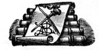
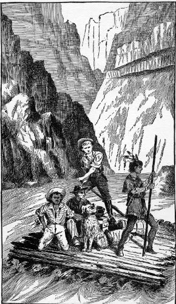
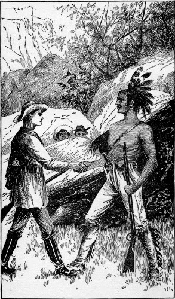
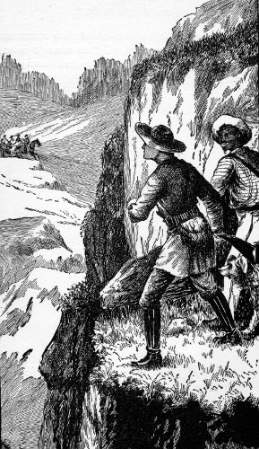

.. -*- encoding: utf-8 -*-

.. meta::
   :PG.Id: 37466
   :PG.Title: Lost in the Cañon
   :PG.Released: 2011-09-17
   :PG.Rights: Public Domain
   :PG.Producer: Roger Frank
   :PG.Producer: Mary Meehan
   :PG.Producer: the Online Distributed Proofreading Team at http://www.pgdp.net
   :PG.Credits:
   :DC.Creator: Alfred R. Calhoun
   :MARCREL.ill:
   :DC.Title: Lost in the Cañon
   :DC.Language: en
   :DC.Created: 1888

.. role:: small-caps
   :class: small-caps


==================
LOST IN THE CAÑON.
==================

.. _pg-header:

.. container:: pgheader language-en

   .. style:: paragraph
      :class: noindent

   This eBook is for the use of anyone anywhere at no cost and with
   almost no restrictions whatsoever. You may copy it, give it away or
   re-use it under the terms of the `Project Gutenberg License`_
   included with this eBook or online at
   http://www.gutenberg.org/license.

   

   |

   .. _pg-machine-header:

   .. container::

      Title: Lost in the Cañon
      
      Author: Alfred R. Calhoun
      
      Release Date: September 17, 2011 [EBook #37466]
      
      Language: English
      
      Character set encoding: UTF-8

      |

      .. _pg-start-line:

      \*\*\* START OF THIS PROJECT GUTENBERG EBOOK LOST IN THE CAÑON \*\*\*

   |
   |
   |
   |

   .. _pg-produced-by:

   .. container::

      Produced by Roger Frank, Mary Meehan, and the Online Distributed Proofreading Team at http://www.pgdp.net.

      |

      


.. class:: center medium

   | THE STORY OF
   | Sam Willett's Adventures on the Great
   | Colorado of the West.

.. class:: center large

   | :small-caps:`By` ALFRED R. CALHOUN,

.. class:: center medium

   | *Author of*
   | "Cochise," "Excelsior," "The Californians," etc., etc.

   | ILLUSTRATED.




.. class:: center medium

   | NEW YORK:
   | A. L. BURT, PUBLISHER.
   |
   | :small-caps:`Copyright 1888, by A. L. Burt.`

----




   Sam succeeded in guiding the raft to a ledge of sloping rocks.

----

.. contents:: CONTENTS
   :depth: 1
   :backlinks: entry

----


.. class:: center x-large

LOST IN THE CAÑON.

----


CHAPTER I.—A REMARKABLE CAMP.
=============================


The scene of this narrative is laid in Southwestern
Colorado, and the date is so recent that boys
living out there at that time are only just beginning to
think themselves young men—and it is really astonishing
how soon boys leap into vigorous manhood in that
wild, free land.

"We's 'bleeged to hab 'im, for dah ain't de least scrap
ob meat in de camp!"

This stirring information was shouted by a stout negro
boy of fifteen or sixteen years of age, who, with a long,
rusty, single-barrel shot-gun in his arms, stood at the
base of a towering mass of bare rocks, and looked eagerly
up at two other youths creeping along the giddy
heights, and evidently in eager search of something that
had escaped them, but which they were determined to
overtake.

The lithe form, long black hair, and copper-colored
skin of one of the young hunters bespoke him an Indian
of the purest type. He wore a close-fitting buckskin
dress, and slung at his back was a short repeating
rifle.

The other youth up the rocks, though bronzed on the
hands and face to a color as dark as the young Ute's,
had the blue eyes and curly yellow hair that told of a
pure white ancestry. His name was Samuel Willett,
and though not much more than sixteen years of age,
his taller form and more athletic build made him look
several years the senior of his red and black companions.

Sam Willett was armed and dressed like a hunter,
and his well-worn equipments told that he was not out
masquerading in the costume of a theatrical Nimrod.

The Indian youth, Ulna, and Sam Willett had chased
a Rocky Mountain or bighorn sheep into the mass of
towering rocks which they were now searching; and that
they were not hunting for mere sport was proven by Ike,
the black boy's repeated cry:

"We's 'bleeged to hab 'im, foh dar ain't de least scrap
ob meat in de camp!"

"I want to get the meat as much as you do, Ike, so
have patience!" Sam shouted down, without stopping in
his pursuit an instant.

The two daring hunters disappeared, and Ike, whose
desire for meat was greater than his love for the chase,
began circling about the confused pile of rocks so as to
keep his companions in sight.

The bighorn "sheep" is in reality not a sheep at all,
but a variety of powerful mountain antelope, whose
strength, speed and daring among the rocks and cañons
are not the least wonderful things about the wonderful
land in which he makes his exclusive home.

Even old Western hunters believe that these animals
can leap from immense heights and land on their horns
without harm, but this is an error.

While Ike was gazing with eager eyes and open mouth
at the towering, volcanic cliffs, the bighorn came to
view on a rock five hundred feet overhead.

The hunters were close behind, and the creature's only
means of escape was to leap across a chasm fully thirty
feet wide to another rock of a little lower elevation.

"Shoot! shoot!" yelled the excited Ike, as the bighorn
gathered himself up and eyed the terrific gorge that beset
his course.

As if stung to desperation by the shout the creature
leaped forward with a force that must have
cleared the gulf, and an accuracy that would have insured
a landing on the other side, but just as it sprang
into mid-air two shots rang out within a small fraction
of a second of each other, and the bighorn came crashing
down and fell dead at the black boy's feet.

In his wild excitement Ike discharged the rusty single-barrel
shot-gun, which he had been hugging in his arms
as if it were a baby. All the power of the old-fashioned
weapon must have been in the report and recoil, for the
former sounded like the explosion of a howitzer, and the
latter was so terrific as to send the holder sprawling
across the carcass of the bighorn.

Sam Willett saw all this as he hurried down the rocks,
otherwise he might have thought when he had reached
the bottom that the animal had fallen on his companion
and faithful servant and killed him.

"Hello, Ike, old fellow, what's up?" asked Sam, as he
helped the owner of the shot-gun to his feet.

"Is I all alive, foh shuah, Mistah Sam?" demanded
Ike, as he stared wildly about him.

"Of course you are, and here is the meat you have
been so eager for," said Sam.

"Wa'll, Mistah Sam, it's dat ar gun," said Ike, gazing
sadly at the old weapon which he still held in his arms.
"I ain't used her bad; ain't fired her off for more'n six
months afore we kem out har from Michigan—dat's five
months ago—an' now only to tink she's done gone back
on me in dat are way."

The Indian youth, Ulna, had come down by this time,
and when he took in the situation his fine, almost effeminate
face was wreathed in smiles, that displayed a
beautiful set of white teeth.

In a low, musical voice and without any accent, he
said in excellent English:

"The sun is setting and we must hurry if we would
reach the camp before dark."

"An' more partikler ez we've got to tote dis ar venizon
home," said Ike, now wide awake to the necessities
of the situation.

Each of the youths had a hunting knife in his belt,
and they soon proved that these weapons were not carried
for ornament.

With a rapidity and skill that would have won the admiration
of an eastern butcher, they skinned and cleaned
the animal, severed the mammoth head and then divided
the meat into three parcels.

Each had to shoulder about fifty pounds, but being
sturdy, healthy young fellows they did not seem to mind
their burdens, as they started off with long, vigorous
strides toward the west.

The sun in all his course does not look down on a
wilder, grander or more desolate land than that which
met the gaze of the young hunters, no matter to which
side they turned.

Verdureless mountains of fantastic shapes rose into
the cloudless sky on every hand.

Here and there in the crevices of the black volcanic
rocks, over which they hurried, a stunted sagebush or a
dwarf cactus suggested the awful barrenness of the place
rather than told of vegetation.

They were in the land of cañons and drought, on the
summit of the Great American Plateau where rain but
seldom falls, where the streams flow through frightful
gorges, and where men and animals have often perished
from thirst within sight of waters which they could not
reach.

Bleak and sublime as the land was, is, and ever must
be, yet the belief—a well founded belief by the way—that
its gloomy ravines contained gold, led hundreds of
hardy miners and adventurers to look upon it as that
El Dorado for which the early Spanish explorers in these
wilds had sought in vain.

As the leader of the little party, Sam Willett, strode
ahead, the deepening shadows of the mountains impelled
him each instant to a quicker pace.

There was no apparent trail, yet Sam never hesitated
in his course, but kept on as unerringly as a bird of passage,
till he came to a great black rift that seemed to suddenly
open at his feet.

Away down in the shadowy depths he could see a
white band that told of moving water.

A glow, the source of which could not be seen, indicated
a fire down near the base of the cliff, and the
barking of a dog—the sound appeared to come from the
depths of a cave—suggested a human habitation.

On reaching the crest of the chasm Sam Willett did
not hesitate, but at once plunged down to what, to a
stranger, would appear certain death.

Along the cañon wall there was a steep but well constructed
trail that afforded secure footing to a traveler
who was not troubled with giddiness.

Without once stopping, Sam and his companions made
their way to the bottom of the rift and forded the roaring
torrent that thundered over its uneven bed.

On the cañon wall, opposite to that by which they
had descended, they saw about a hundred feet above the
stream, what seemed like a number of illuminated pigeon
holes. This was their home, the place to which had
been given the not inappropriate name of "Gold Cave
Camp."

With barks of delight, a big dog met them near the
water and joyously escorted them up the other side to an
irregular plateau, about a hundred feet in diameter, that
shot out like the once famous Table Rock at Niagara.

This plateau was in front of the cave, in which the
miners had made their home.

The background of light revealed the forms of three
men. The dress and long cue of one bespoke him a
Chinaman, the second was dressed like a hunter, and the
third, a tall, powerful figure, had only his heavy beard and
striking stature to distinguish him.

"Is that you, Sam?" called out the tall man, as the
foremost of the party reached the plateau.

"Yes, father," was the reply, "and we have brought
back some meat."

"Wa'll!" exclaimed the second man, "I didn't think
thar was a pound of live meat left within twenty mile of
yar."

"Hoolay! Bully! Now me gettee suppel!" cried
the excited Chinaman, who was known by the fitting
name of Wah Shin.

Preceded by Maj, the dog, Sam and his fellow hunters
entered the remarkable cave—of which we shall speak
hereafter—and laid the meat on the floor.

"I began to grow uneasy about you, my boy," said
Mr. Willett, as he fondly kissed his son, "meat is very
desirable, but I would rather suffer for it than be worried
at your absence."

Sam explained about the delay in the hunt, and then
went to a spring that rose from the floor of the cave
close to the fire, and here he set the example of drinking
and washing himself.

Meanwhile Wah Shin began to demonstrate his position
in that strangely mixed company. In nearly no
time he had steaks broiling on the coals, the savory odor
of which made Hank Tims, the old guide, take long inhalations
with great enjoyment.

Apart from meat there was an abundance of other
food in this strange camp, so that in a very short time
Wah Shin, with Ike's aid, had a most excellent supper
spread on a table consisting of two roughly-hewn cedar
slabs, supported at either end by a square stationary
stone, that had been placed there by the original but
unknown cave dwellers.


CHAPTER II.—LOOKING BACKWARD AND FORWARD.
=========================================


It is not a little remarkable that the six dwellers in
Gold Cave Camp should represent four of the five
types into which scientists divide the human race, but
this though curious in itself, is not nearly so much so as
their being residents of this sparsely settled wilderness,
and living, as it were, in caves in the depths of the
earth.

Mr. Willett had been a merchant in Detroit, Michigan,
where his only child, Sam, was born.

He had been very happy in his married life and very
prosperous in his business; but, alas, for the stability of
human affairs, his wife died. Following this awful calamity
came a series of reverses in business which no
human foresight could prevent. His property was swept
away, and in his fortieth year he found himself a poor
man, with a son to educate and care for and all life's
battle to fight over again.

Mr. Willett had been educated as a mining engineer,
and though he had never followed his profession he, very
naturally, looked to it as a means of support when all
his other resources were gone.

In the days of his great distress and perplexity he read
of sudden fortunes being made in the newly-discovered
gold fields of the San Juan country in Southwestern
Colorado, and thither he determined to go.

Although still in the prime of life, Mr. Willett concentrated
all the love of his brave heart on his son and
resolved to devote his time and thought to his care and
education.

Sam's maternal grandfather, Mr. Shirley, was a very
rich, but a very morose and eccentric old man, who
chose never to become reconciled to his daughter's marriage
to Mr. Willett. But when Sam's mother died, the
old gentleman offered to adopt his grandson and make
him his sole heir, if the father would consent to renounce
all claims to him.

In his son's interest Mr. Willett might have considered
this proposal favorably had not Sam himself
upset the scheme by saying stoutly:

"Father, do not ask me to leave you, for I feel it
would be sending me to death. If you go to the West,
I shall go with you. There are only two of us left, why
should we be parted?"

Mr. Willett replied to this query by kissing his son,
and so it was settled that they should go to the West together.

Ike was an orphan lad who, in some inexplicable way,
had drifted up to Michigan from Kentucky. Mr. Willett
found and cared for the boy, and he repaid this
generosity by a fidelity and devotion worthy of all praise.

Mr. Willett could see no use for Ike in the West, but
when the time for departure came, the black boy appeared
at the depot with an old hunting bag, containing
all his clothing, slung at his back, and a remarkable-looking
shot-gun folded in his arms.

"Dar's no use a talkin' to me, boss," he said to Mr.
Willett, when that gentleman expressed his surprise at
the boy's appearance. "Ize bound to go 'long wid
Mistah Sam. Oh, don't yeh feel skeat 'bout de cash foh
de passage. Ize got ebery cent I ever earned stored
away har; its more'n fifty dollar, an' I'll foot de bills till
de las' red cent's gone."

In proof of this bold statement, Ike drew from the
depths of his trousers' pockets a bag containing several
pounds weight of bronze, nickel and silver coins.

Ike found an eloquent advocate in Sam; and so it
came about that at the very last moment Mr. Willett
decided to take the colored boy with him, though he
could not be made to avail himself of the generous fellow's
hoardings.

The three went to Denver, thence over the Rocky
range to St. Luis Park, and over the Sierra Madre
mountains to the San Juan country.

They had procured horses to ride on, and two pack
mules to carry their supplies and mining tools.

While at Port Garland in the St. Luis Park, they met
with Hank Tims and the Ute boy, Ulna, who was a
nephew of the great chief Uray, whom the writer of
this narrative knew very well and greatly admired.

Hank Tims and Ulna were themselves thinking about
going into the San Juan country, and, as they were
well acquainted with that region and appeared to take to
Mr. Willett's party at once, they were readily induced to
join his expedition.

It would be out of place in this brief but essential review
to recount all the adventures that beset our friends
till they reached the scene of their proposed labors.

After much wandering, they found Gold Cave Camp,
but it was in the possession of a wild, dissolute fellow
named Tom Edwards.

As Edwards was working his claim all alone and was
eager to leave it, Mr. Willett bought him out at his
own price, and at once made preparations to pan for
such gold as might be found in the bed of the cañon.

A few days after the commencement of operations,
Wah Shin appeared in the camp.

He looked as if he had been blown in from the bleak
hills, but he managed to explain in his broken English
that he had lost himself coming up from Santa Fe, and
that he was a first-class cook.

He asked for "a job," but even before Mr. Willett
had made up his mind to hire him, he set to work to
give an exhibition of his skill; and the result was so
entirely satisfactory that he was retained on his own
terms.

But it is much easier to explain the presence of these
people than it is to account for the strange home in
which they lived.

Learned men claim that long before the coming of
the white men to this continent, long, indeed, before
the coming of the Indians, that there was a strange race
of people in that Western land, whom, for the want of
a better name, they call "The Cave Dwellers."

But no matter how formed, or by whom they were first
inhabited, these caves—they are quite common in that
land—made ready and comfortable homes for the mining
adventurers.

Those occupied by Mr. Willett and his associates, consisted
of a series of eight apartments, all opening on the
plateau and all connected by passage ways that must
have been the work of human hands.

The apartments were circular in shape, and the largest,
which was used as a kitchen and general store room,
was about twenty feet in diameter and ten feet in
height.

As before stated there was an ample spring of delicious
cool water in this apartment, and the original hewers of
the caves, no doubt, selected the place on this account.

After a hearty supper, Mr. Willett and Hank Tims
lit their pipes and sat before the fire, for though the
days are warm in this land the nights are unusually
cool.

Drift wood, picked up from the crevices of the rocks
in which it had been lodged by floods caused by the
melting of snow in the mountains, constituted the fuel
of the camp, and the great pile near the fire showed
that it was to be had in abundance.

All had been working hard that day, so after a
desultory talk about the great success that was meeting
their search for gold, they lay down on their blanket
cots in the other apartments and went to sleep—that is,
all but Sam and his father.

Mr. Willett and his son slept together in the nearest
room, but though they lay down side by side they did
not go to sleep at once.

"Sam," said Mr. Willett in a troubled voice, "since
you left this morning that fellow, Tom Edwards, has
been here again."

"What did he want?" asked Sam.

"He appeared to be drunk, and he threatened to kill
me if I did not give him more money."

"But you have paid him the price agreed on?"

"Yes."

"Then I should not heed him."

"Still, I am afraid he will cause me trouble, so, to-morrow,
I will ride over to Hurley's Gulch and consult
a lawyer, and as that is our nearest market and post-office,
I will take Hank and Ulna along with two pack
mules so as to carry back supplies."

"That is forty miles away, so that you will be gone
several days. But if you must go, father, I will do the
best I can while you are absent," said Sam, laying his
hand soothingly on his father's broad breast.

"I know you will, my boy, but there is another matter
I wished to speak with you about."

"What is that, father?"

"Why, this Tom Edwards brought me a letter from
your grandfather's lawyer in Michigan. It tells me that
the old man is dead, and that in his will he leaves all
his property to you, but you are not to have a cent of it
till you are twenty-one years of age——"

"Four years and a half, dear father!" cried the excited
Sam.

"But," continued Mr. Willett, "the will further
says that if you should die in the meantime that the
property is to go to your grandfather's nephew, Frank
Shirley."

"A bad, disreputable man to whom neither you nor
mother would speak," said Sam.

"He is all that, I fear, and it troubles me to learn
from Edwards that Frank Shirley has recently come
into this land," said Mr. Willett.


CHAPTER III.—SAM'S TRIALS BEGIN.
================================


While daylight was flooding the upper world
next morning, and the shadows were lifting
from the gloomy depths of the cañon, the modern cave
dwellers ate their breakfast.

About three hundred yards above the caves the cañon
widened out into a valley some three hundred yards in
diameter. The bottom of this valley was covered with
rich grass, and in it was a grove of cotton-wood trees
whose bright verdure gave the place the appearance of a
rich emerald gem in a mighty setting of granite.

In this valley the horses and pack mules were kept,
and, as they had but little to do, they might be said to
"live in clover."

While it was still dusky in these depths, though the
glimpses of far-off ruddy mountain peaks told that the
sun was rising in the upper world, Sam and Ike, who
were hardly ever apart, went up to the valley and soon
returned with three horses and two mules, the latter
were to carry back the necessary supplies from Hurley's
Gulch.

It had been Mr. Willett's custom to make this trip
once a month, so that his going now was not an unusual
event, yet his face showed that he was much
dejected, as if he had a premonition of the awful calamity
that was so soon to come upon himself and his beloved
boy.

His last words, as he kissed Sam, were:

"If anything should happen to detain me longer than
four days, I will send a letter back by Ulna."

"But we'll be back on time," joined in Hank Tims,
"for I don't like crowds, an', then, we've struck pay
dirt rich up at the head of the valley, an' I'm just a
spilein' to see how it'll pan out to the ind."

Good-bys were said, and Sam, Ike and Wah Shin stood
on the plateau before the cave and waved their hats,
till the three men had led the animals up the giddy trail
and disappeared beyond the towering summit of the
cliff.

Under the teaching of his father and Hank Tims,
Sam had become a skillful gold miner, that is, so far as
panning out the gravel and collecting the gold were concerned.

The fact that he was the prospective heir to a large
fortune did not unfit him for work this morning. With
Ike he went up to the sluices immediately after his
father left, and until the sun was in mid-heaven they
worked, shoveling gravel into the cradle and rocking it
under the water, and only stopping to pick out the nuggets
and yellow dust and scales that rewarded their
effort every hour.

By means of an old-fashioned horn, Wah Shin summoned
them to dinner. Of the fresh meat he had
made pies that would have tempted an invalid's
appetite. And, as the boys ate, sitting before the entrance
to the cave, the Chinaman's face fairly glowed with delight
at the evidence of his excellent cooking.

"Ven'zon pie belly good," chuckled Wah Shin, as he
produced a second when the first had vanished. "But
man eatee too muchee, den get mebbe sick."

"Dat ar edvice is 'tended foh Mistah Sam," laughed
Ike, as he helped himself again. "But vanzon pie an'
'possums are two tings I ain't nebber got my fill ob up to
dis time."

Sam heard but did not heed the talk of his companions,
for his attention was at the moment attracted
to two strange men who were slowly making their way
down the trail on the opposite side of the cañon
wall.

As there was danger from prowling bands of Indians
who had left the reservation, and also from white outlaws
who frequently robbed weak mining camps, every
one at Gold Cave Camp strapped on a belt, with a knife
and pistols in it, as regularly as he pulled on his boots.

Starting to his feet and followed by Ike, Sam went
down to the stream, getting there just as the two men
reached the bottom.

One of the strangers was a tall, dark-bearded man,
with one eye, and the other was a short, yellow-skinned
man with a mean expression of face, whom Sam recognized
as his cousin, Frank Shirley.

Sam had never spoken to this man, so he did not
greet him like an acquaintance now.

Both men were well armed, as is the fashion of the
country, and when they came within hailing distance,
Frank Shirley called out:

"Hello, young man, is this Mr. Willett's camp?"

"It is, sir," was Sam's reply, as he came to a halt.

"Is Mr. Willett home?"

"He is not."

"Where is he?"

"He has gone to Hurley's Gulch."

"When did he leave?"

"This morning."

"Ah, I'm sorry I missed him. When do you expect
him back?"

"In a few days. Won't you come over and have
some dinner?" asked Sam, waving his hand in the direction
of the plateau, on which Wah Shin was visible.

"Thank you; no. We are going on to Hurley's
Gulch, and are in a great hurry," said Frank Shirley,
turning and whispering to his companion, who nodded
vigorously in response.

"Who shall I say called?" asked Sam, as the two men
turned to ascend the trail.

"Friends," was the laconical reply.

"If dem's frien's," said Ike, when the men had gone
out of hearing, "den Ize de biggest kind ob a foe."

The conversation of the two men when they reached
the top of the cliff proved the black boy's surmise to be
correct.

They had left their horses hitched to a rock, and as
they prepared to mount, Frank Shirley said to his companion:

"That's the boy, Badger."

"The boy ez stan's atween you an' fortune?" said
Badger.

"Yes."

"Wa'll, ain't you hired me to help you clear the
way?"

"I have, Badger."

"Good; then let us git rid of the father first, an'
then all the rest'll be ez smooth ez ile."

"You will stick to your contract?"

"I'd be a fool if I didn't. You pay expenses an'
give me ten thousand dollars to get 'em out of the way.
Isn't that it?"

"That's it, Badger," said Frank Shirley, as he
mounted and rode along beside his companion.

"That ar boy down thar," said Badger, waving his
hand back at the cañon, "ain't no slouch. He'll fight,
he will; an' the best way with sich is to give 'em no
chance."

"No chance," echoed Frank Shirley, "that's it
exactly. And now that we have them parted our opportunity
has come."

"Just ez if 'twas made to order," said Badger.

After the men had gone, Sam and Ike went to work
again, but the former had lost the cheerfulness that distinguished
him in the morning.

He could not get those two men out of his mind, not
that he feared their return—indeed, he could not account
to himself for the strange feeling of dread that
possessed him for the next three days.

While working, on the afternoon of the fourth day
since his father's departure, he noticed that the sky had
become overcast and that the water in the bed of the
stream was rapidly rising.

He and Ike quit work earlier than usual, and they
had great difficulty in making their way to the caves
through the swollen torrent.

They had hardly reached cover when a terrific storm
came up and the cañon became as dark as night, while
the roar of the waters and the crashing of the thunder
were ceaseless and appalling.

It was about nine o'clock at night, and the three occupants
of the cave were sitting with awed faces before the
fire, when, to their inexpressible surprise, Ulna, the
young Ute, stood dripping before them.

"How did you reach here?" asked Sam, springing to
his feet and grasping Ulna's hand.

"I rode till I killed my horse, then I ran for hours.
The flood was up, and it is rising, but I managed to
swim across——"

"But my father!" interrupted Sam, pleadingly laying
his arm on the young Indian's shoulders.

"He and Hank Tims are prisoners at Hurley's Gulch,"
said Ulna.

"Prisoners."

"Yes, and in the hands of the lynchers who charge
them with the murder of Tom Edwards. Here is a letter
from your father that will explain all," said Ulna, pulling
a damp paper from his pocket and adding, "your testimony
is wanted at once to clear the accused; but no
man can cross the cañon for a week, and then it will be
too late!"


CHAPTER IV.—A PERILOUS SITUATION.
=================================


Sam Willett had courage and fortitude in no
common degree, but the words of Ulna, who stood
dripping and panting before him, froze him with a
speechless terror.

He took the wet paper from the Indian boy's hand,
but for some seconds he had neither the courage nor the
strength to open it.

The howling of the wind down the gorge and the
hoarse roaring of the maddened waters heightened the
terror of the situation.

Wah Shin, though not well versed in English, fully
understood the import of Ulna's message, but realizing
his own inability to do or to suggest anything, he stood
with his lips drawn and his little oblique eyes half
closed.

Ike was the only one of the party who did not appear
to have lost the power of speech. Taking the letter
from Sam's hand, he said:

"Dat ar paper's powahful damp, an' I reckon, Mistah
Sam, yeh kin read it bettah if so be I dries it so's it
won't fall to pieces."

Ike opened the paper and while he held it before the
fire, Ulna briefly explained the situation.

He said that Mr. Willett, Hank Tims and himself
reached Hurley's Gulch without any mishap.

They found the rude mining camp in a great state of
commotion owing to a robbery and murder that had
recently been committed.

The more law-abiding, or rather the more industrious,
for there was no organized law in the place, had formed
a vigilance committee to hang the next murderer or robber,
under the wild sanction of "lynch law."

"Just as soon as we reached Hurley's Gulch," continued
Ulna, "we met Tom Edwards, and he was very
drunk and very abusive. He shouted to every one
he met that Mr. Willett had robbed him, and took Gold
Cave Camp from him without paying a cent, though he
had promised fifteen hundred dollars."

"Why, the man lies infamously!" interrupted Sam.
"I was a witness to Edwards' receipt for the money in
full, and I have it here among father's papers."

"And that receipt is what your father must have at
once in order to clear him of the charge of robbery and
murder," said Ulna.

"Murder!" repeated Sam.

"Yes. Last night Tom Edwards was found dying
with a pistol bullet in his breast, and with his last
breath he swore to the men who found him that your
father and Hank Tims shot him to get rid of paying the
money they owed him. The vigilantes at once arrested
Mr. Willett and Tom, and they swear they will hang
them if they do not prove that Tom Edwards was paid.
I saw the money paid myself, but they refuse to take the
word of an Indian," said Ulna, with a flash of indignation
in his splendid black eyes; then continuing, "but
they agreed to let me come here for the paper."

"Heah!" cried Ike, springing from beside the fire,
"de lettah's dry enough to read. Let's know w'at
Mistah Willett he has to say foh hisself."

Sam took the paper, and kneeling down to get the
benefit of the light, he read aloud as follows:

    ":small-caps:`My Dear Son`:—I do not want you to be at all
    alarmed at my detention. Ulna will explain why neither
    Tom nor I can return till you have brought us the receipt
    which Tom Edwards signed when I paid him the
    money in full for his claim at Gold Cave Camp.

    "This receipt you will find among the papers in my
    saddle-bags. Bring it to me with all speed and leave
    Ulna back in charge of the camp; it does not matter if
    the mining ceases till we return.

    "I regret to have to tell you that Tom Edwards is
    dead. He was drunk when he received the shot that
    killed him, and he accused Hank and me of the crime.
    If the people here knew us well they would not believe
    this charge for one instant, but they do not, and so we
    must wait till we can show the vigilance committee who
    hold us prisoners, that we could have no motive for,
    even if we were inclined to do this awful deed.

    "I saw Frank Shirley here yesterday afternoon in
    company with a well-known desperado who goes by the
    name of 'One-Eyed Badger.' I cannot but think that
    these two men are at the bottom of this new trouble,
    but what their reasons can be I cannot even guess; certain
    it is that I have never done them or any one else a
    wrong knowingly.

    "Do not lose heart, for I have no fear as to the result:
    only come as soon as you can to your loving father,

.. class:: right

    ":small-caps:`Samuel Willett.`"

Sam read this over rapidly, then he read it a second
time with more deliberation.

"De boss am in a bad fix," groaned Ike, "an' I jest
wish I could take his place."

"I shall go to my father at once," said Sam, stoutly.

He went to the saddle-bags, got the necessary papers—the
receipt and deed—and placed them securely in the
inner breast pocket of his buckskin tunic.

"You no gettee on holse an' lide such night as deez
coz it was so muchee stolmy?" said Wah Shin when
he saw Sam getting out his saddle, bridle and rifle.

"I must get to Hurley's Gulch before another day,"
was the resolute reply, "if I have to go there on my
hands and knees."

"But you cannot go to-night," protested Ulna.
"Come and see the danger."

He took Sam by the arm and led him out to the
plateau before the entrance to the cave.

It has been said that it but seldom rains in this land,
but when it does the watery torrents come down with a
continued fury, of which the dwellers in more favored
climes can have only the faintest conception.

The bare rocks refuse to absorb the rain as it falls,
and so the ever-accumulating waters sweep into the
cañons and fill the narrow beds between the precipitous
banks with wild torrents, that must be once seen before
an adequate idea can be formed of the tremendous and
seemingly irresistible power of water in action.

The four occupants of the caves, all fine types of four
human races, went out to the plateau.

The light, streaming through the cave opening, cut
across the inky blackness of the cañon like a solid yellow
shaft, that made the surrounding darkness more impenetrable.

Laden with sheets rather than drops of rain, the wind
swept down the ravine with a force that threatened to
tear the observers from the rocks and hurl them into
the seething torrent.

"Before this time," said Ulna, speaking with the
calmness that distinguished all he said, "the valley is
flooded and the horses up there are drowned."

Sam shuddered but made no reply.

He went back to the cave, secured a lighted brand,
and, returning to the edge of the plateau, he dropped it
over.

It went hissing down. If the current were as low
as the day before it should have fallen sheer down
for a hundred feet, but before going half that distance,
it lit up an expanse of water white with foam, and was
extinguished.

The result of this experiment brought Sam's heart to
his mouth, and he could not have uttered a word if the
life of the father he so well loved depended on it.

"If she keeps on a-climbin' up dat way," groaned
Ike, "de watah'll be nigh into de cave by mawnin'."

Sam now recalled that he had found drift-wood lodged
in the crevices of the rocks, even higher than the entrances
to the cave, and from this he inferred that at
the highest water no one could stay in the cave and live.

Maj, the fine setter dog, had been moaning beside the
fire all the evening, but now he came out and crouched
at his young master's feet, as if his instinct told him of
the danger and that he wanted protection.

Fearing that the poor horses were gone, and well
knowing that it would be madness to attempt to cross
the cañon that night, Sam turned sadly to his companions
and said:

"We can do nothing till daylight comes. Let us get
in out of the storm."

They returned to the cave and silently sat down on
the stones that had been placed for seats near the fire.

It was a most trying situation.

Even if Mr. Willett and Hank Tims had been safely
there in the cave, the ever-increasing storm and the possibility,
or rather the certainty of its danger if it continued
would have been sufficient to drive sleep from the
eyes of all.

But Sam Willett, brave, unselfish youth that he was,
gave no thought to the peril of his own surroundings.

With his chin resting between his up-turned palms, he
looked steadily at the dying fire without seeing it.

His heart and his thoughts were ever with his sorely-tried
father at Hurley's Gulch, and he groaned as he
read in the beating of the storm the edict that might
bar his going to the rescue.

But though unmindful of himself, it was not in Sam's
nature to neglect the comfort of others.

"Lie down, all of you," he said to his companions,
"and I will stand guard till daylight comes."

After a weak protest, Wah Shin, Ulna and Ike
brought in their blankets and lay down before the fire.

Ike pretended that he did not want to sleep, but, after
an attempt at desultory talk, his eyes closed and he soon
became oblivious to his surroundings.

Maj continued to be restless and frightened. Now
and then, as if to judge for himself how the storm was
getting on, he would go to the cave opening, and, after
whining in a pained way for some seconds, he would
come back and crouch down near the fire with his nose
resting on his young master's knees.

To sorrow-stricken Sam Willett that night seemed like
an eternity of darkness.

He was beginning to feel that the storm had destroyed
the sun, when the grey light of another day began to
creep slowly into the cave.


CHAPTER V.—AT HURLEY'S GULCH.
=============================


Hurley's Gulch, though subsequently called
"Hurley City," has no right on the map if it
ever had a place there, for, like many other more ambitious
and important cities, it has ceased to be the
abode of man and returned to its original state of barrenness
and desolation.

It was at this time a mining camp that had sprung up
in a night, as it were, when a man named Hurley—after
whom the place was named—had discovered gold in a
little creek near the spot that so suddenly became the
site of busy mining life.

Though less than six months old and destined not to
survive a second birthday, Hurley's Gulch had nearly a
thousand inhabitants, with stores, saloons, assay offices,
hotels and all the business establishments that characterize
such places.

There were a few women in the camp and a sprinkling
of Indians, Negroes and Mexicans, but the great mass
of the inhabitants were miners, rough in appearance and
even rougher in speech.

A more picturesque and novel settlement than Hurley's
Gulch it would be impossible to find outside the
peculiar mining camps of the West.

Two little streaks of grass could be found growing beside
the creek on the bluff above which the camp had
been established; but beyond this there was hardly a
sign of vegetation in sight.

All about the place, far as the eye could reach, was a
tempest-tossed expanse of dry, glistening rocks.

As there was neither timber for building nor material
for bricks, the dwellings, stores, saloons, hotels and
offices were necessarily of canvas.

The tents were pitched here and there irregularly,
and as all of them had seen hard service in other mining
camps and "cities," their general appearance was
patched and dilapidated in the extreme.

The great majority of the men at Hurley's Gulch were
industrious miners; but as vultures hover over the track
of an army in the field and wolves follow up a buffalo
herd to prey upon the weakest, so crowds of well-dressed
gamblers and red-faced whisky sellers swarm in prosperous
mining camps to plunder and demoralize.

Hurley's Gulch had more than its share of these
wicked fellows, and as there was not the shadow of law
there to defend the weak, every man went armed as a
matter of course.

Until law officers can be elected or appointed and
courts of justice established in such camps, it is the
custom of the more industrious and peaceable to form
what they call "vigilance committees" for their own
protection.

It need not be said that, no matter how well-meaning
the purpose, many men, themselves criminals, get on
such committees, and that great wrong is often done to
the innocent by these rude efforts to do justice.

Mr. Willett's was a case in point.

A few days before he had come over this last time to
Hurley's Gulch, a hard-working miner had been killed
and robbed of the gold-dust which he had patiently
panned out from the bed of the stream.

This crime made the miners angry, and they held an
indignation meeting after the poor man's funeral, and
organized a committee to ferret out and punish the
criminals.

As there was no jail in which to detain those guilty
of lighter offences, there was only one penalty in the
code of the vigilantes, and that was *death*!

Tom Edwards had not been a favorite with the better
class of men at Hurley's Gulch.

In his opinion money was made for the sole purpose
of gambling away and getting drunk on.

It was generally believed that he had been paid for his
claim at Gold Cave Camp by Mr. Willett, so that many
who heard him declare to the contrary and say that he
had sold on credit, placed no faith in his word.

But when Tom Edwards was found dying the night
before Mr. Willett was to have left the Gulch, his past
falsehoods were forgotten in view of the nearness of his
end and the calmest were inclined to believe him.

It was well known that hot words had passed that
very day between Mr. Willett and Tom Edwards, and
this afforded to many a reason for the act.

It was pitchy dark when the wretched man was shot,
and he was very drunk at the time, so that when his
wound restored him, for a short time, to his senses,
there can be no doubt but he was honest in the belief
that "two men," Mr. Willett and Hank Tims were the
guilty parties.

The accused men were at once arrested by the vigilance
committee and placed under guard in a tent.

Both protested their innocence, as well they might,
and Mr. Willett asked to be permitted to send to his
camp for papers that would prove to all that he had paid
Tom Edwards in full the price at which he valued his
claim.

A few men were inclined to believe Mr. Willett, but
to set all doubts at rest, it was decided that further
action should be postponed in the case till the receipt of
the money and the deed of sale had been procured.

The next morning Ulna was dispatched on this mission,
and we have seen the fidelity with which he performed
the duty and the unexpected obstacles that prevented
the return of the accused man's son with the
papers.

There were two men at Hurley's Gulch at this time
who, if they had chosen, could have set at rest all doubts
as to the mystery surrounding Tom Edwards' death and
handed over the guilty parties to the vigilantes; but as
this act would have resulted in their own swift destruction,
they kept their awful secret to themselves.

These men were Frank Shirley and the outlaw Badger.

Frank Shirley believed, and with reason, that if Sam
Willett was out of the way, the last bar between him
and a great fortune would be down.

He was a dissolute, thriftless fellow, every faculty of
whose low mind seemed to have been concentrated into
the one mean gift of cunning.

On the way from Gold Cave Camp to Hurley's Gulch,
Frank Shirley and the man whom he had hired to help
him in his wicked purpose, discussed the situation from
every point of view.

The first thing they decided on was that Mr. Willett
and his son must be prevented from ever meeting again,
but they did not agree so readily as to how this was to
be done.

More bluff, and possibly more brutal than his employer,
Badger urged that he be allowed to waylay Mr.
Willett and kill him on his return.

But Frank Shirley opposed this, saying, for he was a
coward at heart, as all such men are:

"Willett will have with him the Indian boy and the
old hunter, Hank Tims; they are all well-armed, and
they would be stronger than us. No, Badger, we must
hit upon some plan that has less risk in it."

"Wa'al," responded Badger, "hit upon the plan
yersel', an' if I don't carry it out without flinchin', I'll
give you leave to shoot me down like a dog."

When these men reached Hurley's Gulch they found
Edwards "drunk as usual," and loudly declaring
wherever he went that Mr. Willett was trying to rob him
out of fifteen hundred dollars.

Here was the very chance for which Frank Shirley
had been looking.

If he could have Edwards put out of the way, in such
a manner as to fasten the crime on Mr. Willett, a hundred
stronger and braver men would be ready to accomplish
his purpose with their own hands.

He told Badger of his scheme, and that creature,
without a moment's thought of the awful crime he was
about to commit, pledged himself to carry it out when
the other gave the word.

To add to the evidence against Mr. Willett, as that
gentleman was arrested, Frank Shirley appeared to be
very much cast down.

With tears in his eyes, he explained to the many who
were only too eager to listen, that Mr. Willett had married
his, Shirley's, cousin, that he had borne a bad
character in Detroit, and that he had recently fled from
that city to escape the consequences of his many crimes.


CHAPTER VI.—WHY THE PAPERS WERE NOT BROUGHT.
============================================


Before awaking his companions, all of whom
seemed to be sleeping heavily, Sam went out to see
if the flood in the cañon had risen.

He ventured but a few yards beyond the entrance to
the cave, for the sight that met his eyes appalled him.

The rain was still pouring down in torrents, and the
flood had risen till it was nearly on a level with the
plateau.

"Three feet more and it will be into the cave," he
said, speaking aloud.

"Watel littee mole high up no cannee stay, mus' allee
die if no can swimmee," said a voice behind Sam.

There was no need to ask whose it was.

Wah Shin, with thoughts of breakfast in his mind,
had got up, but first he decided to satisfy himself of the
condition of affairs outside.

"Yes, Wah Shin," said Sam, without turning his
head, "even as I look at the flood it appears to be
rising."

"If it come mole up, wat we allee do?"

"I don't know."

"No cannee stop dis place?"

"I fear not."

"Way we go den, no can tink."

"Nor can I think either, Wah."

"If no can lib, den no coz wy die hungly," said Wah
Shin, and with this belief strong in his mind, he re-entered
the cave and set about getting breakfast with
his usual indifference to the state of the weather.

At any other time the sight of the flood and the danger
of its coming higher would have alarmed Sam greatly,
but though he could not ignore the danger that threatened
him now, his own situation was lost sight of as he
thought of his father's position.

He was still standing looking at the rushing flood, as
if fascinated by its power and volume, when Ike and
Ulna came out and joined him.

"Foh massy's sake!" exclaimed Ike, when he caught
sight of the water. "Ain't she jest a bilein' up."

"Do you think the water will rise higher?" asked Sam
as he turned to Ulna, and tried to find some comfort in
his calm, impassive face.

Before replying Ulna looked up at the sky for some
seconds, then said:

"The storm is not half over."

"And while it lasts the water will go on rising?"

"Yes, Sam, that is what we must expect."

"Then it will flood the cave?"

"It will surely do that."

"And drive us out?"

"Yes, Sam, if we don't want to drown there."

"Then we must try to leave?"

"Yes, we must try to leave," echoed Ulna.

"But how can we get away?"

"Ah," said Ulna, with something like a sigh, "I
cannot now think of how that's to be done."

"If so be we was all birds, we could fly," said Ike,
very solemnly, "it'd come in mighty handy-like jest
'bout dis time."

Sam now realized that he must think and act for his
companions as well as for himself.

His was a brave, sturdy, self-reliant nature, that
grows stronger and stronger in the face of increasing
trials and responsibilities.

"Let us go in out of the rain and think," he said,
while he turned and nervously stroked his forehead.

When they went back to the cave they found that
Wah Shin had a good breakfast ready, and was still busy
cooking more food.

When asked by Sam why he was doing this, he said,
as if it were a matter of course.

"Bime by, watel him come in, puttee out file; file
him go out, no can cookee; no got tings cookee, no can
eat; no eatee den allee mus' die."

"Well, Wah Shin," said Sam with a grim smile, "if
there is any hope in cooking, keep at it while the food
lasts."

Despite their troubles and the dangers that cut them
off from the world and threatened their lives, all, Maj
included, complimented Wah Shin's efforts in their behalf
by partaking of a hearty breakfast.

During the meal Sam was unusually silent; it was evident
he was thinking very hard, and the others did not
attempt to disturb his deliberations till he had risen from
his seat, then Ulna asked:

"Have you thought out a way to get across the cañon,
Sam?"

"I have thought out a way of trying it," he answered.

"How?"

"On a raft."

"But we have no raft."

"Then we must make one."

"Where is the timber?"

"There is some here in the form of slabs and firewood,
and there is plenty whirling down with the flood.
You can handle a lariat, Ulna?"

"I think I can," was the response.

"Then get a rope, we have a lot here in the cave;
make a noose and secure all the long pieces of timber
you can. The water is nearly up to the plateau, and
Ike will help you pull them out."

"An' watee can me do?" asked Wah Shin.

"Keep right on cooking, for if we cannot cross the
flood on the raft, we'll be swept into the great cañon of
the Colorado, and there we shall need all the food we
can take along."

The others set to work with a will, but even Ulna,
who was born out in that land, only faintly comprehended
the import of what Sam said about the great
cañon.

Indeed, Sam himself had only a vague notion of what
was meant by the now famous geographical name.

He knew the history and geography of his own
country very well, as every well-trained youth should, and
he was, therefore, aware that the great Colorado of the
West was formed by the junction of two important
rivers, the Green and the Grand; he was further aware
that the water roaring outside entered the latter river
about twenty-five miles below the camp.

Had these been ordinary rivers there would be good
reason to dread venturing out on their currents at flood
time, even in a good boat; but the Green and the Grand
for many score miles above their junction flowed through
immense rocky defiles or cañons, and they united in one
mighty cañon, through which flowed for fully four hundred
miles the waters of the Colorado on their way to
the Gulf of California.

Sam had talked a great deal about this wonderful
chasm with Hank Tims, and that most reliable authority
had assured him that only two parties had ever attempted
to go through the great cañon and returned to
tell of their perilous adventures and hair-breadth escapes.

Hank claimed to have stood on a cliff that rose
straight up from the edge of the Colorado at one point,
and looked down a sheer perpendicular depth of over
seven thousand feet, the very thought of which is enough
to make an ordinary head giddy.

But Sam helped to make a craft that would enable
them to cross the two hundred feet that separated them
from the opposite bank, and this accomplished in safety,
they could make their way on foot to Hurley's Gulch,
where he knew his father was eagerly awaiting his coming.

He secured all the gold dust about his own person,
and then made up bundles of blankets, provisions and
ammunition that might be of use if they did not succeed
in making a crossing.

This done, he went out and found that Ike and Ulna
had succeeded in staying and landing a great deal of
drift-wood, just the thing for a raft, and a number of
stout poles that might be used in guiding it.

By this time the flood had risen still higher and
higher, and was now ankle deep on the plateau outside
the cave opening, and there was not a moment to lose.

With an energy that was all his own, and a skill that
surprised himself, Sam set about building the raft.

By means of ropes, the longer timbers were securely
lashed side by side, and over these, like a deck, the
lighter slabs taken from the cave were nailed.

When this clumsy and insecure structure was completed,
Sam saw that the food, blankets, arms and
ammunition were tied so that they could not be swept
off by the wash of the waters.

It comforted him somewhat to know that all his companions
could swim, though the stoutest swimmer could
not last long in the mad torrent sweeping past.

Sam assigned each one a position, and gave him strict
instructions as to what he must do under certain circumstances;
and Maj seemingly well aware of what was up,
crouched down in the center of the raft.

"Now," said Sam, as he stood up, pole in hand, at one
end of the raft, "we must wait for the current to float
us off, and trust in God."


CHAPTER VII.—THE WONDERFUL VOYAGE BEGINS.
=========================================


Under and around the raft the waters
surged and poured, as if they were testing the
strength of the frail structure before lifting it up and
hurling it away to destruction.

With his feet well apart to balance himself, and the
long pole ready in his strong hands, Sam stood pale but
resolute.

They had only a few minutes to wait.

Ike and Wah Shin sent up a cry of horror as, with
the roar of an angry monster, the current swept the raft
into the stream.

With the grim stoicism of his race, Ulna looked about
him without seeming to be at all disturbed by the awful
situation.

Sam's object was to get across to the other side of the
cañon and effect a landing with his party, for he never
for an instant lost sight of the fact that his father's
freedom if not his life depended on his reaching Hurley's
Gulch at once with the papers in the Edwards case.

But alas for all the schemes planned by love and executed
by courage! What was man's strength and daring
to the weight of the piled-up, flying waters?

The instant the raft swung away from the plateau Sam
saw that his pole was of no use, for the river bottom was
fully one hundred feet below the surface.

He tried to use the pole as a paddle, but his efforts
had no effect on the course of the raft.

It was hurled like a plaything by some mighty, unseen
power, into the center of the flood; then, with the speed
of a racer urged on by whip and spur, the frail ark
went flying down the cañon.

For the life of him Sam could not utter a word. His
face was blanched, but it was not with fear, though
death seemed now inevitable.

"What will become of poor father!" This is what
poor Sam would have cried out if he could have given
expression to the one thought that filled his brain and
the one feeling that stirred his heart.

But neither Ike nor Wah Shin attempted to restrain
their cries, though their voices were nearly drowned out
by the never-ceasing roar of the torrent.

Wah Shin was terror-stricken, and in his fright he
forgot his little store of defective English and shouted
for help in his native tongue.

The effect on Ike was to change the color of his face
to a dark grey, and to make the whites of his eyes very
conspicuous. He was devoutly on his knees, though he
clung to the logs with both hands, and prayed with an
earnestness that there was no mistaking.

In much less time than it takes to describe the feelings
of the passengers they were whirled out of sight of the
caves and were rushing down between the towering
cañon walls with a velocity that was truly appalling.

It was Sam's belief, as well as the belief of the others,
after they saw that crossing was impossible, that they
would be crushed by the great jagged rocks that beset
their course, but they soon discovered that they were in
the middle of the current, and that they were passing
in safety the obstructions that threatened ruin every instant.

The bravest men tremble on the eve of their first battle,
and their hearts sink when they hear the first rattle
of the skirmishers' rifles. But as the time passes without
their being shot down, they become indifferent to the
dangers that at first alarmed and unnerved them, and
fight with the coolness and confidence of veterans.

A sailor will laugh at a storm that is full of terrors to
the landsman, for it is certain that familiarity with
danger does breed contempt.

After the raft had dashed on for an hour or more, our
friends began to feel confident and to look at the situation
without fear in their eyes.

Ike was the first to speak; perhaps because Wah Shin
had not yet regained his knowledge of English. After
winking very fast for fully a half minute, he said:

"It don't seem like's if we was goin' to sink—at least
not yet a bit."

He had to shout this out to make himself heard, and
Sam, in response, had to speak in the same tones.

"If we can find a place where we can make a landing,
I don't care how soon she sinks after that."

"Dar don't appeah to be much show foh a land in
dese ar parts," said Ike, as he looked up at the walls
that not only formed the sides of the cañon, but which
seemed to block their advance, for the course of the
river was tortuous in the extreme, so much so, indeed,
that they could but rarely see more than a few hundred
yards in advance.

At length, and after they must have floated more than
twenty miles, the cañon of Gold Cave Creek entered the
much greater and more sublime cañon of Grand River.

Here the bed of the river was so much wider, that
though there was more water in it, it flowed with a current
that was calmness itself when compared with the
fierce mountain torrent that had recently made the raft
its plaything.

With a great sigh of relief, Wah Shin now proceeded
to show that his knowledge of English had come back to
him.

"Dees place no so belly bad likee dat place we way
back alle come flom."

"This is Grand River," said Ulna, speaking for the
first time, and seemingly as calm as if he were in a place
of safety, as he added: "And further down all the
cañons of the Green and Grand rivers unite to form the
mighty Colorado."

"I hope we may be able to land before we reach
there," said Sam Willett, who had now discovered that
by means of the pole he could steer the raft in the
calmer water.

Even the dog regained confidence. Maj had been
crouching down on the blankets, and wincing and
trembling with fear, but he sat up when the smoother
current was reached, and licked his lips and moved his
tail in a way that left no doubt as to his approval of the
changed condition of affairs.

But though the current of Grand River was slow as
compared with that of Gold Cave Creek, it would be a
mistake to imagine that it was at all stagnant.

The beds of all its tributaries were swollen at this
time, so that the waters of Grand River were thirty feet
above the average level and moving with a speed of four
or five miles an hour.

Although continually watching for some place in
which he could make a landing, it was not till near sunset
that Sam found such a spot as he wanted.

The river soon widened out into a bowl-shaped valley,
on the margin of which there were benches of dry
ground, covered with stunted little cedars that gave a
grave-yard appearance to the place.

By means of their poles Sam and Ulna succeeded in
forcing the raft to the shore, where it was securely fastened,
and Wah Shin and Ike sent up prayers of thanks,
each after his fashion.

This arrangement had been made none too soon, for
they had not finished removing the cargo from the raft
when the black shadows of night seemed to rise up from
the water, for the glow on the top of the cañon walls
showed that it was still comparatively light in the upper
world.

"Wa'al," said Ike when the last of the cargo was
safely stored under the cedars, "w'at am de nex' t'ing on
de programmy?"

"De nex' t'ing," replied Wah Shin as he began getting
out his pots, pans and supplies, "is dat we makee
file, den we has to gettee hot someting mebbe fol to
eat."

This admirable suggestion met with general approval.

That there had been higher floods than this the drift-wood
lodged in the crevices of the neighboring rocks
abundantly attested.

As it had not only stopped raining by this time, but
the clouds had exhausted themselves and vanished from
the strip of sky visible above their heads, they had no
difficulty in starting a fire.

In the ruddy glow the yellow current, roaring and
sweeping near by, took on the hue of blood, but our
friends were too hungry, weary and anxious to be impressed
by this.

Wah Shin had plenty of food cooked, but he very
wisely thought that it would be more palatable if
warmed over and a cup of good coffee added to the
meal.

Despite the dangers that surrounded them and the
woful anxiety about his father, that was never absent
from Sam Willett's heart, he could not help being impressed
by the wild weirdness of the situation.

He kept his feelings bravely to himself and expressed
pleasure at the appetites shown by his friends, while
trying to comfort them with a half-felt hope that they
might be able to escape from the cañon on the morrow.


CHAPTER VIII.—MR. WILLETT AND HANK TIMS.
========================================


Mr. Willett and his friend and fellow prisoner,
Hank Tims, were kept securely guarded in a tent
situated in about the center of the straggling habitations
that went to make up the camp at Hurley's Gulch.

Hank, who knew the country and the climate better
than any white man in it, was well aware, from the continuence
and violence of the storm, that it was spread
over a wide area, and that the heavy rainfall and the
consequent melting of snow on the crests of the higher
mountains would flood all the streams flowing into the
great Colorado.

He did not wish voluntarily to confess his fears to
Mr. Willett, and yet he felt that it was only right that
that gentleman should know what effect the storm might
have on their own lives.

"Do you know what I have been thinking ever since
night came and the rain has been dashing on the canvas
over our heads, as if determined to get in?" said Mr.
Willett, along toward morning, on the day following the
departure of Ulna for Gold Cave Camp.

"Mebbe ye've been thinkin' that this is a powerful
stormy night," answered Hank, at a venture.

"Yes, and that the storm will be apt to flood the
cañon where the boys are."

"Wa'al," drawled Hank, as if weighing his words,
"this yar rain'll be mighty apt to raise the creeks in the
bottoms of the cañons."

"What if Ulna should not be able to get across?"

"He'll get across, no fear of that," said Hank. "But
thar's another important pint in the case."

"What is that, Hank?"

"It's can Ulna git back an' fetch yer son with him."

"And what do you think about that, Hank?"

"I don't know what to think."

"But, surely, you have some idea."

"Oh, yes," said Hank, his hand to his ear to measure
the sound of the pouring rain, and his gray eyes intently
fixed on the ceiling, as if he were trying to find
out when the flood would break through and drench
them.

"Well," said Mr. Willett, nervously, "what's your
opinion?"

"I don't really think that Ulna, or Sam, ken git
back to Hurley's for days. Cos why, they can't cross
the flood to the trail, an' no man could, onless he
chanced to be rigged with wings, like a bird, an' up to
this time I ain't run acrost a human mortal fixed in that
way, though I'll allow that sich an addition would be
powerful convenient at times."

"But if my son can't come here, what then?"

"You mean, how will it fare with us?"

"Yes, Hank, that is what I mean."

"Wa'al, it'll depend on many pints."

"Give me some of them."

"If the men in these diggins keep sober, we ken
hope for fair treatment, but if they don't it'll go hard
on us. But all that depends on the storm," said Hank,
with great deliberation.

"On the storm?" repeated Mr. Willett.

"Yes; that's what I said. Of course, you understand
that if the rain keeps on an' raises the creek har at
Hurley's, then the miners won't be able to work for
days an' days?"

"I understand that, Hank."

"Wa'al, if they don't work, an' have somethink
to okerpy their minds, do you know what they will do?"

"I haven't the slightest idea," said Mr. Willett.

"Why, they'll crowd into the saloons an' git drunk.
When even a well-meanin' man is drunk he's a beast,
but when these rough fellows drink that devil's broth,
whisky, why it makes 'em reg'lar out and out fiends."

"I understand you," said Mr. Willett sadly.

The two men relapsed into silence and again lay down
on the blankets that had been given them by the vigilance
committee.

Hank Tims was right in his surmise.

Morning brought no cessation to the storm, and as a
consequence the miners could not work, for Hurley's
Gulch was transformed from a little stream into a raging
torrent.

As has been before stated, a majority of these miners
were industrious, honest men; and their vigilance
committee, though apt to do wrong in its efforts to be just,
had a repressing effect on the lawless element.

These men were honest in the belief that Mr. Willett
and his companion were responsible for the death of
Tom Edwards, and it must be confessed that all the
circumstances—circumstances that were strengthened by
the dying man's statements, pointed that way.

The "Grand Union Hotel," the most important establishment
at Hurley's Gulch, was composed of three
tents, and old dilapidated tents at that.

The front tent was occupied by a bar, the center tent
as a kitchen and dining room, and the rear canvas
afforded space for the guests to spread their own
blankets and sleep as best they might.

Frank Shirley and Badger had their headquarters at
the Grand Union. Here, the following day, the miners
gathered to discuss the effect the storm might have on
the return of the messenger with the paper that was to
show that Mr. Willett had paid Edwards in full for his
claim at Gold Cave Camp.

A few men believed Mr. Willett's story, but yet, in
deference to the wishes of the majority they were willing
to have a trial, but not till a sufficient time had passed
for the floods to subside so that the messenger might
have a chance to return.

Frank Shirley saw the drift of affairs, and, without
seeming to do so, he made up his mind to direct it.

He was well supplied with money, and feeling that
he had a large fortune to fall back on, if he managed
his game properly, he decided to give every man, for
nothing, all the whisky he could drink, and then when
he had the camp crazed with liquor to turn them at
once against Mr. Willett.

In carrying out this monstrous scheme, Frank Shirley
was ably seconded by Badger.

The storm continued throughout the day, but the
sound of its fury was gradually deadened by the uproar
of the drunken men in and about the Grand Union
Hotel.

From being a well-meaning crowd of miners, they
gradually became a mob of fierce and profane drunken
men, with no more moral conception of their conduct
than the inmates of a mad-house.

By the time night came again, they had forgotten
their promise to give the accused men a hearing, and
were resolved to slay them at once.


CHAPTER IX.—A FRUITLESS EFFORT.
===============================


The blankets and bundles carried on the raft
were pretty well soaked by the rain and the whirling
waters of the cañon, but as soon as supper was over
Sam gave orders to have the things spread out and dried
before the fire.

In this work all took an eager part, and as they had
been able to collect plenty of fuel, they were enabled to
build such a fire as had never chased the night shadows
from that part of Grand River Cañon before.

When the blankets were dried they were spread over
heaps of cedar boughs and made beds that would have
tempted a dyspeptic to sleep.

But, though very weary, our friends did not lie down
at once, but sat before the fire speculating and wondering
if they would be able to climb out of the cañon on
the morrow and make their way to Hurley's Gulch.

Although there was no danger in this place from wild
beasts or savage foes, Sam Willett began to-night a system
of guard duty which he kept up during all the
nights of his perilous journey.

His great fear now was that the flood might rise and
carry off the raft or drown out their camping-place, as
it was evident it had done on many former occasions.

That they might not be taken by surprise, he divided
the night into four watches, to begin at nine o'clock
and to continue till five, when it would be broad daylight.

Each one was to stand guard two hours at a time and
to wake the next one when his watch had expired. The
order was to be changed every night so that no one
would have to be on duty at the same time two nights
in succession.

This arrangement met with the approval of all, and
Sam took the first turn on guard.

The others lay down with the promptness of soldiers
when the word of command was given, and they were
soon sleeping soundly.

Sam had an excellent watch, the gift of his dead
mother and valued accordingly, and this enabled them
to measure the time with military exactness.

The flood rose about a foot during the night, but beyond
this, nothing of a startling nature occurred.

They breakfasted the following morning before it was
quite light, and when the glow of the rising sun could
be seen on the crest of the peaks that towered for many
hundreds of feet above the bed of the stream, Sam and
Ulna started off to see if they could find a way to the
upper world, leaving Ike and Wah Shin in charge of the
camp.

These two worthies were the best of friends, and
when together they talked in a way that would have
been very amusing to any one who could have overheard
it.

"Dis am a mighty queah place," said Ike, glancing
about him after Sam and Ulna had got out of hearing.

"A belly funny hole, way, way down flom wo'ld,"
said Wah Shin as he imitated Ike's movements.

"Wah Shin."

"Go on chin, me heal you," said Wah Shin.

"Do you t'ink God made all de world?"

"Oh, me t'ink so," said Wah Shin carelessly.

"An' eberyting He made 's got some use?"

"Oh, yes, allee tings got some use—mebbe."

"An' He made dese canyons?"

"Don't know 'bout dem," said Wah Shin dubiously.

"Wa'al, if God didn't make de canyons, who did?"
asked Ike, with a manner that indicated his appreciation
of the great weight of the question.

To confess ignorance of a subject is a manly habit
which very few are addicted to. Wah Shin at once
proved that he did not consider himself an authority on
all matters, for he said, promptly and frankly:

"Me don't know."

"Dey aint got no use, ez I ken see," continued Ike,
"an' it's my farm belief dat dat oder pusson ez goes
roun' like a roarin' lion dug out dese yer canawls an' den
found ez he had no watah to fill 'em up wid."

"Mebbe so—me don't know."

"Now, if dey was filled wid fire," said Ike, with the
same wise manner, "I'd call it a fust-rate job—ob de
kind."

"Ha, ha!" roared Wah Shin, as if he caught the
sharpest point of an excellent joke. "'Spose alle file,
den wat we do, eh?"

"We wouldn't be har," said Ike.

"But no cannee help oursels."

"Reckon yer right. Ez atween de two, I goes in foh
watah ebery day in de week an' twice on Sundays. But
if I'd had de buildin' ob dese yer canyons I wouldn't hab
wasted sich a mighty sight ob stone in puttin' in de
banks. But den eberyting in dis yer world ain't jest as
we'd like to have it, so it's better to take tings as dey
come; what do you say, Wah Shin?"

"We gottee take it as it come—no can help oulsels,"
said Wah Shin grimly.

This phase of the situation was so self-evident that
even Ike could not think of objecting to it, so he began
to whistle a hymn tune and to pack up the food and
blankets so that they might be all ready to start when
Sam and Ulna returned with the information that they
had discovered a way out of the cañon.

But this hope, after having been strongly cherished
for three hours, was doomed to disappointment.

Shortly before noon the two explorers returned, and
though Sam's face told of his failure, Ike could not help
asking:

"Wa'al, Mistah Sam, wat luck?"

"Poor luck, Ike," was the sad reply.

"Couldn't find de way out, eh?"

"There is no way to find. Every wall we came to is
as high and steep as those about the camp," said Sam,
with a sigh and an upward glance at the perpendicular
cliffs that appeared to be bending over them, as if the
touch of a child's hand might tumble them into the
chasm.

"Undah sich sarcumstances ez dem," said Ike, very
solemnly, "wat do yeh tinks best to be done?"

"We must leave here at once."

"But how's it to be did, Mistah Sam?"

"We must leave as we came."

"On de raft?"

"Yes."

"Wa'al, dat's a heap sight moah comfotable way dan
if we had to swim foh it," said Ike, with a sudden display
of cheerfulness.

Sam now began to realize that their stock of provisions
was small, that there was no way of replenishing
them in the cañon, and that their stay in these depths
was very indefinite, if, indeed, the chances were not all
against their ever being able to get out.

He saw that it would be a mistaken kindness if he let
the others or himself eat all that they desired, and great
as his affection was for Maj, the dog, he regretted that
the animal was along, for it made another and a very
large mouth to feed.

With force and frankness he laid the case before his
companions, and without a sign of dissent, they agreed
to have the food so divided as to make it last for ten
days, before which time the least hopeful was certain
they would again be in the upper world.

A dinner of limited rations was at once eaten, and
though it was ample, every one of them thought that
he could easily eat as much more and not feel that he
was playing the glutton.

Again the cargo was placed securely on the raft, and
Maj walked demurely on board and lay down on top of
the blankets.

After strengthening the raft by the addition of some
pieces of light, dry cedar, it was freed from its moorings
and pushed into the current.

The four passengers occupied the same relative positions
as on the previous day, Sam standing in the stern
and skilfully steering the float from the many angry-looking
rocks that jutted into the swift current.

As the light began to fade, Sam gazed eagerly in
front and on either side in the hope of being able to find
some expansion or ledge on which they could land for
the night. But an impenetrable darkness settled over
them, and they were still afloat in the cañon.


CHAPTER X.—A NIGHT OF AWFUL GLOOM.
==================================


Words can convey to the reader an idea of only
those things with which he is familiar, or of
which he can form a picture through his imagination,
and even when the latter is vivid it must draw largely
for its creation on things with which it is somewhat
acquainted.

No pen or tongue could properly describe the situation
and the feelings of the four human beings who through
the long black hours of that night whirled and drifted
down through the black depths of the cañon.

As it was useless to stand up and attempt to steer, for
he could not see his hand held close before his face, Sam
Willett crouched down on the raft, and clung with
nervous hands to its trembling timbers.

Now and then they seemed to be floating through
quiet waters, but just when hope came to cheer them
with the belief that they had passed through the most
dangerous part of the current, the raft would be hurled
down long lines of rapids, or caught by some projecting
rock it would be sent spinning around with a velocity
that made the occupants sick with the whirling motion
and the fear that the end had come. Such a situation
would have tested the strength of the most experienced
nerves, even if the midday sun was shining into the
chasm, but the darkness added to its terrors and filled
the bravest with alarm.

On and on, and on. It seemed to Sam that they were
sinking into the bowels of the earth, or flying away
through the realms of night and the abode of impenetrable
darkness.

Now and then he would look up at the few stars visible
in the strip of sky far overhead, to assure himself
that he was yet in the world of life and light.

They were floating down a quiet stretch of water when
Ike called out in a tremulous voice.

"Say, Mistah Sam, ken yeh heah me?"

"Yes, Ike, I can hear," was the reply.

"How does yeh feel, 'bout dis time?"

"I feel hopeful, Ike."

"Why does yeh feel dat way?"

"It is my disposition," said Sam, for want of a better
answer.

"Got any ideah wot's de time?"

"I have not, Ike."

"How long does yeh tink it is since *de sun went down
foh de last time*?"

"About eight hours," said Sam, though, judging by
his own feelings, it seemed like so many days.

"Eight houahs!" exclaimed Ike. "Oh, Mistah
Sam, yeh's away clar off de track."

"How long do you think it is since the sun went
down?" asked Sam, for the sound of their voices seemed
to lighten the gloom.

"Jest 'bout fifteen yeahs an' six months ago," said
Ike, with the greatest solemnity, adding quickly, "an'
I don't tink de sun'll eber rise agin. It's done gone gin
out. My, if we could see our faces 'bout dis yer time,
do yeh know wot we'd find?"

"What, Ike?"

"Dat we've all growed up in de darkness, and dat we'z
ole men."

"Me not feel like ole man," said Wah Shin.

"What do you feel like?" asked Sam, glad to hear
them all speaking again.

"Me feel belly hungly," was the reply.

"Patience, patience," cried out Ulna, from the forward
part of the raft, "God's sun is rising now."

"Where!" was the exclamation of all.

"In the east," said the young Ute.

Not one of them could tell in what direction the east
was, but all turned their heads.

Suddenly Ike called out:

"Oh, I see a light in de sky!"

At the same instant all saw it, high up and directly in
front.

The light looked like the glow of a wonderful fire
opal, set in the inky blackness of the sky.

Brighter and brighter it grew each moment, till the
reflected light penetrated the profound depths of the
cañon.

It was the rising sun saluting the highest snow peaks
of the mountains, a section of which was visible in
front.

With the joy of the blind when the blessing of sight
is restored, our friends watched the increasing light
coming down from the sky.

Gradually the towering walls of the cañon became
more distinct, till at length their far-off summits could
be seen, with here and there a cedar clinging for dear
life to the giddy ledges.

"If dis yar day is gwyne to be ez long ez de last
night," said Ike, when he felt that the coming of the
sun was not a false alarm, "why, I reckon we'll all be
ole men afore it gits dark agin."

Even the dog gained courage by the coming of the
day, and sitting up he began to bark in a way that
proved his interest in the world was returning.

There was no means of telling how far they had been
borne by the current during the long hours of that
awful night, but as soon as it was light again Sam took
the pole and resumed his position as helmsman.

As they were swept on he looked to the right and left
in the hope of finding a place where they might make a
landing.

They were wet, hungry and weary, but the coming
sun revived their drooping spirits.

It was not till near noon that the precipitous walls
expanded into an area a quarter of a mile in diameter,
that looked, in its flooded state, like a subterranean lake.

Here the current was much slower, and with Ulna's
help, Sam succeeded in gliding the raft to a ledge of
sloping rocks, where it was made fast, and again the
passengers carried the cargo on shore.

The sun shone on their landing place, which, being
on the south bank of the river, Sam decided to explore
thoroughly in the hope of finding a way out of the
cañon, for he did not lose sight for a minute of his
father's trying situation.

This expansion of the cañon walls was much greater
than the one from which they had come the day before,
and there were so many recesses and irregularities that
getting out appeared to be an easy matter indeed.

They spread their wet blankets and clothing on the
rocks, and they found enough drift-wood to make a fire,
but all were so hungry that they did not wait for the
fire before eating.

Wah Shin had some cooked food ready, and, although
it had not been improved by its long soaking, hunger
made it very palatable.

After the fire was started, Wah Shin and Ike, thoroughly
exhausted, and it may be more weary in feeling
because unburdened with the responsibility of the situation,
lay down on the sun-heated rocks and were soon
asleep.

"You must be tired also, Ulna. Lie down and I will
look around and see if I can find a way out of this,"
said Sam, laying his hand on the handsome young
Indian's shoulder.

"I will not say that I could not lie down and go to
sleep at once," replied Ulna, "but if you are going to
search I shall go with you. I know how you feel about
your father, and that thought is always in my heart; so
if you stay awake to work, I must do the same."


   Sam succeeded in guiding the raft to a ledge of sloping rocks.

The two youths shook hands, and after seeing that
their rifles were in order and loaded they slung them
over their shoulders and started off.

They clambered over huge masses of white sandstone
rock that had fallen in from the sides of the cañon, like
the ruin of a giant's stronghold, and at every step they
could see by the drift-wood that the present flood had
been preceded by others much higher.

Compared with the great pillars of stone scattered
about them each was impressed with the idea that his
companion must have shrunk, he looked in contrast with
his surroundings so much smaller than usual.

After much searching and climbing they came to a
great rift in the cañon wall that led up to the blue sky,
and seemed to promise an outlet from these awful depths.

At the discovery Sam could not restrain a cry of joy,
and even Ulna's usually impassive face was illuminated
with the light of hope.

"I can see nothing to stop us!" said Sam, as with the
activity of a mountain lion he sprang up the defile.

But it was three thousand feet to the top of the rift,
and from their position they could not see all the
obstacles that lay in their way.

But like the poet's Alpine climber, the motto was
Excelsior!—higher up—and with stout hearts they faced
the unknown path that promised access to the upper
world and then to Hurley's Gulch.

They clambered up and on, the way becoming narrower
and steeper at each step, while here and there
their course was made difficult by huge bowlders that
had fallen in from above.

After fully three hours hard work, and just when it
seemed that a little more exertion would take them to
the summit, the cleft came to an end in a precipice
fully a hundred feet in height, though from the bottom
it looked only like a step that a child might overcome.

Sam was so cast down by his discovery that he leaned
against the side of the cliff and pressing his hands to his
eyes, he groaned:

"Oh, my poor father, what will become of him!
What will he think of my absence?"

"He will know that if you could you would come to
him; and those who keep him and Hank Tims prisoners
need not to be told about the flood. They will give us
time to get back, I am sure they will give us time," said
Ulna, and he took Sam's hand and pressed it affectionately.

They had made a bold attempt and failed, and now
there was nothing left but to make their way back to the
place where they had left the raft tied, and Ike and Wah
Shin were sleeping on the rocks.


CHAPTER XI.—A TRYING SITUATION.
===============================


Mr. Willett and Hank Tims were guarded by
a number of the vigilantes, and with these men,
who appeared to be rough but honest fellows, they talked
about their trying situation.

It will be remembered that Frank Shirley and Badger
spent money freely during that first rainy day in order
to get the miners drunk, believing that while they were
in that state they could be led to destroy the prisoners
without even the appearance of a trial.

In addition to making two-thirds of the men drunk,
Shirley poisoned their minds by telling them what a very
bad man Mr. Willett had been in Detroit, and he intimated,
in a way more powerful than a direct accusation,
that he had poisoned his wife.

The result of all this was that by the evening of that
rainy day a great mob, inflamed with liquor and driven
into fury by lies, was shouting for the lives of Mr. Willett
and his companion.

The guards not having been subjected to the influence
of the bars were calm and determined to do what they
believed to be their duty.

Soon after dark one of the guards, a tall, rugged man
named Collins came into the tent, and, turning up the
lamp that hung from the pole in the center, he said:

"I'm afraid, gents, we are goin' to have trouble."

"Trouble!" repeated Mr. Willett, as he rose from the
blanket on which he had been lying. "I don't see how
our trouble can be increased."

"I'll tell you how," said Collins, evidently very much
excited. "You know those of us here at Hurley's Gulch
that are in for doin' about what's right, want to give you
gents a fair show."

"That is what I want to believe," said Mr. Willett.

"Well, I'm very much afeerd that things has took a
change for the worst."

Collins hesitated, and Mr. Willett said:

"For the worse! What do you mean?"

"I mean that this man Frank Shirley, who says he's
yer dead wife's cousin, has made most of the men crazy
drunk, for as it's been stormin' and as the krik is up the
boys couldn't work to-day. Then Shirley's give out that
he knowed you in Detroit, and that you was a very bad
man back there."

"If you men knew this Shirley as well as I do," said
Mr. Willett, his brown cheeks flushing with indignation,
"you would not believe him under oath. But what has
this to do with my case? Have they not agreed to wait
till my son comes here with the papers to prove I paid
Edwards in full for his claim at Gold Cave Gulch?"

"Yes, they agreed to that when they was sober."

"But, surely, Mr. Collins, they do not think differently
now," said Mr. Willett.

"I'm afeerd they do. Hark! don't you hear 'em
a-hollerin' and yellin' and shootin' off their pistols?"

Mr. Willett and Hank Tims must have heard the
noise even had their hearing been less acute, for every
minute it came nearer and nearer.

"When men get drunk," said Hank, "they become
brutes. But you are here to guard us, an' you are sober
an' have yer judgment an' senses about you. Now, Mr.
Collins, do you know what I'd advise?"

"What?" asked Collins, who seemed at a loss what
to do under the trying circumstances.

"Either protect us till we've had a trial, or else give
us back our rifles and pistols and let us protect ourselves.
What do you say?"

"I want to stand by you," said Collins, "but before
I can 'gree to anything I must see my friends."

He hurried out, and, blending with the yelling of the
intoxicated mob, the prisoners could hear the low tones
of men in earnest conversation just outside the tent.

"What do you think of the situation, Hank?" asked
Mr. Willett, when they were again alone.

"I think it is mighty bad," was the reply.

"But you surely do not think those men will shoot us
down in cold blood?"

"They've done such things before. If they was only
sober they'd do near right as they know how, but they
ain't. Just hear how they yell! Talk about Injuns an'
savages, a drunken white man is meaner and more bloodthirsty
than all of 'em put together. Ah! It'd be a
heap sight better world if thar was never a drop of
whisky in it," and Hank sighed and shook his head.

He had but just ceased speaking when the flap of the
tent was again raised and Collins re-entered. This time
he brought the rifles and pistols that had been taken
from the prisoners.

"Here!" he said, "we've agreed not to let you be kilt
without a show. But we may git you to a place where
you'll be safe till the mob has a chance to cool down.
Quick! put on these things and foller me."

Mr. Willett and Hank fastened on their belts, and
when they had done so, Collins put out the lamp and led
the way out of the tent.

It was very dark outside and the rain had been followed
by a fierce gale.

"Hang on to my arms, so's we won't git parted,"
said Collins as he stepped between the two men whom
he was gallantly determined to save from the fury of the
mob.

They hurried on through the darkness, the yelling of
the crowd gradually dying out behind them.

It seemed to Mr. Willett that they had walked several
miles, and he was wondering how their guide could be
certain of his way in the inky darkness, for from the
time of starting he never hesitated for a moment, when
Collins came to a halt and said:

"This is the place. Now foller behind me and be
very keerful, for the path is steep and slippery, and if
you should chance to lose your footin' you'd shoot into
the creek whar the water's forty foot deep 'bout this
time."

Bracing themselves they followed Collins down a steep
bank till they came to the very edge of the seething torrent,
then up along the uneven shore they went for
about a hundred yards and turned sharply to the right.

At length they found themselves standing before a
rock and wondering what would happen next.

They were not long in doubt, for Collins lit a dark-lantern
and its glance of golden light revealed an opening
in the rock very much like the entrance to the old
abode at Gold Cave Camp.

"This is whar me and Si Brill, my pardner, hold
out," said Collins as he led the way into the cave.

The place was somewhat contracted, but it had two
beds, a fire-place and cooking appliances, so that space
was not a matter of any importance.

"I must thank you, my friend," said Mr. Willett
with a great sense of relief, "and I hope to be able to
prove to you before long that your kindness and courage
have been exercised for innocent men."

"Yes," added Hank, "and for two men that would
rather do a right, even if it put them out of the way,
than to think a wrong that paid big."

"I'll stand by you," said Collins, "and you must
stand by me, for if it was knowed I fotched you har,
them fellers would make short work of me and Si Brill.
Si's back at the tent and I must go and hunt him up.
But what I was a goin' to say is, don't try to light out.
Stay har till we can have a fair trial. You'll find lots
of grub in this corral, and I don't want you to be hungry.
When your son comes over from Gold Cave Camp,
Mr. Willett, I'll fotch him to you at once. And now,
good-night, for I won't be back again before sun-up."

"We certainly appreciate your kindness, Mr. Collins,"
said Mr. Willett as he took the sturdy miner's
hand, "and I can assure you that Hank and I will remain
here till you say we are free to leave."

"And if we get well out of this scrape an' you should
chance to be in the same fix," said Hank, "you ken bet
your last cent we'll stand by you as one good man should
stand by another."

Putting out his lamp and warning them not to venture
outside the cave till they saw him again, Collins
scrambled out and made his way back to the tent in
which the prisoners had been confined.

He found that the canvas had been torn down and
slashed to pieces with knives in the hands of the furious
mob.

The shouting and the occasional pistol shots told that
the mob had gone back to the saloon, and while Collins
was wondering whether he should go there or not, he
was joined by his partner, Si Brill.

"What's up now, Si?" asked Collins.

"I'm afeerd we're in for it," was the reply.

"What do you mean?"

"The mob believes we run the prizners off——"

"They do, eh?"

"Yes, and they swear if they ain't brought back by
daylight, you and me will have to fight for it."

"Well," said Collins slowly, "they ken have a fight."


CHAPTER XII.—THE VOYAGE IS RESUMED.
===================================


When Sam Willett and Ulna returned to the
camp they found Ike, Wah Shin and the dog
lying on the rocks near the dying fire.

Although they had been sleeping for nearly five
hours, it was with difficulty that Ike could be aroused,
and when he did sit up and rub his eyes, he declared
with laughable solemnity that he had only been asleep a
few minutes.

"If you look at the sun I think you will see you are
mistaken," said Sam, pointing to the west.

"Dat sun," said Ike, with the fine contempt of one
who had lost all faith in the luminary that rules the day;
"I don't got no use foh it. 'Tain't like the sun we
uster know way back at Detroit. Wy, sometimes he
gets up and hurries across the sky like a race-horse, an'
sometimes he don't get up foh weeks an' weeks. He's
foolin' us, dat's all I got to say." And Ike rose and
yawned till he showed every tooth in his capacious
mouth.

"I gottee heap muchee sleep, me no sleep mole foh
twenty-one day," said Wah Shin, who seemed determined
not to agree with Ike in this matter.

"If ebber I should get out of this yar scrape, an' I
should hab lots of money an' plenty ob time," said Ike
with comical earnestness, "I'll go off to some place
whar it ain't dark most all de time, an' I'll sleep in de
sun foh weeks an' weeks an' weeks at a stretch, an'
don't you forgit it."

As it was now about three o'clock in the afternoon
Sam, after consulting with Ulna, and recalling their experience
of the night before, decided not to launch their
raft till the following morning.

Wishing more than ever that he was a bird, Ike went
off with Wah Shin to gather fuel, and Sam and Ulna,
both much exhausted, lay down to get a little much
needed sleep.

When they closed their eyes the western sun was
flooding the cañon with a river of golden glory, when
they woke up "night had let her sable curtain down and
pinned it with a star."

A great fire was blazing near by, and Ike and Wah
Shin were preparing supper, while Maj sat licking his
chops and eagerly watching the operations.

Sam had already divided the provisions, so that with
care, "an' not eatin' nigh's much as they felt like," to
use Ike's words, they could manage to live without much
suffering for another week.

After supper Ike startled the company by saying:

"See heah, Mistah Sam, I'ze got an offer to make."

"What is it, Ike?"

Before proceeding Ike turned and pointed to the parcels
containing their little stock of food.

"Ain't I de owner ob one-quarter ob dat grub?"

"You shall have your share, Ike; but why do you
ask?" said Sam, who half guessed what was coming.

"I've eat my share for to-night."

"Yes, Ike."

"An' I still feel as holler as a drum," and Ike rolled
his eyes and tightened his belt.

"You have had as much as the rest," said Sam.

"Oh, I ain't a complainin'; no one won't say, Mistah
Sam, dat you don't tote fair, but heah's de pint I
wants to git at——"

"Go on, Ike."

"You let me have all my share now."

"What would you do with it?"

"Do wif it!" echoed Ike. "Wy, I'd sit right down
an' gib it all a inside passage. I'd a heap sight rudder
hab one good, squar meal dan a hundred scrimpsy ones.
Dar ain't no pleasure in stoppin' jest when yeh wants to
keep right on eatin'."

"Nevertheless we must all do it, Ike. We are not
eating for pleasure, but to keep alive till we get out of
this place."

"Wa'al, if we ebber does git out, an' I can sit down
before grub an' eat all I wants, dat grub will suffer—if I
has any strent left," and Ike sat down and watched
Maj with a hungry look that boded no good to that
faithful creature.

Sam had often been surprised at Ulna's gentle manners
and the excellent English he spoke; he seemed so
little like the wild Indians he had read about that he
was anxious to know something of his life, but from
feelings of delicacy he had never asked him about his
past up to this time. By way of passing the time before
setting the guard, he asked Ulna where he had
learned English so well.

"In the Mission School at Taos," said Ulna. "My
father, who was a brother of our chief, Uray, was killed
in the Sierra Madre Mountains, by the Hill, or Arizona,
Apaches, when I was a little child."

"And your mother?" suggested Sam.

"She could read and write, and she could speak
Spanish and English as well as the language of her own
people; all this she had learned in the school at Taos,
to which place the good missionaries took her when she
was a child; that was long before the white man crowded
into this land."

"Is your mother living?"

"Yes, and my sister; she is a year older than I, and
she is very good. Two years ago my mother, who still
lived at Taos, married a white man—a Mexican. I did
not like him and I ran away and joined the tribe. But
I did not like the ways of our people, though I felt that
their free life on the hills and along the great rivers
was the only one to live. Yes, I have much of the
white man's knowledge, and I am glad of it. Still, my
heart has ever hungered for the free life of the Ute.
No matter what befalls me, I do not complain; the Great
Spirit rules and directs all," and as Ulna ceased speaking,
he uncovered his head and raised his handsome, expressive
face to the stars.

"I thank you for telling me this," said Sam, taking
the young Indian's hand and pressing it warmly, while
he added: "It does not make me love you any the less
or more, Ulna, but somehow I think that the more good
people know of each other the warmer friends they become."

"Dem's my sentiments," said Ike, who looked as if
he had been sleeping, though he must have been wide
awake. "Foh instants, when I didn't know Mistah
Sam, I didn't like him at all; but now dat I does know
him better'n any one in de world, w'y as a consekence I
likes him a heap sight more'n I does any one in de world."

Sam had been inclined to feel angry with Ike when he
spoke in the way he did about dividing the food, but
this little expression of genuine sentiment on the black
boy's part quite touched his heart, and he showed his
feeling by saying:

"Ah, Ike, you may have a hungry stomach, but it
cannot be truthfully said that you haven't got a kindly
heart."

"Bimeby, mebbe, I tell you sometings all 'bout me,
Wah Shin," said the Chinaman, who felt that he must
add something to the expressions of good-fellowship.

After a little further talk, in which they discussed the
situation and vainly tried to guess where they were,
Sam gave the order in which the guards should be called
and handed his watch to Ike, whose turn came first, and
lay down on the blankets, which were quite dry and
comfortable by this time.

To prove that Ike was not in the least selfish, though
his display of healthy-boy appetite might lead us to a
different belief, it is but just to him to say that when
his two hours guard were up, he did not call Sam, whose
turn it was next, and who appeared to be sleeping very
soundly, but he stood the whole four hours on watch
and then awoke Wah Shin, and, after whispering to him
what he had done added:

"Mistah Sam's got the keer of all on his shoulders,
an' he needs all de sleep he kin git. W'y, I ken sleep
any time; he can't, so I sez, let's let him sleep his fill
w'ile he's at it."

They were up again before daylight, and the allowance
of food for breakfast made ready, a portion being
set apart for Maj, for though the dog was not at all a
useful member of the little band, indeed, his consumption
of rations for one made him undesirable, yet Sam
could not find it in his heart to put the faithful creature
out of the way.

There was no need to discuss the course they should
next take; there was only one avenue that held out the
promise of escape, and that was the swift stream rushing
by their resting place to an unknown landing.

By this time all hands had become quite expert in
loading and unloading the raft, so that it did not take
them long to get under way this morning, each one in
his accustomed place and Maj crouching down on the
blankets in the center.

The rope was untied, and, with the pole in his hand,
Sam stood up behind, and again they were sweeping
down on the red waters of this wonderful river.

As they drifted between the precipitous banks that
seemed to grow higher and higher with the passing of
each bend, Sam recalled all he had ever heard or read
about the mighty Colorado of the West and its wonderful
cañon. He remembered that it was four hundred
miles of continuous cañon wall from the point where the
Green and Grand Rivers united to the Mormon settlement
at Virgin River, where the cañon walls give place
to a wide valley.

He shuddered but kept his thoughts to himself, for he
wisely reasoned that no good could result from frightening
his companions by a true picture of the dangers that
lay before them.

For himself he believed that there must be some opening
by which they could leave the cañon before traversing
its length, and this hope was not darkened with the
thought that such an avenue of escape, if used, might
not better their condition.

They drifted on till the middle of the afternoon, passing
many side cañons which it was impossible to enter,
when they suddenly found their raft swept by a whirling
current, that boiled about them like the waves of a
storm-tossed sea.

They looked up, to find that the towering gray walls
had broken into mighty pillars that rose for thousands
of feet into the sky.

It was the junction of the Green and Grand Rivers,
and the piled up, roaring and irresistible flood was
caused by the coming together of the two currents.

The scene that presented itself at this point was indescribably
sublime, and even the dangers of the situation
were forgotten for the moment in the awful grandeur of
their surroundings.

Although Sam still stood bravely up, his pole was useless
to control the movements of the raft, which was
borne with the speed of a swallow's flight into the whirlpool,
about which the waters circled and danced, as if
celebrating their meeting in these wild depths.


CHAPTER XIII.—WHIRLED AWAY.
===========================


As the raft was being swept into the whirlpool,
Ike and Wah Shin sent up a shriek of alarm that
rose high above the roar of the waters, and Maj crouched
down lower on the blankets and moaned piteously.

Ulna sat in his accustomed place. He did not make
a movement, nor did the expression of his face change
as they were being whirled to what seemed certain death.

As nothing could be done to avert the impending
catastrophe, Sam uttered a prayer, drew in his pole to
save himself from being swept off and then sat as calmly
and stoically down as if he were a young brave.

There was a central vortex about which the waters
swept with the speed of a mill-stream, and for this
point—as if forced on by an irresistible power, the raft
plunged.

It seemed like going down a hill on a sled. Once
fairly under way there was nothing to stop it.

With one quick glance from the center of the whirlpool
to the pillars piercing the sky, Sam closed his eyes
expecting the next instant would be the last.

But instead of rushing down to death, he was called
back to an interest in his surroundings by feeling a peculiarly
soothing, swinging sensation in the raft.

He opened his eyes and looked about him, and to his
unutterable surprise they were being swept about the
mighty whirlpool, like a ball at the end of a string in a
strong man's hand.

Nearer and nearer to the center, until it seemed that
the fraction of a second must bring the fatal plunge, and
then the raft would be suddenly flung to the outer edge
of the whirlpool again.

"Golly!" exclaimed Ike, as he looked about him and
winked very fast, "dis am curus."

"Too muchee, swing, swing!" cried Wah Shin, as the
raft hung again on the edge of the vortex, only to be
hurled a second time to the outer edge.

This swinging was at first a decidedly pleasant sensation,
but soon it made the passengers on the raft giddy
and then quite sick.

It was only by keeping their eyes shut that they could
command their senses.

A half an hour of this whirling to the center and being
thrown back to the edge continued, though it
seemed much longer to the tortured occupants of the
raft, and Sam spoke his thoughts rather than addressed
any of his companions when he said:

"Will this go on forever?"

"It do look to me powahful-like's if we was a-gwine
to sikle round dis yar place foheber an' eber, amen,"
said Ike.

Sam looked up again at the sky, and the crimson
hue of the clouds told him that the sun would soon sink
in the upper world and that darkness would soon come
to add to their trials.

He felt that whether the raft was swallowed up or
continued to swing in that giddy dance till morning
would make but little difference to himself or his companions,
for in either case death would come before
morning.

His brave heart grew heavy, as if the darkness of descending
night were falling on it.

He thought of his dead mother, thought of the imprisoned
father, whom he had set out so heroically to
save, and the death that threatened was only awful to
him because he was to see his father nevermore.

While these thoughts were running through his mind
he felt a different movement in the raft. This was followed
by a cheer from Ike and Wah Shin and the loud
barking of the dog.

Sam looked quickly up.

Joy! joy! In some inexplicable way the raft had been
hurled so far beyond the circle of the whirlpool's power
as to be caught by the current and carried into the
Colorado, which here begins its journey under that
name, for the Gulf of California.

Even Ulna was roused from his usual stoicism by the
change. Pointing to the right, where in the twilight a
low peninsula could be seen jutting into the river, he
called to Sam:

"Let us steer for that point. I think we can make a
landing there."

"All right," replied Sam with his habitual cheerfulness.

Ulna now took up his own pole, and after much
effort they succeeded in getting the raft to the low
point, and here, without difficulty, they made a landing.

As there was neither tree nor rock to tie to they
pulled the raft high up on the strip of beach, and then
looked around, but without success, for the means to
make a fire.

It was too dark to see ten feet away, so they sat on the
rocks after making the discovery that what they supposed
to be a peninsula was really an island.

But they made another discovery at the same time
that was destined to affect their progress very seriously,
and that was that one-half the provisions had in some
way been pushed or slipped from the raft; but they were
lost, and hunger, or rather, starvation was only a few
days off.

They ate a little of their remaining provisions and
then spread the blankets on the low, damp ground.

Sam Willett had a military idea of the value of discipline.
Having begun with having guards at night, he
determined to keep it up till the end.

The wisdom of this precaution was shown before another
sun came to banish the shadows.

About an hour before daylight Ulna, who was then
watching, discovered that the flood was rising around
them, and hastily awoke his companions.

They sprang up to find the water roaring about them,
and Sam, holding the raft to keep it from floating off,
ordered the others to bundle up the blankets and get all
the things on board.

As soon as this was done they pushed the raft into
deeper water, got on board and were at once swept away
by the current.

Such trials would have crushed the spirits of any but
the bravest, and with a less resolute leader than Sam,
despair would have made the others indifferent to their
surroundings.

While it was yet as dark as midnight in the cañon,
they could look up and see pink streaks in the far-off
sky that told them the light of another day was again
flushing the upper world.

But the sun only looked into this gloomy abyss for
one short hour in the twenty-four, and then left it to
the gathering shadows and impenetrable night.

It was ten o'clock by Sam's watch when they found
a ledge of rocks on which they could make a landing.

This haven was discovered none too soon, for the
severe straining the raft had had in the whirlpool had
loosened the cords that held the logs and they threatened
to come apart and let all into the water.

The remaining food was very much soaked, but their
appetites were keen enough to eat the whole of it just as
it was.

Two more days would see all of their provisions gone,
and, realizing this fact, Sam proposed dividing what was
left so as to last over three days, but against this arrangement
Ike and Wall Shin entered a protest.

"Now, Mistah Sam," said Ike, "I ain't got nigh so
much sinse as you has, but it'd been a heap sight bettah
if you jest took my edvice."

"Your advice about what, Ike?" asked Sam.

"'Bout dat grub."

"What about it?"

"I proposed, night afore last, we should all go in and
eat all we could—now, didn't I?"

"I believe, Ike, you did say something like that."

"An' you said 'no;' so w'at's the consekence?"

"The consequence is, Ike, that you obeyed me then,
and I expect you to obey me still," said Sam firmly.

"Yes; an' I'll keep on obeyin' you till I die, but har's
de pint," and Ike spread out his hand and looked at the
palm as if he were reading. "If we'd hab eat a lot more
ob dat grub, den dar wouldn't have been so much lost.
Wouldn't it be a heap sight better if we had dat stuff
inside ob us dan at de bottom ob dat ar whirlpole?"

"We did everything for the best, Ike, and therefore
we should not blame ourselves," said Sam.

"I no tinkee dat glub's in watel," said Wah Shin.

"Whar is it, den?" asked Ike.

"I tink Maj he lookee muchee fat. Him no so
hungly like befole; mebbe him eatee glub."

The object of this awful accusation sat near by eyeing
the little stock of provisions as if he could dispose of
the lot without feeling any great discomfort.

"No," said Ulna, who usually listened to these conversations
without taking part in them; "the dog did
not eat that food."

"W'y you tinkee no?" asked Wah Shin.

"Because the bag in which the food was placed is
gone, and the dog could not have eaten that."

"Me no so shule bout lat," said Wah Shin. "W'en
dog him heap hungly him eat bag too."

Clearly Ike and Wah Shin had formed a conspiracy
against the dog, and this only confirmed Sam in his
attachment to the poor brute, though more than once he
wished that he was in some other place.

Sam and Ulna at once set about repairing the raft,
and while they were engaged in this work Ike showed
that he had unbounded faith in his young master's
knowledge by asking these questions:

"Mistah Sam, w'at you tink bout dis time?"

"Nothing, Ike," was the reply.

"Know 'bout whar we is?"

"I do not."

"Know whar we'z goin'?"

"No."

"Nor whin we'll git dar?"

"No."

"Eber heah ob sich a fix?"

"Never."

"If we gits out ob dis yeh won't neber want to try
anudder sich scrape, I reckon?"

"No."

"Ye've had enough?"

"Yes."

"So has I, but dar's no use a gibbin' up so, Mistah
Brown!" and then with a sudden change of manner that
startled all hands, the dog included, Ike sang out in a
rich tenor voice.

   | "Oh fust was made de sun,
   | An' den was made de sky,
   | An' den dey made de earf
   | An' hung it up to dry,
   | An' den de made de star, outer yalla gals' eyes
   | Foh to gib a little light
   | W'en de sun don't rise."


CHAPTER XIV.—ORDER AND DISORDER.
================================


The storm died out over Hurley's Gulch, and
except for the high current in the creek there was
nothing to indicate that the land had been recently
deluged.

The bluest of cloudless skies bent over the landscape;
the verdureless rocks glistened in the light of the sun,
as if they had recently been subjected to a furnace heat
instead of being drenched by a flood.

The lines of the Sierra Madre Mountains, to the east,
were so clear and sharply defined that they seemed to be
but a short walk away instead of being seventy miles.

Only the ragged tents and dilapidated cabins showed
the effects of the storm; perhaps we should include the
crowd of red-eyed miners, who, with the evidences of
unbridled dissipation on their faces, crowded about the
principal saloon.

Frank Shirley and Badger were disappointed in the
work they had planned for the night before.

They had spent much money and time in working the
mob up to a pitch of unreasoning and brutal frenzy, and
yet nothing had been done.

"'Tain't the boys' fault," said Badger, as on the
following morning he and Frank Shirley walked along
the banks of the creek.

"Whose fault is it, then?" asked Shirley, sulkily.

"Why, it's the fault of them other two fellers—Collins
and Brill—that was sot to guard the prizners; they
ain't no good; they've gone clar back on us," said
Badger, with an angry light in his single eye.

"Well, I left the management to you, and I don't
understand why you failed," said Shirley, who evidently
felt that the man he had employed to do his vile work
was not keeping his part of the contract.

"If a man don't win first time is he agoin' to give
up and never try again?" and Badger answered his own
question by adding: "Not if he's got the right kind of
stuff in him."

"But what are we to do next? You see, I must have
this man out of the way. If he lives then I have no
show to get the fortune."

"I thought it all depended on the boy's livin'."

"So it does, but you know our plan."

"I do that, and I'm goin' to stick to it. Don't lose
patience; this yar world wasn't made in a day. Time is
allers well-spent on a big job."

By this time they had come in their walk to the tent
in which the prisoners were confined the night before.

The tent, as has been said, lay torn on the ground,
but the knives of the mob and not the storm had made
the rents.

Collins and Brill, both seemingly very angry, were
talking to a lot of the miners when Badger pushed
through the crowd and said:

"You two is purty guards."

"We didn't ask your opinion," said Brill, hotly.

"Still I feel like givin' it. Whar's the prizners?"

"They are safe," said Collins.

"Safe whar?"

"In my charge."

"But whar have you hid 'em?"

"Where a lot of drunken ruffians can do them no
harm till they have had a fair trial," said Brill.

"Drunken ruffians!" retorted Badger, with a cool
effrontery that won the admiration of his employer, "we
ain't murderers at any rate. And if we did want to do
for them two, that you've hid away in yer dugout, as I
believe, it was to prevent others from doin' like 'em.
When you are a savin' of them, you'd orter think of
poor Tom Edwards, as is dead and buried."

"I started out to see that them two men had a fair
trial," said Collins, stoutly, "and I'm goin' to do it.
We've sent other messengers for that boy with the paper,
and if he don't show up with it, why then, I'll be in for
trial. But let me warn you fellers that there's men in
this camp that means to see fair play, and if you don't
like our way of doin' business, Badger, just step to one
side and say so to me, and I'll give you all the chance
you want to larn who's best man."

As Collins spoke he laid his hand on the stock of his
pistol and there was a set to his firm lips and a light in
his keen gray eyes that there was no mistaking.

Like all of his class, Badger was at heart a very great
coward, and he proved it now.

"Oh!" he exclaimed, in a voice that trembled perceptibly,
"I don't want to quar'l with you. I'm in for
doin' what's right. But I tell you this, Collins, and
you mark my words, that boy of Willett's ain't agoin'
to show up in this camp with no paper."

"We'll see about that," said Collins.

"I'm willin' to bet on it," said Badger.

"Have you got money to bet?"

"Yes, I have."

"Then my advise to you, Badger, is to start off and
pay your debts instead of gambling with other people's
money," and with this caustic shot, Collins turned on
his heel and walked away with his partner, Brill.

They had gone about fifty yards when Badger shouted
after them:

"See har, Collins!"

"What is it?" asked Collins looking over his
shoulder.

"How long are we to wait for the trial?"

"I told you till Mr. Willett's son comes."

"A day?"

"On account of the floods it may take three days."

"Say three days then."

"Wa'al, if it will make you fellers easier, I'll say
three days!"

"And then the trial?"

"Yes."

"Boy or no boy?"

"Boy or no boy," replied Collins.

"And if they're found guilty?"

"Then me an' Brill will be in for punishin them as
much as any man in your gang. Meantime it might be
better if you fellers shut down on drinkin'."

With this very sensible opinion Collins and Brill, each
active and tall and with a rifle at his back, started off in
the direction of their dugout.

They told Mr. Willett and Hank Tims what had happened,
and Brill added:

"You're purty safe for three days, Mr. Willett, yet if
I was you I don't think I'd leave this place or run the
risk of meeting any of the gang drunk."

These miners, like all brave fellows, were gentle and
generous to the two men whom they took pains to treat
as guests, so that they might forget that they were
prisoners.

The day following the events just narrated the man
who had been sent by the vigilantes to Gold Cave Camp
to hurry up Sam Willett with the all-important paper,
came back on a weary horse, bringing with him a very
startling report.

The instant he dismounted before the canvas hotel he
was greeted from all sides by queries like these:

"Got back, Ned?"

"Wot's the news?"

"Whar's the boy?"

"Wouldn't he come?"

"You found thar wasn't any paper to fetch?"

When the messenger had recovered his breath and the
silence abated, he replied to all these questions in one
sentence:

"Thar wasn't no one at the caves!"

"No one!" shouted a number.

"Not a livin' soul."

"Whar had they gone?" asked Badger.

"The flood must have drowned 'em all out," said the
messenger.

"Did it rise as high as the caves?" asked one.

"Yes; clear up to the top."

"But they mout have got off afore the flood riz?" said
Badger.

"Wa'al," was the reply, "if they did git off, they
must have gone inter hidin', for I sarched and sarched,
and didn't see hair nor hide, nor sign nor trace of 'em."

This news startled every one, but it brought intense
pleasure to two.

As soon as Frank Shirley and Badger could go off
without attracting attention, they withdrew from the
crowd, and the former asked:

"What do you think of the news, Badger?"

"Couldn't be better," said Badger.

"Think the boy's drowned?"

"He must be."

"But might he not have escaped?"

"How?"

"In a boat or on a raft."

"Wa'al," laughed Badger, "they didn't have no
boat, and if they tried a raft, why that'd be the same as
committin' suicide."

"What do you mean?"

"I mean that I've knowed of men as got into the
great cañon of the Colorado, but no one knows of any
that came out on a raft. The boy's dead as a door nail
by this time, and you're a rich man," said Badger,
reaching out his hand.


CHAPTER XV.—THE PROVISIONS ALL GONE.
====================================


When the raft was repaired, the blankets, arms,
and little stock of food were put on board and
securely fastened, each one took his accustomed place,
with Maj in the middle, and the voyage was resumed.

How far they had come, Sam had no means of telling,
he only knew to his sorrow that he was being borne further
and further away from his father.

Without this awful anxiety on his mind, the situation
would have been sufficient to shake the nerves and courage
of a strong man.

The brave youth felt that he was not only battling in
these depths for his own life, but for the lives of those
whom fate had thrown with him on this most thrilling
voyage.

He fully realized the situation, and the fortitude with
which he faced it redounds the more to his credit.

They were on a shaky raft at the bottom of the
mightiest gorge in all the world.

Even if they could reach the top, they would find
themselves in the midst of an arid, trackless desert, cut
up by other cañons, across which naught but the mountain
eagle could pass in safety.

The hunger, ever gnawing at his vitals, kept before
him the fact that their provisions were nearly out.

If by dying, Sam could save his beloved father and
return to safety his companions in these trials, he would
not have hesitated about facing death; but as it was, he
determined to do his full duty while his strength lasted,
though no eye but God's appreciated the effort he was
putting forth.

The cañon through which they were now passing, had
the highest walls they had yet seen. For more than a
mile their glistening gray sides shot up to the thin belt
of dark blue sky, their summits crowned with pinnacles
that in comparison would dwarf the highest and
noblest structure ever built by human hands.

As if resting after their mad dance in the whirlpool,
the waters flowed calmly and silently down, yet with a
speed that told Sam they were moving at the rate of
about four miles an hour.

The most wonderful thing about these depths was the
dim twilight, and long before the sun went down in the
upper world, the stars were visible from the bottom of
the cañon.

As night approached the passengers scanned the
shores eagerly, and looked ahead to every bend in the
tortuous river, hoping they might be able to find a strip
of shore or a ledge of rocks on which to make a landing,
but in vain.

"It don't look's if dar was any more shoah," said
Ike, in a loud, frightened tone, that echoed from rock to
rock for nearly a minute after he had spoken.

"Not within sight," said Sam, with affected cheerfulness.

"Den wat's we to do?"

"We must keep on."

"On de raft?"

"The only chance is between that and the water."

"Dat's so," said Ike, solemnly.

"Too muchee watel, too lillee glub; no likee dis fix
belly muchee," said Wah Shin.

"You must try and rest as best you can," said Sam.
"Ulna and I will take turns in steering the raft."

"All night, Mistah Sam?"

"Yes, Ike, all night."

"Den you done lost faith in dis chile?"

"I have not. Why do you ask?"

"Coz, Mistah Sam, I ain't agoin' to sleep while you
weah yorself out. I may be purty mean, but I ain't
nigh so mean as dat. I ken steer in de dark as well as
de next man, an' I'm agoin' fer to try, if so be you don't
objeck."

"Me, too; allee same like Ike. Me no steels so well
likee me cookee, but I tly, too," said Wah Shin.

"I am glad to see, boys," said Sam, feeling stronger
for the spirit shown by his two most dependent companions,
"that you are willing to do your part. If we
come out all right, as I believe we shall, it will be because
we never felt like giving up."

"Dem's my sentiments," said Ike, heartily.

"Me say allee same likee dat," joined in Wah Shin,
who showed that he was coming out strong as their trials
increased.

Ulna spoke not a word, but in the dim and fading
light his dark face glowed with a pride and pleasure
more eloquent in its expression than words.

To show that he appreciated their efforts, and with
the belief that it would be better for all, if each was
made to feel that he had an important share of the responsibility
on his shoulders, Sam decided that they
should take turns in steering during the night, in the
same order that they would if on guard.

These arrangements were hardly completed when the
impenetrable darkness, to which no mortal with eyes
could ever grow accustomed, came down on the cañon.

Sam had matches in a water-proof case, and with the
help of these and his watch they were enabled to mark
the hours during that long, dreary night.

During the watches of heavy, painful darkness, the
raft swept swiftly and silently on, meeting with no mishap
but giving to its occupants the impression that
they were falling down, down through the depths of a
rayless and fathomless space.

When it became light enough to see the next morning,
Sam noticed that all his companions looked older, and
he reasoned that this was due to hunger, mental anxiety
and want of sleep.

Even in the days of plenty, Ike was always ready to
eat, and, as we have seen, the desire for more food was
ever on his mind, from the hour when Sam thought it
prudent to limit the rations.

From the moment it was light enough to see he kept
his eyes fastened on the little bag containing their
remaining stock of provisions. It was evident, from the
expression of his mouth, that he was trying to restrain
his feelings, but unable to resist, he at length exclaimed:

"See heah, Mistah Sam!"

"What is it, Ike?" asked Sam, who already guessed
what was coming.

"How does yeh feel 'bout dis time?"

"Pretty well, Ike; how are you?"

"I'ze mighty holler!" groaned Ike, and he pressed his
hand over his belt and bent himself forward in a most
comical way.

"Hungry, Ike?"

"Hungry!" repeated Ike, "dat ar' word don't nigh
begin foh to 'spress jest how I feel."

"Cheer up, Ike; we'll find a landing-place presently,
and then we'll have something hot."

"W'en a feller's as holler an' hungry as I am, he ain't
so mighty partickler whedder do grub's hot or cole. De
question wif him is, is dar enough to fill up all de
emptiness."

"Very true, Ike——"

Sam's sentence was cut short by an exclamation from
Ulna, who had risen to his feet and was pointing to a
line of shore on the left, where grew a cluster of stunted
bushes.

They succeeded in getting the raft to this point and
made a landing without any difficulty.

Here they found a great quantity of drift-wood, and
Wah Shin and Ike started a fire while Sam and Ulna,
with an eye to the future, selected some stout pieces of
timber with which to strengthen their raft.

"Don't you t'ink," asked Ike as he pointed to their
little stock of food, "dat dar ain't no use in makin' two
bites ob a cherry?"

"Why do you ask that, Ike?"

"Coz, dar ain't more'n nuff grub dar foh one right-down,
honest, squar meal, an' if us was to eat it, we'd
all feel a heap sight bettah."

"But the future, Ike?"

"Wa'al, sah, I ain't hungry in de futah; Ize hungry
right jest now at dis bressed minute."

"Me feel allee same like dat," said Wah Shin.

As this was exactly how Sam and the uncomplaining
Ulna felt, the former gave orders to warm up all the
food and divide it into five shares, one of which was to
be for Maj.

They had a good supply of coffee left and a few
pounds of bread with a like quantity of meat.

We shall not attempt to describe that feast. Only
those who have long endured the pangs of hunger can
appreciate it.

Each one rose from the banquet much relieved and
refreshed, and in their enjoyment of the present they
quite lost sight of the fact that their last particle of food
was gone.


CHAPTER XVI.—DANGER AHEAD.
==========================


After their last hearty meal, which finished up the
provisions, Sam Willett and his friends felt better,
stronger and warmer than they had since the beginning
of this wonderful voyage.

It is one of the blessings and charms of youth that
while it enjoys the present and anticipates the happiness
of the future, it steadily ignores all thoughts of coming
afflictions.

Ike was boisterous in his hilarity; he danced about the
fire, as if "the squar meal" had had an intoxicating
effect on him; and, at length, unable to restrain himself,
he burst into the following snatch from an old
plantation song:

   | "Oh! don't you know Miss Dinah Crane,
   |  She's 'gwine to be married;
   | Glad am I, an' dat's a fac,
   |  For berry long she's tarried.
   |
   | "So fotch along de wine an' de hoe cake too,
   |  De gumbo an' de cream,
   | An' don't fergit de weddin' cake
   |  On wich we darkies dream!
   |
   | "For we will larf an' sing all day,
   |  Hooraw, hooraw, hooraw!
   | An' on de banjo sweetly play
   |  With a zip, yaw, yaw—yaw, yaw!"

Even Ulna smiled at this performance, and Maj
chased his tail and barked till the cañon walls rang with
the echoes.

The strip of shore, on which they were encamped,
extended from their landing place for some distance
down the river, so before launching the raft again, Sam
thought it would be well for Ulna and himself to make
an examination as far as they could do so on foot.

Taking their rifles, which were loaded with metallic
cartridges that the water could not injure, they started
off, first telling Ike and Wah Shin to take advantage of
their absence to get some sleep.

They walked and clambered along the shore for about
half a mile, when there came to their ears a hoarse,
deep, monotonous roar.

"What is that?" asked Sam, coming to a sudden halt
and laying his hand on Ulna's arm.

"I don't know," was the quiet reply.

"From what direction does the sound come?"

"From down the river."

"It must be the water?"

"There is nothing else to make a noise down here."

"I once heard the roar of the great fall at Niagara,
and that brings it to my mind. Let us move on," said
Sam.

Again they resumed their journey.

At times they were forced to creep along the edge,
knee deep in water, but they did not mind this.

After going about three hundred yards further down,
they came to an irregular rock, up whose sides they
climbed in the hope of getting a better view of the river
below.

They were not disappointed in their purpose, but the
prospect that met their gaze was well calculated to dismay
the stoutest heart.

Their vision was limited by a bend in the river a quarter
of a mile below, but between this and the rock on
which they stood, the water was white with foam as it
roared and tumbled over a series of rapids, in the midst
of which black rocks appeared like the heads of monstrous
creatures.

This sight was so appalling that neither Sam nor
Ulna could utter a word for some seconds, but stood
looking from the maddened waters into each other's
frightened face.

Sam was the first to speak:

"Oh, Ulna, that is awful!"

"Bad," was the laconic reply.

"What are we to do?"

"I cannot tell."

"We can't go back the way we came?"

"No," said Ulna, and he emphasized this opinion by
a vigorous shake of the head.

"We can't get out by climbing up the walls?"

"I wish we could," said Ulna.

"Then," continued Sam, "there are only two courses
open to us."

"Only two."

"One is to try and go down the rapids on the raft."

"And the other," added Ulna, "is to remain where
the raft now is and starve to death."

"And have you a choice, Ulna."

"Yes, I have."

"What is it?"

"If I am to die, I want to die resisting."

"Then you are for trying the rapids?"

"I am; but I shall do as you say."

"I say 'go on.'"

Sam reached out and took Ulna's hand, and so they
stood for some minutes looking at the frightful rapids
which they had decided to face.

It was now about noon, there was fully five hours of
daylight left, and they decided to avail themselves of it
to test the rapids.

Sam reasoned that the thing had to be done, and the
sooner the experiment was made the better, and in
addition to this he knew that there was no more food
left, and that from this time on himself and his companions
would grow weaker and weaker for the effort.

They turned to walk back, Sam clambering along the
giddy ledge of the rock which rose straight up from the
water. He was a few yards in advance of Ulna, for
whose immediate safety he had no fear, when he was
brought to a sudden stand, and his heart stopped beating,
and the cold sweat came out on his forehead at
hearing a short, quick cry of alarm behind him.

The cry was followed by a splash, and turning, Sam
saw that Ulna had fallen from the rock into the fierce
current that roared and foamed above its base.

Sam threw aside his rifle and sprang back to the rescue
of the young Indian, but before he had gone ten
feet Ulna was fifty yards away, bravely battling with the
maddened waters, above whose roar came the words:

"God bless you! Farewell!"

Sam stood petrified with horror.

To plunge into the water and attempt to help Ulna in
that way would be madness.

Even as Sam watched he could see the brave face becoming
more and more indistinct as it rose and fell on
the surges, and then with a wave of the arm vanished
out of sight behind the distant bend of the river.

Overcome with his emotions, Sam sat down on the
rock, and pressing his hand to his eyes, he cried as if
his heart was breaking.

It was not for himself he grieved, nor would it be
just to say that these tears were an evidence of weakness
in the character of our brave young friend.

He loved the handsome Indian youth, as he might
have loved a brother; but this awful loss came with the
memory of his other trials, so that his emotion was a
proof of his loyal heart and gentle nature.

The man or boy who is incapable of tears, it is safe to
say, is also incapable of a noble feeling.

Believing that Ulna had gone down the mad river to
his death, Sam, as he sat there, recalled that he owed a
duty to the living.

Slinging his rifle on his back again, he retraced his
steps to camp.

He found Ike, Wah Shin and the dog, all sleeping by
the fire as peacefully as if they were on downy beds in
the midst of civilization.

Maj leaped up barking with joy and began to fawn on
his young master.

This awoke Ike and Wah Shin, the former of whom
declared as usual that he had only just closed his eyes,
"an' hadn't been asleep at all."

"We must make ready to start at once," said Sam.
"Get the things on board and tie them securely."

"All right, sah," said Ike, and he went to work with
the energy of one who had dined abundantly and slept
well.

"Ulna, whele him go?" asked Wah Shin, stopping in
the midst of loading the raft and looking about.

"He has gone down the river," said Sam, and his sad
face told the Mongolian that something serious had happened.

"Him no gone gettee dlownded," gasped Wah Shin,
and his eyes grew more oblique with alarm.

"Drownded!" cried Ike. "Why, Ulna kin swim
like a whole flock of ducks in a mill pond."

"The river is very rough ahead," said Sam, "and
after Ulna fell into the rapids he could not get back."

"An' whar did he go to?" asked Ike.

"Down the river."

"To de bottom?"

"I don't know."

"Golly!" exclaimed Ike, "if de ribber's as rough as
dat, den we'd bettah stay whar we is."


CHAPTER XVII.—MR. WILLETT LEARNS THE NEWS.
==========================================


Collins, and his partner, Brill, were at heart as
tender as they were brave.

They reasoned that Mr. Willett should know the news
the messenger brought back from Gold Cave Camp, yet
neither felt like conveying it to the unhappy man.

"Somebody's got to tell him," said Brill, to his partner,
"and as you've got the best gift of gab, Collins, I
reckon you're the feller to do it."

"If it comes down whar I've got to speak my mind
and tell a sneakin' feller jest what I think of him," replied
Collins, "I ain't slow, and I find I'm flush of
words 'bout that time, but tellin' a man his son's dead,
and that that 'ar paper he sent for to save his own life,
ain't agoin to be perduced, why, that's an entirely different
matter, and I'd a sight rather contract out the
job to some chap as don't mind sich things."

"See har, pard, I've got an idear."

"Let's have it," said Collins, much relieved.

"I think we'd better do this kinder by slow degrees
like. What do you say?"

"Why, I say, Brill, ole feller, I don't catch on to the
drift of your ore bed," said Collins.

"I mean through Hank Tims."

"What about him?"

"We must get him to one side, kinder."

"And what then?"

"Why then we must up and tell him the hull story."

"I see yer pint, Brill."

"And then," continued Brill, "he can give it to Mr.
Willett, and that'll kinder let us out of the scrape."

In token of his approval of this very excellent plan,
Collins shook hands with his partner, and then Hank
Tims was called outside of the dugout.

The partners were still in doubt as to which of them
should tell the story, and noticing that they stood looking
at each other Hank asked:

"Is there any fresh trouble up, pards?"

"Wa'al, yes, kinder," said Collins, taking upon himself
the painful duties of spokesman.

"Let's have it," said Hank, stoutly. "Neither me
nor Mr. Willett is skeered to hear the worst."

"Jest so," said Collins, "and so we thought we'd
better give you the news and let you break it to him."

"What news?" asked Hank.

"Why the news that's come from Gold Cave Camp."

"Wa'al, let's have it."

"You know, Hank, we sent a messenger to Gold Cave
Camp when we found the storm was onto us, and Mr.
Willett's son hadn't showed up with that paper."

"Yes, I heard of that, Collins."

"Wa'al, the man's back——"

"And the boy—Sam Willett?" cried Hank.

"Couldn't be found," stammered Collins.

"Why not?"

"He wasn't thar."

"No," added Brill, "he wasn't no whar in sight."

"And the other folks, the black boy, the Chinee and
the young Ute, Ulna, what came here with me an Mr.
Willett and went back again when we was took prizners?"

"No one knows; they wasn't in sight."

"Drownded out!" gasped Hank.

"No, the folks think they tried to git away by swimmin'
or making a raft," said Collins.

"They might as well try to fly. Ah, this is bad news;
mighty bad news. I'd rather die mysel', and I know
Mr. Willett would rather die a thousand times over than
to lose that boy. Did you ever see young Sam Willett,
gents?"

The partners shook their heads and said they never
had seen young Sam Willett.

"Wa'al," continued Hank, with a sob in his voice,
"he wasn't what you and me mout think a full-growed
man, but never a braver nor a handsomer lad ever
crossed them Sierras off thar to the east. He was a
gentleman, young Sam was, from the ground up; he
couldn't think anything mean, much less do it. Ah,
why should men like you, and me, and others be left
and him be took? I don't see how I can bring mysel' to
tell his father, for he was all Mr. Willett had left, and
he won't keer any more for life when he hears this."

"It's mighty tough on the old man," coughed Brill,
"not to mention his other troubles; but as he's got to
know it sooner or later, my pard and me thought you'd
better tell him."

"Wa'al, if I must I 'spose I must; but I tell you
what, boys, I'd jest as soon you'd order me out to be
shot. In fact I'd a heap sight rather be shot, if I was
only sure that my dyin' would bring back young Sam
Willett to life."

Brushing his sleeve across his eyes, Hank turned
away to hide his feelings, and the partners went silently
back to the cluster of tents and buildings that was
known as "the camp."

We have already seen something of the love that existed
between Mr. Willett and his son.

Apart from the affection natural to their relationship,
these two were still more strongly attached to each other
by the fact that they were alone in the world and the exclusive
object of each other's most profound affections.

We shall not attempt to describe the manner in which
Hank Tims communicated the news to the already
much afflicted father, but it should be said that he
acquitted himself with a tenderness hardly to be expected
from one of his rough exterior and rude life.

There are blows so crushing to the human heart that
they fall without being followed by a sign of pain or a
cry of agony.

The sting of a bee will call out a shout from the
strongest man, but the bullet that taps the fountain of
life is received with ashy but silent lips.

All the color left Mr. Willett's face, and he fell back
on the blankets on which he had been sitting.

He looked as if he were dying, and Hank, to redress
the effects of the blow he had been forced to deal, sprang
forward, and putting his arms about Mr. Willett's
shoulder, he said, though he had not the slightest faith
in his own words:

"Thar ain't no doubt in my mind but the boys made
a raft. Sam was sharp, and thar was lots of timber to
do it."

"But that would only be going to death," said Mr.
Willett faintly and slowly.

"Oh, not by a long odds. Thar's lots and lots of
places lower down whar they might get out easy. Now,
let's jest have patience; thar ain't nothin' like a good
stock of patience. Why, it wouldn't s'prise me not a
bit if I was to see Sam and the hull caboodle of 'em walk
into the door of this dugout this blessed minute," and
Hank fixed his eyes steadily on the opening, as if he
were quite prepared for this phenomenon.

Leaving Hank Tims to fan the faint ray of hope he
had kindled in the afflicted father's heart, let us give a
few minutes to reporting the conduct of the two men
who were the authors of all this trouble.

There were some very bad men at Hurley's Gulch, as
there are bad men in any gathering the world over, but
in justice it should be said that a majority aimed to do
as near right as they knew how.

Men's ideas of right and wrong vary with their training
and their natural abilities to weigh evidence and
comprehend truth. But even those men who are rude
in their bearing, or even vicious in their lives, have their
hearts touched by a death that brings great sorrow to
some fond, loving heart.

So when the people at Hurley's Gulch began to think
over Mr. Willett's loss, they forgot for the time the grave
offence with which he was charged, and expressed themselves
as very sorry for the death of his boy.

This change of feeling did not escape the ever wide-awake
observation of Frank Shirley.

He was a pretty good judge of human nature, and so
he thought it wiser not to say anything at this time.
Indeed, he played his part so well that he expressed to
the crowd, whom he kept attached to him by frequent
treating, that he was very sorry for young Sam Willett's
loss.

"He was a cousin of mine," sighed Shirley, "and not
a bit like his father."

How could the people know that the death of Sam
Willett was the one object that brought Shirley to this
land, and how could they know that the life of the noble
youth was the one thing that stood between this fellow
and a large fortune.

"I tell you, Mr. Shirley," said Badger to his employer
the day after the reception of the news from Gold
Cave Camp, "you're a keen one. Oh, you ken play it
fine—finer'n any one I ever seed."

"Do you think so, Badger?" said Shirley, flattered by
this compliment to his talent for crime.

"Yes, I do. In a day or two the boys'll forgit all
about the death of young Willett. Then you ken swing
in on the murder of Tom Edwards again, and make
them do jest as you please."

"Well, I'll try," replied the jubilant Shirley.


CHAPTER XVIII.—IN THE RAPIDS.
=============================


The bravest soldier, no matter how cool his
bearing, feels a sense of awe and dread when the
rattle of rifles along the skirmish line tells him that the
murderous battle has begun.

If there be men who never felt fear under such nerve-trying
circumstances, then they certainly deserve no
credit, for true courage consists in the determination to
face a danger while fully comprehending its awful
possibilities.

Sam Willett wisely decided not to picture to Ike and
Wah Shin the dangers that lay before them; but while
doing this he did not attempt to hide from himself the
fact that within a few hours himself and his faithful
companions might be the dead playthings of the wild
waters.

As calmly and sternly as the cavalry leader wheels his
battalions into line in front of the murderous artillery
which he intends to charge, Sam Willett made his preparations
for the passage of the rapids.

He strengthened the raft and fastened to it their arms
and blankets, and then to prevent their being washed
off, or lost if they fell overboard, he insisted that each
should tie a rope about his waist, the other end being
fastened to the logs.

It was not until the last precautions against the danger
that lay ahead were proposed that Ike began to feel
greatly alarmed.

"Golly, Mistah Sam," he said, with trembling lips,
"hitchin ob oursels to dese yar logs wif ropes looks to me
kinder skittish."

"I hope they may not be needed," said Sam, as he
made ready to push the raft off.

"You seed dem currents down de ribber?"

"I did."

"Pooty ugly, ain't dey?"

"We must pass them."

"'Twas dem as drownded Ulna?"

"He fell from a rock into the river."

"Den if he couldn't swim back, dem currents must
be mighty bad."

"No can stay hele; no can backee go; den wat we do;
allee same we mustee glong down ribbel," said Wah Shin,
who seemed to have no trouble in taking in the situation.

"Wa'al," said Ike, desperately, "I reckon de job's
got to be did. I don't want to be drowned way down
har, when no one won't neber heah ob me agin, an'
moah 'ticklah, Mistah Sam, I doesn't want you to die,
but if dat be de good Lor's will, den I says amen, an'
goes ahead."

Sam at first thought that he would tie Maj to the raft,
but as the animal had not the reason to avail himself of
this advantage, he decided to let him take his chances
if he should be washed off.

"Now, I am about to push off," said Sam, standing
at the stern with the pole in his hand, "and if we get
into danger I want you both to keep cool and do as I
say. Don't yell out, or try to hang on to each other, if
the raft should go to pieces."

Ike and Wah Shin promised to do as they were told,
and then with a mental prayer to Heaven to guide and
protect him, Sam set one end of the pole against the
bank and pushed the raft into the current.

"Dis don't seem so powahful bad," said Ike, as he
looked ahead and saw a smooth expanse extending for
nearly a half mile in front.

"Not so bad, Ike," said Sam, his eyes fixed on the
bend, beyond which he knew the dreaded rapids rolled.

As they drifted on he could not help recalling the
mighty falls of Niagara which he had visited with his
father a few years before.

He remembered that a few miles above the falls the
majestic river flowed on grandly and swiftly, without a
ripple to break its glassy surface, or a murmur to suggest
the frightful plunge it was soon to take. Then
came the roaring rapids and the thundering fall.

What if these rapids ended in the same way?

This thought had just flashed through his mind, when
the raft shot past the rock from which Ulna had fallen,
and the next instant it swung round the bend, and the
thunder of the waters was heard and the seething white
waves came to view.

Every stick of timber in the raft groaned, as if it were
a sentient being, trembling at its coming destruction.

Ike and Wah Shin fell flat on the logs and clung to
them with all their might, not daring to look at the
prospect ahead.

Even Sam dropped on his knees and gazed steadily in
front, while the dog crept towards him, and, with a
plaintive whine, thrust his nose into his master's breast.

Sam soon discovered that it would not only be useless,
but absolutely dangerous to attempt to steer the raft, so
he hauled in the pole and with his hands clung to the
logs on either side.

The speed at which they went down soon became so
frightfully great that the objects along the shore could
not be distinguished, but became streaked and confused
to their sight.

Now and again the raft would strike against one of
the black rocks, that rose like a monster out of the
water, and then it would spin and whirl down the torrent
as if determined to throw off its occupants.

Bend after bend was passed, and Sam began to think
that the rapids extended indefinitely, when to his horror
the raft struck against another rock, and with such force
that the ropes, fastening one end, snapped and broke
like a silken thread in the hands of a giant.

At the same instant the logs parted and spread out
like a fan, throwing all the occupants into the water.

Now the wisdom of Sam's precaution in tying themselves
to the raft became evident.

Had it not been for this they would have been swept
apart and drowned at once, but as it was the ropes not
only kept them together, but enabled them to haul
themselves back to the logs and cling to them for support.

The dog was, of course, thrown out with the others,
and was at once swept beyond reach, though for some
minutes Sam could see the brave creature facing the current
and making a desperate effort to swim back.

Sam was just beginning to feel that the raft must soon
go to pieces, when they were suddenly swept around a
bend and into a calm expanse of water, though a few
hundred yards further on he saw the line of white foam
that indicated other rapids ahead.

Calling to his companions to assist him, and putting
forth a superhuman effort himself, Sam succeeded in
getting the raft out of the current and into a little cove
where there was shallow water and a ledge of smooth,
shelving rocks that made a good landing place.

They straightened out the logs, made them fast again,
and then they took off the arms and frayed blankets
that had not been swept from the raft by the rocks and
rapids.

This done the three clambered up to a dry place,
though they were so wet that it would not have made
any difference if they stood in the water.

Thinking that Ulna might have made a landing at
some point along the shore of this calm expanse, Sam
looked up and down both banks, but excepting Ike,
Wah Shin and himself there was not a living creature
in sight, even the dog had been unable to resist the
force of the current.

"Dis am a mighty bad fix, sure enuff," were Ike's
first words as he surveyed his dripping form and then
began slowly to take in the situation.

"It might be worse," was Sam's comment, though if
he had been called on to explain how it well could be
worse, he would have been at a loss to tell.

"Watel we do nex," asked Wah Shin, and he half-raised
his hands and let them fall again to indicate his
utter helplessness.

Sam could not reply. He would have felt a great
sense of relief if either of the others had made a reasonable
suggestion.

It was growing dark, and he knew that it would be
madness to attempt the river again till the light of another
full day lay before them.

In answer to Wah Shin's question, Ike said:

"I'll tell yeh w'at I'd like to do, Wah."

"I can tellee mesel lat too," said Wah Shin.

"In de fust place I'd like some nice dry clothes."

"I too," said Wah.

"Den I wouldn't mind bein' in a nice house."

"Ugh," and Wah shrugged himself as if he thought
that a very lovely idea.

"Den," continued Ike, as he smacked his lips, "I'd
like to be a settin' down to a table in dat house."

"Ha!" cried Wah.

"An'—an' I'd like to hab dat table filled way up wid
good tings, an' me a settin' dar free to pile in all I
wanted——"

"Dat am belly nice," said Wah.

"Den arter I'd eat, an' eat an' eat, till I couldn't
more'n stan', I'd have some one pick me up and tote
me off to de wahmest, softest bed——"

At this point Sam interrupted by saying:

"We must all take off our clothes and wring them
out, for I am not going to try it again till morning."


CHAPTER XIX.—AFLOAT AGAIN.
==========================


Work is the one certain remedy for a troubled
mind. Sam felt that if he didn't do something
he should go distracted, and judging by his own feelings
he reasoned that it would be better for Ike and Wah
Shin if their hands and brains were employed.

He made them wring out their own clothes and
the blankets, and spread them on the rocks to dry; and
then all three set to work to repair the damage to the
raft.

They found that the ropes that held the logs together
had been cut and frayed by the keen edges of the
rocks, with which they were brought into contact.

They took the whole raft to pieces; first having tied
the rope till it was as strong, though shorter, than it
was before, and then they refastened the whole structure,
making it as secure as possible with the material
at hand.

They had but just completed their work, and made
the raft fast by anchoring it to a stone, when it suddenly
grew so dark that they could hardly see each
other.

They next put on their clothes, which were far from
being dry, and their discomfort was increased by a keen,
cold wind, that came driving down the cañon.

"Wat's to be did de nex'?" asked Ike, his teeth chattering
and his voice tremulous with the cold.

"We must move about till our clothes get dry. It
will never do to have rheumatism added to our other
troubles," said Sam.

"Wa'al, I dunno dat we'd be much de wuss off, if we
had rheumatiz, an' measles, an' toothaches, an' dem
tings. Fac' is, Mistah Sam, we couldn't well be in a
badder fix, no matter wat happened to us."

"Oh, yes," drawled Wah Shin, "'spose we hab no
clothes, no laftee, no gun, no can gettee way, den wat?"

"Keep moving, boys, till you get warm," called out
Sam, and he set the example by walking about on the
flat top of the rock, taking care that neither himself nor
companions went too close to the perilous edge.

The exertion and the heat of their bodies warmed
them up and dried their clothes, but by this time it was
near midnight.

There was no danger of being disturbed by savage foe
or wild beast, still Sam thought it better to keep up the
system of guards he had first established.

He was so weary that he could have dropped on the
hard, cold rock on which he stood, and been asleep at
once, but that fine sense of duty that distinguished all
his acts, led him to forget or put aside his own wants
for the safety and comfort of others.

But though Ike loved to eat and sleep as well as any
youth, black or white, that ever lived, there was a
"streek" of thoughtfulness and unselfishness in his
character that asserted itself now and then.

When the order of the watch was arranged, Ike laid
his hand on his young master's shoulder and said:

"See heah, Mistah Sam, does yeh tink I'm blind?"

"Certainly not, Ike. Why should you ask such a
question as that?" asked Sam, in great surprise.

"Coz, Ize got de reasons."

"Well, what are they?"

"Don't yeh tink I'ze been a watchin' ob yeh?"

"What of it, Ike?"

"Dar's dis ob it. I'ze seed yeh a workin' an' a workin',
an' not gettin' no rest nur sleep, but jest a layin'
yersel' out foh to keer for us no-account folks, and make
us comf'able. Now, I know I'm mean 'bout habin' my
share ob grub an' sleepin', an' dem tings, but I ain't so
mean's not to see an' tink."

"You are a good fellow, Ike, but I really can't see
what you are driving at," said Sam.

"I'm dribein' at dis, dat you'z got to rest de fust one.
Har, de blankets ain't so awful wet, an' if you ain't
wahm enough, yeh can hab my coat. So do lie down
an' take a sleep, dat'll make yeh brain more clarer foh
to tink to-morrow."

When one is inclined to a thing, it does not require
much urging.

Sam yielded to Ike's entreaties, which were supported
by Wah Shin, in the strongest English he could command.

They made him as comfortable as possible under the
circumstances, and, after promising to wake him when
his turn came, they crept off some distance, and sitting
down side by side they talked in whispers like a pair of
conspirators.

"Wah Shin?"

"Glang, Ike, me gottee no deaf," said Wah.

"You're a good feller."

"Me tinkee so, too," said the modest Mongolian.

"You like Mistah Sam?"

"Oh, yes; likee him gleat heap."

"I thought so."

"Him belly fine youngee man."

"Now, Wah, you an' me's had a heap sight more
sleep dan Mistah Sam since we started out on dis yar
scrimmidge, ain't we?"

"Oh, yes, heap molee."

"So," continued Ike with the confidential whisper of
one about to communicate a great secret, "I wants you
an' me to play a trick on him."

"Playee tlick!" repeated Wah, puzzled as to the
meaning.

"Yes; yeh see he's sleepin' now like a angel."

"Dunno; me nebel see angel. W'at him?"

Without attempting to enlighten Wah as to the nature
of angels, of which it must be confessed he had only a
vague conception himself, Ike said.

"We must let him sleep right straight 'long till de
mornin'; den w'en he gits up an' rubs his eyes an' sees
it's daylight, he'll be dat s'prised ho won't know w'at to
say. Won't dat be a trick?"

"Him belly nice tlick," chuckled Wah. "Heap
muchee fun. Let 'im sleep; you, me watchee till sun
him come top-side galore. Ike, you gottee heap big
head," and Wah patted the black boy's head in a way
that showed affection and approval.

A generous master makes faithful servants. We do
not know whether this is an adage or not, but it sounds
as if it ought to be.

So weary was poor Sam that Ike and Wah Shin might
have slept through the night without his knowing it,
but it did not require his watchful presence to make
them dutiful.

They divided the night into two reliefs, each taking a
half and doing his duty with the fine sense of pleasure
that came from the knowledge that they were cheating
Sam into a long and much needed rest.

Sam certainly was much surprised when he got up in
the morning and saw the flush of day in the strip of sky
far overhead and the light coming into the depths of the
cañon.

He was certainly much refreshed by his rest, and
when he saw Ike smiling near by, he at once guessed
what had been done.

"Why didn't you wake me up?" he asked.

Ike laughed and at once told him of "the trick" he
and Wah Shin had played.

Sam was much touched by this evidence of thoughtfulness
and devotion, and he fastened it in his memory,
that it might be easily recalled if the chance ever came
to show his appreciation in another form than words.

This was the first morning that they were wholly
without food since starting on their journey.

All were decidedly hungry, but not a word was said
about eating. Even Ike, always ready to show he had
an appetite, felt that it would be somewhat personal
to talk about "grub," but at heart he blamed himself
for having eat so much the day before. It would
have been the part of wisdom, he thought, to have
put a little away for this morning.

"Wa'al, Mistah Sam, wat's to be did nex'?" asked
Ike, as he looked down at the white line that marked
the beginning of another series of unknown rapids
about three hundred yards away.

"We must try it again, Ike," said Sam, bravely.

"Down de ribber?"

"Do you think we could go up?"

"Wa'al, not berry well, an' if we could dis chile
wouldn't be in foh tryin' it again."

"Then we must go down."

"No cannee help oulsel's, if so we go flom dis," said
Wah Shin, with all the wisdom of Confucius.

Once more the few remaining things were placed as
securely as was possible on the raft.

Again, and without the wondering of the day before,
Ike and Wah Shin imitated Sam by tying themselves to
the raft.

With much of that feeling of desperation that stirs an
officer who leads his men in a hopeless assault against a
powerful enemy, Sam pushed the raft into the stream.

The current near the shore was slow, but as they got
out further it became more rapid, until at length they
shot down with the speed of a race-horse for the white
line of foam that flashed between the grim walls like
the teeth of some fierce monster set in lips of stone.

"Cling tight to the raft, boys!" cried Sam, as the
logs began to groan and tremble. "Cling fast and keep
cool! We are going through all right!"

The brave fellow did not have much faith in his own
words, but they had an inspiriting effect on the others.

Into the warring rapids shot the raft, and in an instant
all were drenched in the spray that dashed around them.

Sam could not see ten feet ahead.

His mind, like the waters and the raft, was in a wild
whirl; yet, with the grip of a drowning man, he clung
to the logs and tried to shout words of cheer to the
others.


CHAPTER XX.—THE TRIAL BEGINS.
=============================


At the instigation of Collins and his partner, Si
Brill, a number of men started off from Hurley's
Gulch to see if they could find Sam Willett and his companions,
or learn anything of their fate.

Neither the searchers nor those who sent them had
any great faith in their mission, but the very fact that
they tried shows that they were moved by a feeling of
commendable humanity.

Three days passed and the men came back saying they
could not find Sam Willett, nor the others, and giving
it as their opinion, that they had all been drowned.

In the meantime Frank Shirley, who had much of
that cunning and ingenuity for which men of his character
are so often noted, sought to create the impression
that Sam was alive, but that he had run away, in order
not to be forced to appear against his father.

The night the searchers came back there was a great
crowd in the bar of the principal saloon, and as Shirley
was treating, as usual, he was the center of attraction
and virtually the chairman of the gathering.

A few of the men had just expressed sorrow for Sam's
death, when Shirley said:

"I'd be sorrier than any one if I knew the young
fellow was dead, but I'm happy to say I don't believe he
is."

"Of course, you've got reasons for your belief," said
one.

"Yes; I always have good reasons for everything I
do and say," said Shirley, feeling the authority his free
use of money had given him.

"Mebbe you'd tell us why you think so," said the
man.

"I'll explain by asking you some questions," said
Shirley, licking his lips, as he always did while speaking.

"Fire ahead," said the man.

"You remember that Indian boy—what's his name?"

"Ulna," suggested the man.

"Yes, Ulna. Well, the day of the arrest of these
two men, Willett and Tims, for the cruel murder of
poor Tom Edwards, this Indian boy was sent to Gold
Cave Camp to bring back the son of one of the prisoners
and a certain paper. Isn't that so?" and Shirley
looked around for the approval of the assembly.

"Yes, that's so!" shouted a number.

"Now," continued Frank Shirley, with the deliberation
of a man who had carefully weighed what he was
about to say, "I ask you gentlemen if this Ulna returned
to Hurley's Gulch?"

"No!" exclaimed half the men in the place.

"Of course he didn't. Now, what should we, as
sensible men, infer from this fact?"

Again Shirley looked about the room, and as no one
attempted to say what should be inferred from the fact
as stated, he proceeded to enlighten them.

"As Ulna did not come back and cannot be found, it
is safe to infer that he succeeded in delivering his message
to Mr. Willett's son."

"Yes," said the man who had drawn Shirley out, "I
must say it looks very much that way."

"Very well; Mr. Willett's son, who is a wonderfully
brave, bright young fellow, got that message, and from
this fact I make another inference."

Shirley licked his lips and remained silent so long that
it was becoming painful, and Badger voiced the feeling
of the crowd by calling out:

"Go ahead and give us yer p'ints!"

"If Ulna could get to Gold Cave Camp in the night
with that message, don't you think that young Sam Willett
could get away?"

Nearly every one said this looked reasonable.

"Now, my belief," Shirley went on, "is that he and
all hands did get away. The searchers, who have just
come from the camp, say the place was cleaned out,
rifles and all that being gone, which wouldn't be the
case if the folks were drowned."

"But," said the man who had started this discussion,
"if the young feller got away, why didn't he come right
straight to Hurley's Gulch?"

"Ah, that's the vital question," said Shirley, with a
more vigorous lick at his lips. "Now, you'd like to
know why I think he didn't come here?"

"I certainly should," said the man.

"It was because he had no paper to bring. Oh, he's
a bright fellow; he's a second cousin of mine, and I can
put myself in his place and just see how he reasoned
about this matter."

"Don't wait, but go right in and tell us all about it,"
said the impatient Badger, whose admiration for his
employer was rising every moment.

"Why, he reasoned that if he came here without Tom
Edwards' receipt—which he knew had no existence—that
the gentlemen of the vigilance committee would
make short work of his father——"

"And he was as right as right can be in that guess,"
interrupted Badger.

"But," continued Shirley, "being a keen young
fellow, he made up his mind that nothing would
be done to his father if he stayed away. He believed
the vigilantes would wait for several days, as they've
already done, and that by the end of that time their
anger would go down; they would look more lightly on
the murder of poor Tom Edwards—and that would be
the last of it. But talking is mighty dry work; step
up to the bar, boys, and have a drink with me."

Like other invitations of the same kind, from the
same source, this one was promptly accepted, the effect
being to convince nearly every man that there was no
getting away from Frank Shirley's reasoning.

Before the meeting broke up that night, which it did
not do till a late hour, it was firmly decided that the
trial of Mr. Willett and Hank Tims should take place
the next day, which being Sunday would enable every
one at Hurley's Gulch to be present.

In addition to its effect on the unfortunate men, the
foregoing conversation serves admirably to show how a
cunning and malicious man can pervert facts to suit
himself, and while making them seem most like truth
to the reason, have them exactly opposite to it in fact.

Unobserved by the crowd in the bar, Collins had
overheard this conversation, and the conclusion to which
a majority of the vigilantes had come.

Being simple-hearted, Collins was imposed on for the
time being by Shirley's argument, and while he was listening
to it he really believed that it might be true; but
as he slowly returned to the dugout, his good sense asserted
itself and he saw the utter falsity of the fellow's
reasoning.

Knowing how deeply troubled Mr. Willett was by the
uncertain fate of his beloved son, Collins said nothing
to him about the decision of the vigilantes till the following
morning.

After breakfast Collins repeated the talk at the saloon
the night before, and added:

"I hope the feller's right 'bout the boy's safety."

"Ah, I wish he were," sighed Mr. Willett. "But if
my dear boy were living, and he could get to me, sleep
would not touch his eyes till he was again at my side."

"Thar's one thing in partiklar I'd like to git out of
this scrape for," said Hank, and on being asked by Brill
what that thing was, he continued:

"I'd like to lick that lyin' slanderin' cowardly Shirley.
Only to think of a critter like him accusin' young Sam
Willett of doin' a low, mean trick. Ah, he's a dirty
dog, if one ever came west of the Sierra Madres."

Up to this time Mr. Willett had not explained to Collins
and Si Brill, Shirley's reasons for desiring to see his
son dead and himself out of the way. He did so
now.

"Wa'al!" exclaimed Brill, "that thar explanation
shows the culled pusson in the wood-pile, as clar as daylight.
Ah, I only wish Bob Sturgis—he was a lawyer—didn't
leave camp when he did; but I'll see that you
have a show to defend yourself, if we've got to fight for
it?"

While the sturdy miner was speaking, two rough looking
men—they were the worst element in the vigilance
committee—appeared in the doorway and one of them
called out:

"We've come from the kimitty, and we'er agoin' to
fotch up the prizners; so trot 'em out."

"We'll trot 'em out," replied Collins, as he took
down his rifle from a peg, "and we'll trot along with
'em, for neither Si Brill nor me has give up our office as
guards yet, an' what's more, we ain't agoin' to do it till
this case is ended, one way or the other."

"We ain't got no objection," growled one of the men,
"only don't keep us waitin' har all day."

"If yer in a great hurry," retorted Brill, as he also
reached for his rifle, "go back as you come, for we've
got charge of the prizners, and you can't take 'em from
us without a fight."

The two men stepped back to consult, and Collins
whispered, as he handed Mr. Willett and Hank two revolvers
each:

"Hide those about your clothes, you may find them
handy before we get through with this scrape."

Mr. Willett and Hank Tims quickly secreted the revolvers
in their inside breast pockets and then followed
the guards out of the dugout.

They clambered up the bank, ignoring the two men
who constituted the "kimitty" and went on to the
hotel, the dining-room of which—it was also the
kitchen—was set apart by the proprietor for the trial.

The place was already crowded to suffocation, and a
curious feature of the gathering was the fact that the
burly, bearded man, who was to act as judge, and every
other man in the room, was armed to the teeth and
looked as if eager for a fight.


CHAPTER XXI.—A BREAK IN THE CLOUDS.
===================================


The second series of rapids, though much more
dreaded by Sam than the first, proved to be
neither very long, nor, by comparison, very dangerous.

Within ten minutes from the time of entering them
they were passed in safety, and the raft was floating
down the broadest, smoothest current they had experienced
since starting on their perilous journey.

Ike and Wah Shin cautiously released their hold on
the logs and looked about them.

Sam again stood up with the steering pole in his
hands.

Straight as an arrow, and for fully three miles, the
river could be seen flowing down between its towering
banks.

This sight brought to Sam a sense of great relief, and
its effect on Ike was decidedly exhilarating.

Standing up in the front of the raft he waved his
arms like a windmill and shouted out:

"Bress de Lor! we'z safe! we'z safe!"

Escape from the awful dangers they had just come
through so miraculously made Ike forget, for the moment,
his hunger and the fact that there could be
no safety to people floating on a shaky raft, down a river
whose course seemed through the very heart of sterile,
towering mountains.

Ah, well, this only goes to show that, no matter how
desperate the situation we always have something to be
thankful for; and that no matter how bad things are, so
long as life, health and hope remain, they might be
worse.

Another thing very unusual in this experience was the
fact that the cañon walls, instead of rising straight up
from the water, stood back, leaving on either side a
strip on which, amid great masses of detached sandstone
there grew a number of stunted mezquite and cedar
trees.

They were all as wet as they well could be, but they
had grown so accustomed to this that Sam made up his
mind not to go ashore to dry their clothes, but to keep
right on, when a shout from Ike caused him to change
his purpose.

"I see a wolf or a deer; way dar to de right!" and
Ike pointed down to where the bushes hid the rocks.

"Lat no deel," said Wah Shin, as he bent forward
and shaded his eyes.

"Mebbe yeh ken tell us wat it is," said Ike, with a
touch of sarcasm, for having discovered the animal he
felt that he had a right to say what it was.

"Lat's yalla doggee," said Wah Shin.

And Wah Shin was right, for at that instant the
animal sprang into view and began a vigorous barking,
and a frisking back and forth.

"It's Maj! It's Maj!" cried Ike.

Maj it certainly was, and the joy of the faithful creature
at seeing his friends was touching.

Sam at once guided the raft to the shore, but while
it was yet many yards away, the dog swam out, was
pulled on board and at once jumped on Sam, who if he
had not been wet before certainly would have been now.

"Dat ar dog looks to me ez if he had been habin' a
big feed some place," said Ike, when they got on shore,
and he could examine Maj's rounded form, which his
dripping coat made more conspicuous.

"Mebbe him full of watel," suggested Wah Shin.

"No," said Ike, as he pressed the dog's sides, "it's
grub; good solid grub." Then, addressing Maj, he said,
in tones intended to be very seductive: "See har, ole
feller, don't go foh to tell me dat yer hungry, like we is.
You'se been eatin' meat, don't say 'no' foh I won't stan'
it; but, like a good dorg, show me de place whar yeh
found it, an' if ebber I gits out ob dis yeh fix, I'll buy
yeh a brass collar, wif yeh name on de outside in great
big letters."

As if he understood this and was anxious to earn the
reward so generously offered him, Maj started off with a
short, sharp bark, but before he had gone very far he
turned and came slowly back again, as if he had changed
his mind.

Meanwhile, Wah Shin got together a pile of dry wood,
and, as the matches in Sam's water-proof case escaped
the water, they soon had a roaring fire, before which
their cargo and their clothes—the latter well tattered—were
placed to dry.

At first Sam, who was now very hungry, was inclined
to think that it was a whim of Ike's that led him to see
anything suggestive of food in the dog's appearance, but
when he came to look carefully at the animal and study
his contented manner, he was satisfied that he had found
something to eat since being washed from the raft.

With nearly all his clothes drying before the fire, Sam,
followed by Ike, started off to examine the shore further
down.

He had not gone far when he noticed great clefts in
the walls of the cañon, as if the mighty mass had been
cracked by some tremendous power.

These fissures ran up and back for thousands of feet,
but the largest one visible was not of sufficient width to
admit of their getting up in that way, neither were these
openings on the side of the cañon which they must ascend
in order to reach Hurley's Gulch.

An examination of the point where one of the fissures
came down to the shore convinced Sam that some creatures
had used this passage-way recently as an avenue
for ascending to the upper world, or coming down to
this profound and silent valley.

He had just communicated this opinion to Ike, and
was about to turn away when his attention was attracted
to the dog, now standing with his right paw raised, his
tail extended and his whole form as rigid as if it had
been cut in marble.

"See!" shouted Ike, "Maj is on de p'int! Whar,
whar's de game?"

The words had scarcely passed his lips when there
was a squeak and a rushing noise, and a score, or more,
long-eared rabbits dashed by within twenty feet of the
party.

"Hooraw! Rabbits! rabbits!" cried Ike. "Let us
git our guns! Rabbits makes bully grub!"

Sam had not his gun with him, but he at once started
back to the fire and examined his rifle, which had come
through without being damaged.

The water had not affected the metallic cartridges, of
which he had a good supply left. Filling his belt with
these he started off, Ike keeping by his side with his remarkable
old shot-gun on his shoulder, though its utter
uselessness had been emphasized by its recent heavy
rusting.

Ike was useful, however, in holding back the dog,
who had evidently been feeding on rabbit since his landing
at this place.

Sam was an excellent rifleman, having had much
practice, and being possessed of nerves as true and
steady as steel, without which the weapon can never be
mastered.

He crept ahead, and about three hundred yards below
the camp he came within sight of a little cove, or
pocket, in the cañon wall that seemed literally to swarm
with long-eared rabbits.

He fired with judgment, and kept firing while the
creatures remained in sight and he was sure of his
shots.

The result was that within five minutes he had killed
thirteen rabbits.

Everyone that was struck was taken, and to the true
hunter, who never inflicts an unnecessary wound on the
animals he hunts, this is always a great satisfaction.

Ike was disappointed that he had not been permitted
to try "her," as he called his old shot-gun, on the game;
but, as he picked up the goodly load of rabbits and carried
it back to camp, it would be difficult to imagine a
more delighted fellow.

It is said that "it never rains but it pours," and this
seemed to be the case with the sudden turn in the tide
of good luck that had set in toward our unfortunate
friends.

When they got back to camp, they found that Wah
Shin had been testing the fish lines and flies, which they
had scarcely thought of up to this time, and with such
unexpectedly good luck that he had landed two fine
trout and was in the act of pulling in the third when
Ike came to sight laden down with game.

The least ray of light is cheering to those who have
been long in darkness; and the briefest cessation from
pain is like Heaven to those groaning in agony! so the
prospect of food—a prospect made all the more delightful
by the gnawing hunger each felt so keenly—made
them forget for the time all the trials they had passed
and the uncertain future that lay before them.

Even the fire blazed up cheerily as if in sympathy
with their feelings, and Maj lay down like a faithful
scout, who has guided the famished into a land—of
rabbits.

In almost as short a time as it takes to tell it, the
rabbits and the fish were cooking.

We shall not attempt to describe that feast, for there
are some things impossible to even our expressive English
tongue.

Suffice it to say, each ate all he could, with a result
that "made away" with one half the supply on hand.

They had just finished their most enjoyable meal,
when Wah Shin, who chanced to be looking toward the
river, uttered a cry of alarm.

The others quickly turned in that direction, and, to
their amazement, they saw the spectral figure of a dark
man rising from the water.


CHAPTER XXII.—"JOY! JOY! IT IS ULNA AGAIN!"
===========================================


Unlike Ike and Wah Shin, Sam Willett was not
the least superstitious, yet, as he saw the spectral
figure rising from the shore he could not imagine it a
human being.

"Did you think me dead?" asked the dripping figure.

By this time Sam had leaped to his feet and advanced
toward their extraordinary visitor.

He was not long in doubt.

There was no mistaking the lithe figure and the now
pinched but still expressive face.

"Joy! joy! It is Ulna again!" cried Sam, and with a
bound he was on the shore and the young Ute was in his
arms.

As soon as Ike and Wah Shin were convinced that
this was Ulna in the flesh and not his ghost, they ran
down and performed such a war dance about him, as
they held his hands, as he never witnessed around the
camp fires of his own tribe.

When Ike could give expression to his delight, he
pulled Ulna in the direction of the fire, calling out the
while:

"Tum along; tum along! you looks if yeh hadn't
had nawthin' to eat foh years. We kin fix yeh. We
kin stuff yeh with rabbits till yeh can't stan'; an' w'en
dem's gone we knows de place whar we kin go an' git
lots moah."

Ulna certainly did look famished, but true to himself,
neither by word nor sign did he give expression to the
sufferings he had passed through nor the agony of
hunger he was now enduring.

The half of a cooked rabbit was left from the recent
banquet, and Ulna had this placed in his hand and
made to sit on a stone before the fire.

"Eat 'em allee up; me gettee nodle one, no time,"
said Wah Shin, who was never so happy as when he was
cooking.

"Yes," urged Ike, "wade right in. Dar ain't no
stint dis time. We've found de head-quahtahs ob all de
rabbits, an' we ain't a gwine foh to be hungry no moah."

After all these expressions of hospitality and good
will, Sam had a chance to say, as he took a seat beside
Ulna.

"I thought I had seen you for the last time, but
thank God you and all of us are saved to meet again."

"When I called 'farewell' to you," said Ulna, "I
felt the end had come, but like the people of my
tribe I did not give up——"

"Nevah give up de ship," interjected Ike.

"I made up my mind to resist the flood till my
strength was gone," continued Ulna.

"One ain't got much strent, onless he's got plenty to
eat an' lots ob time to sleep," said Ike, who, though
much interested in Ulna, felt that he must give expression
to his own feelings or choke.

The young Indian explained that he was so weighted
down by his rifle and cartridges that, after the first
rapids had been passed, he had only strength left to
keep afloat without being able to make the shore.

"When I was swept into the second rapids," he said,
"all hope vanished. I must have been rendered unconscious
by some blow, but be that as it may, I have
no memory of reaching the bank. When I came to last
night I was half lying in the water. I drew myself out
and walked about, trying to find something to eat. I
could not sleep for thinking of you, for I did not see, after
what I had suffered, how you were to get through the
rapids on the raft."

"I cannot describe to you how my heart beat with joy
a few hours ago, when I saw the raft shooting out of the
foam with all its passengers except the dog on board. I
saw you making for the shore, and I shouted to attract
your attention to the opposite side."

"If we'd a heerd yeh, yeh wouldn't ha' had to hollered
twice," said Ike.

"I did not feel very strong till I saw you, and then,
as there was nothing else left me, I made up my mind
to try swimming across."

"An' you made it; you made it like a—like a mice,
an' yeh fotched yeh rifle widge yeh," said Ike, in tones
of great approval.

"Ike he heap talkee," said Wah Shin, as he sat another
half of a broiled rabbit before Ulna. "Me cookee light
slate along."

"And now," said Ulna, who had the rare faculty of
eating while he spoke, "tell me how you made out after
we parted in that strange way."

Sam narrated the adventures, already recorded, and
after some discussion, to Ike's great delight, it was decided
to remain here for at least another day, and to lay
in a supply of rabbits before they faced the unknown
and dreaded cañon again.

After Ulna had appeased his hunger, Sam made him
lie down before the fire and take a sleep, while he and
Ike went off on another hunting expedition.

They brought home several loads of rabbits during
the day, and Wah Shin, who believed the game would
keep better if it were cooked, busied himself broiling
rabbits till the last one was in an edible condition.

Toward evening Ulna got up from the blanket, in
which he had been wrapped, and when he put on his
clothes he looked like an entirely different being from
the spectre that appeared at the river side some hours
before.

Now that the immediate danger from hunger was
over, Sam would have been comparatively happy had it
not been for thoughts of his father.

It is well that it is not given to us to lift the veil of
the future, or to tell what is happening beyond the
range of our own vision. Yet, it must be confessed,
that it would have eased the minds of the loving father
and the devoted son, if each could have known of the
situation of the other at this time.

It was not in Ike's nature to feel trouble for any
length of time. He had all the light-heartedness of his
race, and an enviable capacity for enjoying the present.

He played with the dog; he laughed and sang, till at
length, overcome with the excess of enjoyment—and it
may be the great quantities of broiled rabbit he had
eaten, he threw himself on the ground before the fire
and was asleep in no time.

Again Sam detailed the guards, taking the first
watch himself, and when another morning dawned
they found themselves more rested and refreshed than
they had been at any time since leaving Gold Cave
Camp.

The night before Ulna busied himself cutting the
jack-rabbits' skins into strips, which he knotted and
twisted into ropes, and these ropes were found of the
greatest use in binding the pieces of the raft together
before they resumed their journey down the long, dark,
watery arcade.

They were afloat again soon after daylight, and the
thought that they were safe and sound and all together
again brought unspeakable joy to every heart—and we
might include Maj in the list, for from his seat in the
middle of the raft he eyed his friends with an expression
of great comfort and satisfaction.

Long before the sun rose high enough to look into the
cañon they had drifted many miles away from their
camp of the morning.

The current, which Sam estimated at about three
miles an hour, was unbroken; flowing on in silent majesty,
between the cold, gray cliffs that rose at points for
more than a mile sheer up, till their eyes grew giddy in
measuring their elevation.

Here and there, to the right and left, they passed side
cañons, black and forbidding, like cells set in the walls
of a mighty prison.

In the afternoon these side cañons became more
frequent, and as they approached one Sam saw that a
stream of clear water was pouring out from between its
walls.

As this opening was on the east, or left bank, and in
the direction of Hurley's Gulch, he determined to try
and get the raft into it, and see if they could find an
avenue to the upper world through its bed.

He told Ulna of his purpose, and in an instant the
young Ute had a pole in his hand.

They could touch bottom at this point and as the current
from the side cañon was not very strong, they succeeded
in getting the raft in.

The bed of the stream was so narrow in places that
Ike on one side and Wah Shin on the other were enabled
to help along by pulling at the rocks.

It was growing dark again, and Sam, elated at their
success so far, began to fear that they might not be able
to reach a place where they could make fast for the
night, when all at once the cañon walls, as if they had
been touched by the wand of a magician, expanded into
a beautiful bowl-shaped valley.

This valley, in the dim light, looked to be fully a quarter
of a mile in diameter, and to the great surprise of
all it had grassy banks; and as their feet touched the
sward the delicious odor of wild thyme and Indian
pinks filled the air.

They found enough dry wood to make a fire to warm
up their meat.

"It looks to me," said Sam, as he sat quietly before
the fire, for some time after supper, "as if the worst is
over, and that we can get to Hurley's Gulch without
much trouble from here."


CHAPTER XXIII.—THE TRIAL IN PROGRESS.
=====================================


It cannot be denied that these rude forms of justice,
known as "Judge Lynch's Courts," have done
some good in disorganized conditions of society, by deterring,
if not in punishing, crime. Indeed, in many
cases vigilance committees have been of the greatest service,
even in places where the law is supposed to be in
force. At one time these committees saved the city of
San Francisco from the control of murderers and gamblers.

But on the whole they do more harm than good, for,
as in the present instance at Hurley's Gulch, bad men
join them for self-protection or to carry out their own
selfish ends.

The only men who can properly administer justice are
those accustomed to weighing evidence, and, no matter
how well meaning, rough miners are apt to be influenced
by their feelings rather than their reason.

It would not have taken a stranger long to see that a
majority of the men gathered in that canvas-covered
apartment, in the hotel at Hurley's Gulch, were prejudiced
against the prisoners.

To Mr. Willett, who was familiar with the dignified
forms of courts of justice in the East, the proceedings
looked like a burlesque on law, for an attempt was made
to do things after the manner of long established
methods.

Before the prisoners were brought in, it was decided
by the committee having the matter in charge, that a
man named Jacks, an ignorant, red-faced fellow, who
had occupied a similar position on a former occasion,
should act as judge.

Mr. Willett and Hank Tims were given camp-chairs
directly in front of "the judge," who was making a
desperate effort to maintain the dignified bearing supposed
to be essential to the office.

The judge rapped with the bottom of a heavy tumbler—the
contents of which he had just drank—on a
little pine table by his side and called out:

"The next thing in order, gents, is to 'lect a sheriff
and a clerk, for I propose that everything in this court
shall be square and reg'lar; and, if the prizners has any
objections to the officers they must say so now, or forever
after hold their peace."

When the judge had ceased speaking, a man with
a bullet-head, a red shirt and no neck to speak of—he
was the proprietor of this remarkable hotel—pushed
himself through the crowd and called out:

"I nominate Badger for sheriff of this here court."

Without waiting for this motion to be seconded, the
judge yelled out:

"All in favor of Badger for sheriff say 'aye,' all opposed
say 'aye,' too."

As this arrangement left no chance for those who
might be opposed to Badger to say "no," he was declared
to be unanimously elected.

"Next thing in order is to 'lect a clerk," said the
judge.

The man who had nominated Badger now yelled out:

"I name Frank Shirley for clerk!"

The judge, without waiting for the forms in such
cases, would have declared Shirley elected had not Mr.
Willett leaped to his feet and shouted:

"I protest."

"One of the prizners protests," said the judge, and
he picked up the tumbler with an angry gesture, as if
about to hurl it at Mr. Willett's head.

Frank Shirley evidently expected to act as clerk of the
court without any opposition, for as soon as his name
was called he pushed himself to the front.

"What objection have you got to Mr. Shirley, I'd
like to know?" said the judge, his face growing redder
with anger.

"I have many objections," said Mr. Willett, not at
all intimidated by the frowns of Shirley's friends.

"Can't the man write?" asked the judge.

"I suppose he can," replied Mr. Willett.

"Wa'al, if he can write what more do you want in a
clerk?" said the judge.

"Many things."

"What are they?"

"He should be free from prejudices."

"And so he is."

"And so he is not," said Mr. Willett, calmly but
firmly. "He is my bitter enemy. He has been setting
the good men of this place against me by his slanders
and unblushing falsehoods. If you want this trial to be
fair you must not begin by making officers of men who
may find it to their interest to convict me."

"I mean to do what's fair," Shirley managed to say.
"And I am not seeking this place. If you elect me I
will serve, and do my whole duty like a man, forgetting
the past bad character of this unfortunate man, Willett,
who married my cousin and sent the poor woman to the
grave by his cruelties."

This speech had a powerful effect on the mob, for the
men began to stamp, and some of them yelled:

"Don't pay no heed to the prizner, but go right
straight on with the trial!"

"Yes, we'll go on with the trial," said the judge,
rapping for order, as if determined to have it or break
the table.

Still cool and undaunted, Mr. Willett stood up till the
storm had somewhat abated.

"If," he said, "I am to have no voice in my own defence,
then this trial is a farce and the sooner it ends in
the murder of two innocent men the better. If the
judge did not mean that I could object to the officers
you were about to elect, why did he say so? I am simply
availing myself of the privilege you grant me, and I can
give you still stronger reasons for my opposition to this
Frank Shirley, whom I here denounce, as a man without
manly courage or honest principle, and wholly unworthy
of belief. He is the one man in this territory who will
reap wealth from the death of myself and my son; are
you willing to let such a man take part in a trial that
may seal my doom in his interest?"

The judge was about to make an angry comment on
this, but he was prevented by Collins, who pushed his
way through the crowd, and said with a flash of the eyes
that boded no good to those who opposed him:

"Thar ain't no man in Hurley's Gulch, or out of it
either that'll stand before my face, or the face of my
pard, Si Brill, and say that either of us don't always tell
the right up and down truth. If thar is sich a man
har, I'd like him to trot himself out so that I ken git a
good square look at him for 'bout three seconds and a
half."

As Collins said this, he quickly threw his strong right
hand back on the stock of one of his revolvers and took
a calm survey of the sea of astonished faces.

If there was any man present who had doubts as to
the honesty and veracity of Mr. Collins and his partner,
he thought it the part of prudence to keep them to himself,
for the present at least.

"Now," continued Collins, after a half minute of
painful silence, "I happen to know, and so does my
pard, Si Brill, that that sneak, Shirley, who has been
tryin' to make friends with the honest men and the
mean ones too, in this camp, by keepin' of 'em howlin'
drunk, will fall into a big estate over thar in Michigan,
if Mr. Willett's son should chance to peg out afore he
gits to be old enough to vote in politics. So, for one, I
ain't a goin' to stand by and let that cur have anythin' to
do with the case. And more than that, you fellers
ought to feel ashamed, clar down to your boots, at
'lectin' for sheriff of this court a man who's known in
every minin' camp this side of the Sierras as a drunkard,
a bummer—yes, and a murderer! that's Badger, and I
make the charge right here to his face. If he don't
deny it, mebbe some of his new found friends, Jacks, the
judge of the court for instance, might like to take it up.
If so, I'm just about as ready to back my words now as
at any other time."

Again Collins drew himself up and looked about him,
with his right hand gripping the stock of his six-shooter.

"See har, Collins," said the judge, speaking in tones
intended to be very soothing, "we're not here to fight,
but to do our duty as good men——"

"But is it doin' yer duty to tell the prizners they kin
object, and then, when one of 'em does so, to try and
choke him off, so's to put in an enemy and a sneak as
the clerk of this court?"

"Wa'll, Collins, thar's other folks that ken write in
this camp," said the judge. "So I'll withdraw Mr.
Shirley, and let another be named."

Much crest-fallen at this decision of the judge, and
the very uncomplimentary opinion of himself which he
had been forced to listen to, Frank Shirley shrunk back
into the crowd from which he had lately emerged with
so much confidence.

Even Badger, usually so ready to assert himself, remained
dumb in the presence of this strong, brave man.

A young miner, bearing the appropriate name of
Clark, was selected as clerk of the court, and then the
judge said it was in order to swear in a jury.

"'Cordin' to law," he added, "the prizners has a
right to ax the jury questions, and to object to 'em if
they doesn't pan out all right. But I hope we'll git
along faster'n we've been doin' else this yar trial will last
from July to eternity."

As Mr. Willett did not know any of the men who
were called to act as jurors, he judged their fitness for
the position by their appearance, and so he offered objections
to only two, and they were drunk.

It was already noon when the judge declared that all
the preliminaries were over, and that he was now prepared
to go on with the trial in earnest, "and have
justice did to the livin' and the dead."


CHAPTER XXIV.—OUT OF THE DEPTHS.
================================


The delight of Sam Willett and his friends at
being out of the great cañon compensated them in
part for the severe trials through which they had
recently passed, and with the disappearance of the
stupendous walls of the Colorado they believed all their
troubles would vanish.

Daylight convinced them that they had encamped for
the night in a spot that seemed like an Eden when compared
with their recent resting-places, though back from
the charming little valley the rocks rose straight up to
a height nearly as great as those of the main river.

Hungry people care more for the quantity than the
variety of their food, and so the boys made a hearty
breakfast of the goodly supply of broiled rabbits, and
then started to find a way out of the valley.

Sam and Ulna soon discovered that though they could
not take the raft much further up the side cañon, that
they could march along its bed at the bottom of which
flowed a little stream of clear, cool water.

They came back to camp, made up their arms,
blankets and remaining supplies into four bundles, and
Sam announced that they would follow up the stream on
foot, for its direction was directly toward Hurley's
Gulch.

With wise precaution Sam made fast the raft, for
though such an event was to be dreaded, he wanted to
have it within reach if they were again forced to go back
to the cañon in which they had suffered so much.

"Golly!" exclaimed Ike, as they took up their line of
march along the stream, "dis seems like ole times."

"How so?" asked Sam, who was always pleased to see
the colored boy in a good humor.

"W'y, we're totin' oursels instead of habin' de raft
tote us. I 'clar to goodness, I nebber wants to see a raft
agin the longest day I lib. Ize done wif rafts foreber
and eber, amen."

"Duno," said Wah Shin, who seemed always very
solemn, "dat laft sabe us, me no go backe on laft. No
laft, den we allee dead."

Maj barked approval of this and began to leap on
every one in turn to show his delight at the new method
of travel.

They found no serious obstacles in the cañon, though
the sharp grade rose in a way that indicated they were
rising rapidly to the table lands above.

Late in the afternoon they came to a spring near the
head of the ravine along which they had been marching
all day, and, as it was well known to all that water and
fuel were scarce in the uplands, it was decided to stay
here for the night.

While Ike and Wah Shin gathered dry cactus and
weeds to make a fire, Ulna shouted to them not to make
a light till he came back; then motioning to Sam to
follow him he led the way up a steep ascent, the summit
of which promised a view of the surrounding country.

After a half hour's clambering they reached the top,
and after the cramped range of vision that recently
hemmed them in, the sight that now gladdened their
eyes was thrilling and inspiring beyond expression.

A table land, nearly devoid of vegetation, broken here
and there by chasms, or stately pillars of sand rock came
to view under a blaze of golden sun-light that poured
down from a cloudless sky with a splendor nearly blinding
in its brilliancy.

Away to the east the wall of the Sierra Madre mountains
rose up like an amethystine rampart, the snow peaks
glowing in the light of the declining sun like mighty
masses of fire opal.

After inhaling a long breath, the better to give expression
to his surprise and delight, Sam exclaimed in
the poetical language of Mrs. Hemans:

"For the strength of the hills we bless Thee, my
God, our father's God!"

Ulna's fine face, though usually calm and impassive,
now showed much feeling, but that this was not due to
the glorious scenery about them was soon evident.

"Sam," he said, "I didn't care to speak to you before
Ike and Wah Shin, for I did not want to excite them,
but I saw something down there at the spring that
troubles me very much."

"What was that?" asked Sam.

"A track."

"What kind of a track?"

"An Indian's."

"But this is the hunting ground of your people, the
Utes, why should we fear?"

"There would be no war if the different tribes of men
were content to stay in their own hunting grounds, but
that track was made by an Apache," said Ulna, with
more than usual seriousness.

"How do you know it was made by an Apache?"

"By the impression of the sole of the moccasin. The
Mezcarillas have the sole in two pieces, sewed together
down the middle; the Utes have their's in one."

"But the Apaches have recently made a treaty of
peace with the whites; why should we fear them?" said
Sam.

"The Apaches will break the treaty, or will defy it,
if they can do so with safety. But they have never
made a treaty with the Utes. For generations they have
been at war with my people, and if they knew I was
here they would be after my scalp with the hunger of
wolves."

"They could not take yours unless they took mine,"
said Sam, reaching out his hand to prove his sincerity.

"I am certain of that, Sam; but I do not want to add
to your dangers and troubles, if I cannot lessen them."

"Of course not, Ulna, but I do not understand
you."

"It may be that the Apaches, and I am not sure they
are about, will let you and the others go on without
harm, while if they discover me they will be sure to
make an attack on all of us," said Ulna, speaking very
slowly, but with a strong, steady voice.

"Well, we can't help that. If they attack us we
shall be able to show that we have rifles and know how
to handle them," said Sam, bravely.

"This is what I have been thinking," continued
Ulna. "I can make my way alone from here faster
than the four of us can, and I can elude the Apaches as
the hawk eludes the wild-cat. If I can reach Hurley's
Gulch I can start men out to your relief; if I fail you
will be none the worse off."

"This is too serious a matter to decide at once," said
Sam. "Even to save the lives of the others, I would
not increase your danger——"

"But what if the danger of all is increased by my
staying here?"

"Then I should say go, but let us go down to the
spring and think it all over. I am sure we can tell Ike
and Wah Shin about this; they are both plucky and
faithful."

"As you say," was Ulna's reply, and he cast a quick
glance about the horizon before descending from the
rock on which they had been standing.

"What do you see?" asked Sam, looking eagerly in
the direction of Ulna's fixed eyes.

"Apaches!" was the whispered reply.

"Where?"

"Off to the south."

Looking in the direction pointed out by Ulna, Sam
saw, low down on the edge of the horizon, a number of
pigmy figures that but for their movements might have
passed for bunches of cactus.

"Are they coming this way?" asked Sam, unconsciously
tightening his grip on his rifle, while his heart
beat faster.

"I cannot tell that, but if they should come they
must not find us here."

Ulna sprang down the rocks, followed by Sam, and
they found Ike and Wah Shin about to start a fire.

"You must make no fire to-night," said Sam.

"What foh?" asked Ike, who had a strong prejudice
in favor of hot food.

"Because we are afraid there are Indians near by."

"Injuns!" exclaimed Ike, and he pressed his hands to
the top of his head, as if to keep down his rising scalp.

"Yes; we must fill our canteens with water and move
from here at once."

"But whar to, Mistah Sam?"

"To the shelter of some rocks not far from the head
of this ravine. Let the fire go, Wah Shin, we can get
along without it to-night."

"Me no likee bad Injun; me no kalee fo' fi'," said
Wah Shin, as he kicked over the pile of fuel, and hurriedly
began to fill the four canteens.

The sun had set and the chilling shadows were creeping
up from the cañons, in which they seemed to have
their home during the day, when Sam and Ulna led the
way into the broad plateau of the upper world.

The mass of rocks in which they sought shelter was
close to the head of the rift.

The increasing darkness favored their reaching these
rocks without being seen by any one not near by.

This was an admirable hiding place, and in the event
of trouble it had every advantage for observation and
defense.

In the midst of these rocks they ate their supper, and
Sam detailed the guards for the night.

His greatest fear was that the dog might reveal, by
growling, their hiding place to any who might come
near. To guard against this as much as possible, he
fastened a rope muzzle about the dog's head and told Ike
to watch him.

Some three hours of darkness had passed when Ike
called out:

"See har, Mistah Sam, this yar dog scents somethin'
an' I can't hold him to save my life."


CHAPTER XXV.—FROM SAFETY INTO DANGER.
=====================================


It did not need the low growling of the dog to convince
our young friends that they were in the midst
of danger.

Along the trail leading up from the ravine, they
could hear low, gutteral voices, and they did not need
to be told that the Apaches, whom they had seen as the
sun was setting, had come to the spring, for the fall of
moccasined feet could be heard dying out in that direction.

"The Apaches!" whispered Sam, as he grasped
Ulna's arm with one hand, and clutched his rifle more
tightly with the other.

"Yes," was the reply.

"Do you think they will discover us?"

"They cannot help doing so."

"What will be their next move after finding we are
near by?"

"They will trail us down."

"To these rocks?"

"Yes."

"And then?"

"And then if they find me they will see that the
rising sun looks on one less Ute in the world," was
Ulna's reply, given with his habitual calmness.

"But we will fight," said Sam, stoutly. "And if it
comes to dying, we will die together, and the enemy will
make nothing by it."

"Ha! dey's startin' a fiah down dar by the spring,"
said Ike, who had been peering through the darkness in
the direction the Apaches had taken.

This was true. A column of luminous smoke, followed
by a fountain of sparks and flame, shot into the
calm night air near the spring.

The Indians were using the fuel Ike and Wah Shin
had gathered, and by the light of the dancing flames
their slender, half-naked figures could be seen.

Sam counted thirteen warriors. All appeared to be
well armed with rifles, and the red paint on their faces
told that they were out on no mission of peace.

"I will go out and try to learn their purpose," said
Ulna, as he slung his rifle on his back, and tightened
his belt.

"But they may catch you," said Sam.

"I will see that they don't."

"Can you understand them if you hear them speak?"

"Yes, as well as if they were Utes. It is better that
I should go, and if I find that it will be wiser not to return,
remember I shall either escape to Hurley's Gulch,
or stay so close that I can be of service if needed. But,
if it can be avoided, do not bring on a fight with these
people."

Sam was about to protest against Ulna's course, but
before he could utter a word the young Ute had sprung
lightly over the rocks, and was making his way to the
spring.

For the first time since leaving Gold Cave Camp Sam
Willett felt thoroughly alarmed.

He had fearlessly faced the storm and stood undaunted
in the presence of Nature in her most awful
aspects, without losing heart for a moment, but the
presence of these savages—ignorant and bloodthirsty—made
him tremble for the safety of his dear father, to
whose rescue he was straining every nerve to come.

Ulna's daring and seemingly reckless conduct filled
Sam with alarm, for apart from his great regard for that
youth, he knew that he could not offer a strong resistance
to the Apaches with only the inexpert Ike and Wah
Shin to depend on.

"I wouldn't ha' did wat Ulna's done," said Ike, in a
frightened whisper. "No, not for fifty hundred thousand
million dollars in goold an' solit dimeints."

"No catchee dis chile do so much like foolee," said
Wah Shin, with a shudder at the thought.

"Hist! Keep still and stop the dog's growling," said
Sam sternly, as from his perch, higher up, he tried to
make out what the Indians were doing down by the fire,
and if possible to discover Ulna.

Meantime Ulna, moving as silently as the shadows
that came and went about the fire near the spring, made
his way toward the enemy.

He walked so erect and quickly that it would seem as
if it were his purpose to go directly to the fire, but he
took care to keep a rock between him and the enemy.

When within fifty yards of the spring he dropped on
his hands and knees, and without stopping, crept
quickly forward.

When he got so close to the fire that he could distinctly
hear what the Apaches were talking about, he
came to a stop, and lying close to the ground, he bent
eagerly forward to listen.

The leader of this band was a man named Blanco,
which is the Spanish word for white, though in this case
it seemed to be misapplied.

Blanco's repulsive appearance was increased by the
fact that he had only one eye—like Badger.

The chief and his companions had already discovered
that the spring had been recently visited, and they very
naturally inferred from the tracks of shoes that they had
been made by white men.

Nor did the impress of the moccasins escape their
keen eyes.

"One Ute, three white men," were the first words
Ulna heard when he got within hearing distance of the
Apaches.

"Where did they come from?" asked a brave, who by
the aid of a torch had been examining the tracks lower
down the ravine.

"It looks as if they came by way of the Great Cañon,"
said one.

"Ugh!" grunted Blanco, "I don't believe that."

"But the trail leads that way," persisted the man
who held the torch.

"I don't care if it led into the sky."

"If it did, Blanco, you could not see it, and though
our medicine-men say that people in the times far past
came from the sky, I never heard of their bringing dogs
with them," said the man with the torch.

"Dogs!" exclaimed the band in chorus.

"No; one dog."

"Where is it?" asked the chief.

"Here is the track," and the man held the torch
down and showed the impress of Maj's feet on the
ground.

"No, that's a wolf," said the chief.

"The foot of the mountain wolf is not so large," said
the keen observer, "nor has it long hairs on its toes as
has the creature that made this track."

Like all leaders, the chief did not like to be so openly
contradicted by one under him, and he was again about
to protest that he was right, and it was a wolf that had
been at the spring, when, as if to set all doubts at rest,
the fierce barking of a dog could be heard at the top of
the hill and not more than two hundred yards away.

Maj, in some way, had slipped his muzzle and escaped
Ike's hold and was now making himself heard outside
the rocks, among which Sam and his friends were hiding.

The instant the Indians heard the sound they seized
their arms and sprang away from the light of the fire.

As luck, rather than design, had it, they ran in the
direction where Ulna was hiding, and before he could
think of rising to his feet they were about him.

The brave fellow stuck close to the ground, and he
might have escaped had not one of the Apaches stumbled
and fell on top of him.

The savage gave a yell of fear, but at the same instant
he seized Ulna and held him fast.

"What is wrong there?" demanded the chief, as he
hurried in the direction from which the cry came.

"A Ute! a Ute!" was the response of the man whom
Ulna was making a desperate effort to cast off.

In an instant every brave had fallen on Ulna, and,
almost as quickly, he was bound hand and foot, but he
uttered neither cry nor groan to show the pain nor to
tell of his mental anguish.

"Who are you?" asked Blanco, bending over him.

"I am a Ute," was the reply.

"Have you a name?"

"I have."

"What is it?"

"Ulna."

"What! the nephew of the hated Uray?"

"The nephew of the great chief, Uray."

"You come alone?"

"No, with friends."

"Utes?"

"No, miners from Gold Cave Camp."

"How came you here?"

"Through the cañon."

"And you want me to believe that?"

"I ask you to believe nothing; I tell the truth," said
Ulna proudly and half-defiantly.

"Who ever went through the Great Cañon and
lived?" said the Apache in a calmer tone.

"We have," said Ulna.

"How many of you?"

"Four and a dog."

"And where are the others?"

"They are where they can defy a foe or welcome a
friend," said Ulna with undaunted spirit.


CHAPTER XXVI.—THE TRIAL ENDS.
=============================


Mr. Willett, like every American of intelligence,
not only knew a great deal about the laws
of the country of which he was proud of being a citizen,
but he also knew as well as most lawyers the methods by
which trials were conducted in the regularly organized
courts of justice.

In addition to this he saw that the men who had
gathered to try him and Hank Tims, though anxious to
follow the forms as they understood them, were very
ignorant, and like all their class, had a profound respect
for those who knew more, or seemed to know more, than
themselves.

The jury was composed of twelve rough, sturdy men,
who looked as if they fully realized their duty.

Even the judge sat more erect and tried to look dignified
at the risk of being ridiculous.

"Now we're all ready to begin, and I want order in
the court. The gents as has thar hats on will take 'em
off and hold 'em in thar hands," said the judge, again
rapping with the heavy glass on the little pine table by
his side.

The "gents" promptly took off their hats, and this
was followed by the scraping of boots and a chorus of
little coughs that told how nervous all were.

"Now," continued the judge when order was restored,
"we'll have the witnesses in and go on with the trial."

"Before you call any witnesses," said Mr. Willett, "I
want you or whoever is conducting this case to state the
charge against me and my friend Hank Tims."

"We can't have everything har like if it was a reg'lar
out-and-out court," said the judge angrily, and again
picking up the tumbler as if he were going to hurl it at
some one. "And as for the charges, I thought every
one in and about Hurley's Gulch knowed that you two is
charged with robbin' and murderin' poor Tom Edwards.
Thar, I hope that statement of the case will suit the most
partic'lar."

"I and my companion, being the most interested,"
said Mr. Willett, with wonderful calmness, "should be
the most particular; but if that is the best statement of
the case that can be made, I am willing that you shall go
ahead, asking only that I be permitted to cross-question
any and all witnesses that may be called."

"This court ain't got any objections as it knows on to
yer axin' questions, pervidin' you stick right down to the
point," growled the judge.

Nodding to show that he was satisfied with this, Mr.
Willett said, "I am ready," and the young man acting
as clerk called out:

"Badger!"

Badger moved nearer to the judge and began to twirl
his hat in his big, rough hands in a way that showed he
was anything but calm.

"Now, Badger," said Judge Jacks, "tell this yar
court and this yar jury all you know 'bout the case."

Badger looked into his hat as if he saw something there
that might refresh his memory, and then, after coughing
and casting his malignant eye up at the ceiling, he
began:

"Wa'al, this is 'bout all I knows 'bout this case. You
see, me and Tom Edwards had been ole pards, and so I
knowed him as well as any man this side the Rockies.
He wasn't a bad kind of a feller to them as knowed how
to take him, and though he didn't have much book
larnin'——"

Here Mr. Willett interrupted Badger to say:

"This evidence, your honor, is not to the point. We
are not here to discuss the character of the dead man, but
to find out if we can who murdered him."

"Reckon yer right," said the judge, and then he told
Badger he must "stick to bottom facts."

Thus admonished Badger resumed:

"Me and Mr. Shirley got to Hurley's Gulch the night
before Tom was did for so cruel bad, and we found he
was on a spree, and complainin' to every one that Mr.
Willett he was a-tryin' to euchre him out of fifteen hundred
dollars, as he'd 'greed to pay for the claim over at
Gold Cave Camp. Wa'al, the next mornin' 'bout an hour
or so afore day me and Mr. Shirley was sleepin' together
when we heard two pistol shots and a man a-hollerin'
"murder." We hurried out and found poor Tom all shot
to pieces. We carried him into this yar hotel, and with
his dyin' last breath he told us that it was Mr. Willett
and Hank Tims as did for him. Thar, that's all I knows
'bout the case."

My young readers will notice that there was no oath
administered to Badger, nor would such a sacred proceeding
have affected in any way the nature of his
evidence.

"Now you've heard Badger's evidence," said the
judge, with an angry glance at Mr. Willett and Hank.
"Have you any questions to ax him?"

"I have a few," said Mr. Willett.

"Well, rattle 'em off quick."

"Badger," began Mr. Willett, "what is your business?"

"I'm a miner," was the answer.

"Where do you mine?"

"I ain't at work—jist now."

"How long have you been at Hurley's Gulch?"

"Off and on, 'bout a month."

"You came here broke?"

"Yes. I wasn't flush, I'll allow."

"But you are flush now?"

"Wa'al, I've got a few dollars."

"Where did you get your money?"

"That's my business," said Badger, angrily.

"Yes," said the judge, "no gent ain't bound to tell
no one how he came by his money—unless some one else
goes to work and claims it as his'n."

"My object is to show that Badger received his
money from Frank Shirley," said Mr. Willett.

"And what if he did?" asked the judge.

"There is this about it, that if Badger is in Frank
Shirley's employ, then he is working to get me and my
son out of the way, for if my son dies before he's twenty-one
years of age, then Shirley falls heir to a large fortune."

"We ain't a-tryin' Frank Shirley. So I ain't agoin'
to let you ax any sich questions," said the judge, rapping
vigorously on the table.

Still calm, if not confident, Mr. Willett asked:

"Badger, were not you and Frank Shirley dressed
when you say you heard those shots?"

"Wa'al, yes, except our boots," replied Badger.

"And you were awake?"

"No; but I can't say I was sleepin' heavy."

"*Badger, did not you kill Tom Edwards?*"

This question came with the suddenness of an explosion,
and it so staggered Badger that it was fully a
minute before he could stammer out:

"No. Who said I did?"

"I say it! You committed the murder at Shirley's
bidding, so as to get me out of the way, and you
prompted the murdered man whom you shot down in
the darkness to say I did it," said Mr. Willett with a
forceful manner that startled all.

During the confusion that followed this bold but perfectly
just accusation, Badger left the witness-stand and
mixed in with the astonished crowd.

Frank Shirley was next called, but as his evidence
was much the same as that given by Badger, it is unnecessary
to record it.

On his cross-examination, he claimed to have no ill-feeling
against Mr. Willett or his son; and he had the
boldness to claim that he did not want young Sam's
fortune, as he was rich in his own right.

Two other witnesses were called to prove the dying
words of Tom Edwards, and on these and the fact that
Mr. Willett had no evidence to prove that he had paid
for the claim at Gold Cave Camp, the whole case hung.

Mr. Willett testified in his own behalf.

He told such a clear, straightforward story that, for
the time being, even his enemies were impressed with
its truth.

In a tremulous voice he spoke about his beloved son,
whom he feared to be dead, and he said, in conclusion:

"Had it not been for the cruel flood that snatched
from me my boy, the only tie that holds me to earth, he
would have been here with the paper bearing Tom
Edwards' signature, and then you would have seen that
I could have no reason for desiring the death of this
man, whose drunkenness made him his own worst enemy."

After this Hank Tims told all he knew, corroborating
Mr. Willett, and boldly asserting that he was present
when Mr. Willett paid the money to Tom Edwards.

Collins and Si Brill testified that they had known
Hank "off and on" for many years, and that no man,
up to this time had ever dared to say a word against his
truthfulness or honesty.

"Wa'al," said the judge, when the evidence was all
in, "I give it as my opinion, that them two men, Willett
and Tims, kilt Tom Edwards. I don't believe thar
stories for a minute. Men that commit crime will lie to
hide it every time, and don't you gentlemen of the jury
go for to make any mistake about it.

"Thar, that's all I've got to say. Now let the jury
take thar time and fetch in a verdict that'll suit all
hands. I ain't got anythin' more to say. The evidence
is all in, and so, till the time comes to say the prizners
is guilty or innocent the trial is jest 'bout over."


CHAPTER XXVII.—THE APACHES HAVE THEIR WAY.
==========================================


If an earthquake had shaken the rocks about his
ears, Sam could not have been more shocked and
startled than he was at the barking of the dog.

As for Ike, he was rendered speechless, for Maj had
darted away without any apparent effort to hold him
back.

"Ah, golly!" gasped Wah Shin, "de fat am allee
gone in de file!"

Although Maj had done all the damage possible, for
Sam could see by the movements of the Indians that
they had heard the barking, yet he did not provoke his
young master to anger.

Sam sprang down, caught the dog by the collar and
pulled him back to their hiding place.

"I—I wish we'd a left dat ar dorg back home!" cried
Ike. "He ain't did no good eber sence we started, but
to eat up de grub; an' now he goes an' makes a fuss,
jest whin we most wanted foh him to keep his tongue to
hisself."

"See that he does not get out again," said Sam.
"After all the dog only led the Indians to a discovery
which they must have made sooner or later. Ah, I
wish Ulna had not gone out. He knows the habits of
these people and he would know what to do."

"De man as knows what to do ondah dese yer sarcumstances,"
groaned Ike, "is a heap sight smarter'n
me."

"Plenty men know heap mo' den you," said Wah
Shin, who was evidently in a bad humor. "You don'
know 'nuff gettee in out lain."

"Hist! Keep still," said Sam, who had again clambered
to his perch on the rock that commanded a view
of the fire. "I can see men coming this way."

"Oh, laws a massy!" cried Ike, and with one hand he
held the dog, while with the other he pressed his lips,
"to keep from hollerin' right out," as he afterward expressed
it.

Sam was not mistaken as to the movements of the
Apaches. A number of them, led by their chief, had
left Ulna in charge of the others and advanced boldly
to the head of the ravine.

As a proof that they had no fear of the party they
were in search of, one of the braves carried a torch,
which he brandished above his head till he seemed to
walk amid a fountain of sparks.

Taking a position where he could see without being
seen, Sam, with an anxiously beating heart, watched the
oncoming braves.

They approached to within about fifty yards of the
rocks in which the little band had sought refuge, and
came to a sudden halt.

Sam was wondering what would happen next, when,
to his great surprise, the chief called out:

"Hello, white mans! Hello!"

The Indian spoke broken English in a way that no
combination of letters could give a correct idea of, so
for our own convenience, as well as for the reader's
clearer understanding, we shall report what he said in
the ordinary way, though Indians never use the elegant
language some writers put into their mouths.

"What do you want?" was Sam's response to the Indian's
outcry.

"Who you are?" asked the Indian.

"My name is Sam Willett."

"Where you come from?"

"From the cañon."

"Oh, no; that's a Ute lie."

"I did not ask you to believe me, nor do I care to
talk to you. Go off about your business, if you have
any," said Sam, his confidence increasing every moment
that he spoke.

"You got dog?"

"Yes."

"Big dog?"

"A very big dog."

"Him bite?"

"Yes, if you come nearer."

"That dog fat?"

At this question the Indians laughed and jumped
about, as if they thought their chief had uttered a very
fine joke, for to the Apache a fat dog is the daintiest
dish in all the world.

Sam treated the inquiry about Maj's condition with
haughty silence, while all the time the animal under
consideration was growling and straining to break away
from Ike, as if eager to exhibit his condition and his
teeth.

"You all white men?" was Blanco's next question.

"No—not all," shouted Sam.

"Who you three be?"

"I shan't tell you."

"Why you no tell?"

"Because it is none of your business."

"Dat am de gospil truff," said Ike, "an' if he don't
light out purty soon dar'll be a loose dog a-howlin'
'round, for I can't hold onter Maj much longer."

"My name Blanco. Me big Apache chief."

"Well, what do you want?" asked Sam.

"Me very good man."

"I am glad to hear it."

"Me and all my men, good friends to whites."

"And I am a good friend to the Indians; if you let
me alone, I shall let you alone. Good-night," said Sam,
hoping that the Indian might prove sensitive and take
this as a hint to leave, but he had entirely mistaken his
man.

"When sun come up then where you go?" asked the
chief, with the same inquisitive manner.

At this juncture it struck Sam that he might be able
not only to make these people his friends, but to utilize
them in getting to his father, so he said in a kindlier
tone than he had yet used:

"We are going to Hurley's Gulch."

"You live there?"

"I want to get there. Do you know the *shortest*
road?"

This was asked as if Sam might be well acquainted
with the longest road himself.

"Oh, yes," said the chief.

"If you guide me—by the shortest way—to Hurley's
Gulch to-morrow morning, I will give you money, rifles,
pistols, knives, blankets, and lots of other good things,"
said Sam with lavish generosity.

"You got money, rifles, knives, blankets, all good
things with you here, eh?" asked the chief.

"We have all the arms we need for our own defense,
and we know how to use them. But you guide me to
Hurley's Gulch, and I will keep my word," said Sam,
with more confidence than he felt.

Instead of replying at once to this generous proposition,
the chief spoke with his followers for some minutes
in low, guttural tones.

Sam could hear the murmur of their voices, and he
rightly guessed that they were discussing whether to
accept his offer in good faith, or to kill and rob himself
and his companions.

"We see you, sun up; you no leave," called out the
chief at length.

"You must make up your mind to-night, for I am
going to leave early in the morning," said Sam.

"Oh, all right. I on hand," was the chief's reply.

Again they consulted together, and Sam could see that
four men remained behind to watch, while the others,
with the chief, went down to the fire.

All this time Sam was in great trouble about Ulna, for
he did not even suspect that he was a prisoner in the
hands of his cruel tribal foes.

Ike and Wah Shin were in great tribulation about
themselves, for they had no faith in the Indians; indeed,
they firmly believed that the Apaches would scalp them
all on the morrow.

Ike gave expression to his feelings in the remark:

"When we was down in that yar canyon den I felt ez
if I'd rudder be in any odder place in dis worl', or de
nex'; but now I'd a heap sight sooner be down dar dan
up yar."

Though tired and sleepy, Sam could not think of closing
his eyes that night, for he feared to trust Ike or Wah
Shin on guard, and he half expected an attack from the
Apaches before morning.

He knew that any attempt at escape would be detected,
and might hasten the struggle he was so anxious to
avoid.

More than once he wished himself back in the cañon,
but the thought that he was nearer to his father, and the
hope that after all the Indians might not be so bad as he
feared, gave him courage to face the future.

He knew that resistance against such a force, and
with his own limited supply of food and water, would be
downright folly. So when the chief appeared before the
rocks, just as the sun was rising, he went out to meet
him, and shook hands with him.

"Me come down to water, eat something," said the
chief, in what seemed a hospitable spirit.



   Sam went out to meet the chief and shook hands with him.

Sam, Ike, and Wah Shin took up their bundles and
with the dog, went back to the spring.

Here to their amazement and horror they found Ulna
lying near the fire with his hands and feet bound.


CHAPTER XXVIII.—A BOLD MOVE.
============================


We have already seen that Sam was cool and
brave, and such characters but rarely act from
impulse. Yet there are times when impulse is more
effective than all the calm reasoning in the world, and
this was one of them.

On the way to the spring with Blanco, Sam felt very
nervous. He did not have much faith in the chief's
profession of friendship for the whites, and from what
he remembered of Hank Tims' stories about the
Apaches, he believed them to be a very treacherous and
bloodthirsty people.

But the sight of Ulna, prostrate and bound, scattered
all Sam's fears and indecision to the winds.

"This is my friend!" he shouted as he sprung to
Ulna's side and drew his own hunting-knife.

"Hold! He is a Ute and my foe!" roared the
chief.

But neither his words nor his movements could stay
Sam Willett, who was now blind to everything but the
condition of his brave friend.

Two rapid flashes of the knife, and the cords that
bound Ulna's hands and feet were severed.

Ike and Wah Shin trembled at the audacity of their
young leader.

Even Blanco and his braves were speechless and helpless
for the moment, and looked from one to the other,
as if wondering what this extraordinary young white
man would do next.

They had not long to wonder, for Ulna, in the very
second that he was freed, sprang to his feet, leaped at
the nearest Indian, who chanced to hold the repeating-rifle
that had been taken from himself the night before,
and tearing it from his grasp, he bounded up the ravine
before a hand could be raised to stay him.

"Shoot! shoot!" cried the chief when he could regain
his breath.

"Don't fire!" shouted Sam as, with his own gun
raised, he sprang directly in front of the Apaches.

They did not fire, perhaps because it would have been
useless, for before they had fully realized the order of
the chief and why it was called out, the fleet-footed
Ulna had vanished up the rift.

Blanco shouted for the braves to pursue, and on the
instant four of the youngest and most active leaped forward,
like blood-hounds freed from the leash.

With yells that frightened the dog and made him
crouch behind Ike, the Apaches started up the ravine.

Sam was about to follow them, but the chief caught
him by the shoulder and said sternly:

"You do heap harm. Stay!"

Meanwhile, Ulna had gained the upland, with his face
turned toward the sun, now flashing over the crests of
the Sierra Madre Mountains.

The cruel cords had cut into his wrists and ankles,
and the strained position in which he had been held so
many hours had stiffened his limbs; but, absorbed in
the battle for his own life, he forgot or did not feel his
pain.

On gaining the upland, he halted for an instant to
pull his cap lower and to tighten his belt; then, as he
heard the blood-curdling yells behind him, he started off
again, running this time straight for the mountains to
the east.

He looked back for an instant, to see the four Apaches
rising into view from the rift.

He had about two hundred yards the lead, and he very
wisely made up his mind not to increase it.

As a tribe, the Utes have ever prided themselves on
the speed and endurance of their runners.

They begin to practice as children, and they are taught
to stop at no obstacle and not to vary their speed, whether
facing or descending a hill.

They keep the lips firmly closed, breathing altogether
through the nostrils, and the arms, or at least the elbows,
are kept firmly pressed to the sides, the hands being advanced
at right angles to the body and the fingers shut,
like a boxer's fist.

An observer, seeing Ulna's light, springy bound and
the absence of all effort, would have been charmed with
the grace of the youth's movements, but would have felt
that he was not getting over the ground very fast, while
his pursuers appeared to be flying; and they were certainly
straining every nerve.

But Ulna's feet were on his native heath, and he knew
that his safety depended on reserving his strength,
rather than exhausting himself by a mighty effort at the
start.

The four runners behind him discharged their rifles,
but the bullets whistled harmlessly by his ears.

They yelled, and he heard them with a feeling of delight,
for he well knew that men cannot run fast and
yell very loud at the same time.

Still the Apaches seemed to gain on him, till his lead
was reduced to not more than fifty yards, and he could
hear their loud explosive breathings behind him.

Gradually three of the young braves began to lessen
their speed and drop to the rear, while one appeared to
gain at every bound on the fugitive.

After running for more than hour, Ulna threw a
quick glance over his shoulder and took in this state of
affairs.

His heart bounded with delight at the prospect, but he
neither increased nor lessened his speed. His movements
seemed to be as even and tireless as the flight of
the mountain eagles circling above his head.

Another half hour and he looked back again. Only
one man was in sight, and he was not more than a hundred
feet away.

Quick as a flash Ulna came to a halt, wheeled and
fired. The Apache threw up his arms and fell senseless
at the feet of the young Ute.

Here Ulna's training in the missionary school at
Taos came into play.

His natural impulse would have led him to make sure
work, and tear the black scalp from the head of his foe,
but his heart was touched with pity rather than hate,
and now that his pursuer was harmless he might help
him, if he was not fatally wounded.

He examined the Apache's wound, and found that the
bullet had struck his head without breaking his
skull.

"He will come to himself after a while," said Ulna,
as he drew his foe to the shadow of a rock and placed his
back against it.

But while prompted to this act of humanity, Ulna did
not permit his heart to interfere with his head. According
to all the rules of civilized warfare, the arms of an
enemy belong to his conqueror, so he took the Apache's
pistol and ammunition-belt, which also contained his
long, keen scalping-knife.

These he fastened on his own person, and had scarcely
finished when the wounded brave opened his eyes and
looked about him in a dazed way. As soon as he saw
Ulna he closed his eyes again and began to chant in a
low solemn voice the death-song of his tribe.

He was in the power of his foe, and as he could not
give mercy himself, for he did not know of such a thing,
he expected that the Ute would put him to death, and
his song told that he was ready to meet it without
fear.

"Listen to me," said Ulna, laying his hand on the
Apache's shoulder and speaking in a firm but kindly
tone. "I am a Ute, but the whites have taught me to
hate no man because of his tribe. Your life is your
own; take it and make your way back to your friends
who have lagged in the race, and tell them that the
nephew of Uray does not hate nor kill the helpless."

"But I am an Apache. I have forfeited my life. I
would take yours if I could. Why stay your hand?
This is not the warfare that our fathers practised," said
the astonished Apache.

"No, nor shall I ever practice such a warfare. Yet
for the life I spare I would ask a favor."

"What is it?"

"Return to Blanco and tell him that the people now
in his hands mean no harm. Tell him that if he guides
them to Hurley's Gulch he will be well paid. Tell
him that if he harms them, the whites will make war,
nor stay their hands while there is an Apache left in the
Mogollon Mountains."

With the last word Ulna waved his hand to the brave
and sped away again to the eastward with the same tireless spring.

Ulna was miles away when the three Apaches, who
had started out with the wounded man, made their
appearance.

"Where is the Ute?" they asked.

"Gone," was the reply.

"And your arms?"

"They are gone, too."

"Who took them?"

"The Ute."

"Why then did he not take your life and your scalp?"
they asked in great surprise.

"He stunned me with a shot which I was not expecting;
but he stunned me more when he refused the death
I was expecting," said the brave.


CHAPTER XXIX.—THE VERDICT AND SENTENCE.
=======================================


In order that the jury might think over and discuss
the evidence against Mr. Willett and Hank Tims
it was decided to leave them in full possession of the
tent in which the trial was held.

"When you've got yer minds made up," said the man
who had been acting as judge, "let me know, and I'll
come in and pass sentence."

This fellow had started out to convict the accused
men, and, as we have seen, he let slip no chance to
impress his prejudices on the jury.

Collins and Si Brill with two others, who had been
the original guards, took charge of the prisoners while
the jury were making up their minds, though Badger
insisted that he should have the prisoners in his
keeping.

"If I ain't to have 'em," he protested, "whar was
the good of 'lectin' me sheriff?"

"Not a bit of good," sneered Collins, "and if you'd
had any spunk you wouldn't have took the place. Now,
take my advice and git."

Badger did "git," that is, he sought out Frank Shirley,
whom he found in the bar-room surrounded by a great
crowd of men, who were drinking at his expense and
discussing the verdict at the same time.

It seemed to be the opinion of nearly all present that
the jury would soon bring in a verdict of "Guilty of the
crime charged."

"If they don't do that," said the landlord, "then
I'll tell you what I'm in for."

"What's that?" asked Badger.

"I'm in for hangin' every man on the jury, and the
prizners with 'em, before the sun sets."

A cheer showed the favor with which this proposition
was received.

When Shirley could get away from the crowd, he and
Badger went down by the creek where they could talk
without being overheard.

"Well, Badger, what do you think?" asked Shirley.

"'Bout the verdict?"

"Yes."

"No one can't think but one way after the evidence.
Why, nothin' could be stronger."

"That's so; but do you think any one suspects?"
asked Shirley, nervously.

"Suspects what?"

"That we put up the whole job."

"Not a soul," said Badger.

"I wish I could think that."

"But you can think it."

"You forget what Mr. Willett asked you when he was
cross-examining."

"What was that?"

"His question was, '*Badger, did not you kill Tom
Edwards?*'"

As Frank Shirley repeated these words he looked into
Badger's face and saw the color flying and the thick lips
trembling.

"Why do you speak in that kind of a way to me?"
stammered Badger. "Ain't I stuck by you and did
what I said? And so far as the killin' of Tom Edwards
is consarned, didn't you help plan the job, and didn't
you stand by while I carried it out?"

"That is all true, Badger; but I am not going back
on you——"

"Then why do you speak that way?"

"Because I want you to understand that Willett suspects
the whole truth. Indeed, he stated the case from
beginning to end as if he knew all about it."

"Wa'al, if he does, I didn't tell him."

"Of course not, Badger; but you must see that those
who think Willett and Hank Tims innocent will at once
say, 'Some one killed Tom Edwards, and we should find
the guilty parties.'"

"And that's the thought that skeers you?"

"I must confess, Badger, it makes me feel very uneasy,"
said Shirley.

"I thought you had more nerve."

"I am not lacking in that, but caution is better than
nerve; and I've been thinking that the sooner we can
get out of this place the better."

"I'll allow yer right thar, Mr. Shirley; but if we was
to get away in a hurry, them that suspects us would foller
up and hunt us down like wild beasts. Why, Collins,
he's jest a spilin' to have a fuss with us, and I'm bound
that he shan't, for he's powerful ugly with a six-shooter."

"Still, I want to get away. There is no doubt in my
mind as to the fate of young Sam."

"Thar shouldn't be, for thar ain't no more doubt
about him and all the rest of his gang bein' drownded
than thar is that that jury over thar will bring in a
verdict of guilty," and Badger jerked his head in the
direction of the canvas hotel.

"And they will hang the prisoners?"

"You can bet they will, and in short order, too."

"To-day?"

"Yes, to-day."

"Then my mission will be accomplished, and it would
be folly to stay an hour in this savage hole if I can get
out of it and go to wealth and friends."

"And I'll stick by you, no fear of that, leastwise till
I get my share of the swag, and then I think I'll marry
and try to lead a more decentish life than I have been
doin'——"

Badger was stopped in his statement of good resolutions
by a loud cheer coming from the hotel.

"Halloo! what's that?" asked Shirley.

"It must be the vardict; let us go and see," replied
Badger, and he at once started off in the direction of the
noise, followed by his nervous employer.

Badger was right in his guess.

The jury had sent out word that they had agreed on a
verdict.

The preceding excitement was great, but it was calmness
itself compared with that that stirred the miners
when it became known that the jury were ready to
report.

From the bar and the tents and huts round about men
poured into the place of trial.

Badger had to run to get up in time, for he did not see
how business could go on without the presence of the
sheriff.

Mr. Willett and Hank Tims sat in the place they had
occupied during the trial.

The judge, flushed with liquor, took his place and
rapped and shouted for order.

The twelve jurymen and the prisoners were the only
calm persons present, and even their faces showed that
they fully appreciated the situation.

When the judge, after breaking the heavy glass and
splintering the little pine table by his side had succeeded
in getting the mob down, he turned to the jury and
said:

"Gents, have you got a verdict?"

"Yes," coughed the one acting as foreman.

"All unanimous?"

"Yes."

"Wa'al, let's have it," said the judge.

The silence became profound on the instant.

Men with watches could hear them ticking, and men
with hearts became painfully aware of the fact.

Though a big, strong fellow, the foreman was trembling
when he rose to his feet, and he tried to cough
behind his hand several times before he could get control
of his voice. At length he managed to say:

"We find that the two prizners is——"

Here he stopped and coughed again, and he undoubtedly
would have sat down without finishing the
sentence had not the judge shouted:

"Wa'al, the prizners is what?"

":small-caps:`Guilty!`" came the reply.

On hearing this Badger tried to lead a cheer with the
help of the judge, but as the farce was not yet over, some
one cursed him and told him to "shut up."

"I don't well see how you could fotch in any other
vardict," began the judge. "Fact is, you couldn't have
did it and continued to live among the people at Hurley's
Gulch that's in for law and order and fair play; so I say
you've all done yer duty nobly like good feller citizens."

This opinion met with some applause; then the judge
turned to Mr. Willett and Hank, and in a voice intended
to be very solemn, as it certainly was very hoarse, he
called out:

"Presners at the bar stand up!"

The two men rose, and Mr. Willett cast a quick glance
over the crowd in the hope of seeing the friendly faces of
Collins and his partner, Si Brill, but they were not in
sight.

"Have either of you men anythin' to say why I
shouldn't now pass sentence of death on you?"

"Only this," said Mr. Willett: "that you will pass
sentence of death on innocent men."

"It is the sentence of this court that the committee and
the sheriff of this yar court take you two prizners out of
this place at once and hang you both till you are dead,
dead, dead!" said the judge, with a fierce emphasis on the
last word.


CHAPTER XXX.—SURPRISE FOR HURLEY'S GULCH.
=========================================


On hearing the cruel sentence, something like
a gasp of pain came from many of the men who
most firmly believed in the guilt of the prisoners.

No man can ever become so degraded and hardened
as not to be moved by the approaching death of even a
perfect stranger.

Badger alone was delighted at having something to do
with the trial, for it was the sheriff's duty to attend to
the execution.

With the death of these two men, the work which he
had pledged Shirley to do would be completed.

More than this, with the death of these two men he
felt that all danger to himself would vanish and all suspicion
be allayed.

"It's mighty hard lines, Mr. Willett," said Hank
Tims as he shook his fellow-prisoner's hand, "but one
has to die sooner or later, and it should comfort you and
me at this time to know that we can leave this world
and stand in the presence of the Great Master and Chief
of all, feelin' that we ain't never done anythin' that
should bring a blush of shame to our cheeks nor a pang
of regret to the friends as is left behind."

"True, Hank, true," said Mr. Willett as he stroked
his brow. "Since I have come to feel that my boy is
dead, life has lost all its charms for me and death its
terrors. What is there to live for since he is gone?
Nothing!" and with a sigh of resignation Mr. Willett
let his hands fall heavily by his side.

Badger, judging by his conduct on this occasion, must
have had no little experience in lynching affairs. He
appeared before the prisoners with ropes, and as resistance
would have been useless, Mr. Willett and Hank
permitted the heartless wretch to tie their hands tightly
behind their backs.

This over, he went to the members of the vigilance
committee, who were engaged in earnest conversation
outside the tent.

Having told them what he had done, Badger asked
for instructions.

"We're in a kind of a fix about this onpleasant business,"
said one.

"Wot's the trouble?" asked Badger.

"Thar ain't no trees big enough for the purpose
within twenty miles of this," said the man.

"Then why can't they be blindfolded and shot?"
asked Badger.

"'Coz the judge said to hang 'em."

"Wa'al, I don't think thar'll be any trouble in gettin'
him to change his mind," said Badger. "You see he
must 'commydate the sentence to the place."

The vigilance committee meant to do right, and they
were determined to erect a scaffold on the cliff above
the creek, and carry out the sentence as it had been
ordered.

By the time these preparations were completed the
sun was well down the west.

Another hour and darkness would fall upon the world
and on the lives of the condemned men.

With more thoughtfulness than might have been expected
from men of their character, the crowd withdrew
from the place in which the trial had been held, leaving
Mr. Willett and Hank alone.

It is not for us to attempt to describe the secret
thoughts and feelings of the condemned men.

They spoke but little.

Once Hank looked about him and said:

"I wonder what's become of Collins and Si Brill, they
were kind to us, and I'd like to shake hands with them
and thank them before the ind comes."

"They must know how we feel toward them, Hank,
and as to their absence, it is my belief that they have
gone away to avoid witnessing the death—the murder of
two innocent men that they are powerless to prevent,"
said Mr. Willett.

"Yes, that must be it. Wa'al, I never saw a
lynchin' nor took part in one, but I must confess I'd die
a sight easier if I only knowed that them two critters,
Badger and Shirley, was sure to meet up with the ind
they deserve."

"You may be sure, Hank, that justice will overtake
them in the end. Standing as you are, on the edge of
the grave, would you exchange places with either of
these men?"

"No, not if they was to throw in all the gold in the
world to boot," said Hank earnestly.

"Then you see there is something which a good man
dreads more than death, Hank."

"Yes, Mr. Willett, it's a black character and a black
heart."

Hank had just uttered this when the flap of the tent
was pushed aside and Badger entered, followed by a
number of the committee.

"Wa'al, gents," said Badger, "we're all ready."

"And so are we," said Mr. Willett, as he and Hank
rose to their feet and stood side by side.

"This ain't pleasant work," said one of the committee
with a face and manner that told he was heartily ashamed
of his part in the business, "but it's got to be did."

Neither Mr. Willett nor Hank made any reply.

Badger and the members of the committee were all
armed to the teeth, and forming about the prisoners,
they marched them down to a platform that projected
over the cliff and from the further end of which two
ropes hung down.

About this platform every man living in and about
Hurley's Gulch, excepting Si Brill and Collins, had
gathered, even Frank Shirley, weak and wicked, could
not resist the temptation to see his cruel work
completed.

The ropes were made ready and the condemned men
were told they could pray for five minutes.

Instead of kneeling down both turned their faces to
the setting sun, and in all that crowd no one was calmer
than they.

Suddenly the painful stillness was broken by a cry
that came from the westward and the crowd, as one man
turned in that direction.

There, like a silhouette against the red face of the
setting sun, they saw a lithe figure, in the picturesque
garb of a Ute Indian bounding toward them.

"It is Ulna!" some one shouted, "Ulna coming from
the direction of the great cañon!"

"Hold! hold! hold! for your lives!"

This was shouted by a dozen stalwart horsemen, Collins
and Si Brill in the lead, who came galloping to the
place of execution from the east.

As these men flung themselves from their saddles,
Ulna, with compressed lips and flashing eyes bounded
through the crowd.

At a glance he took in the situation, and then in a
voice that rang clear and high as a bugle blast along the
cliffs he called out:

"Sam Willett lives and he has the paper!"

"And these men shall not die, if me and my friends
can help it, and we're inclined to think we can!" thundered
Collins, as he drew Mr. Willett and Hank back
from the platform and severed the cords that bound
their arms.

"And my boy still lives?" cried Mr. Willett, as he
reached out his hands to Ulna.

"Yes, he lives; I left him this morning, and——"

Mr. Willett heard no more.

The resolute heart that could face death without a
tremor, was all overcome by this joyous revelation, and
he fell fainting to the ground.

"That's a Ute lie!" hissed Badger, to whose side
Frank Shirley had come, pale and trembling.

While Hank and Si Brill were restoring Mr. Willett
to consciousness, Collins called out:

"We'll see if it's a lie. Come, Ulna, my boy, tell us
all about it, and if any man tries to stop you I'll give
him a chance to bite the end off my revolver."

The coming of the young Ute, being unexpected,
caused more of a sensation than the execution of the
prisoners would have done.

The mob with bated breath gathered about Ulna, and
though he was wearied with his run of fifty miles over a
rough, trackless country, he told the main points of his
thrilling story in a way that convinced everyone of the
truth of his report.

For men to go down to death is an old story, but when
those mourned for as dead appear in the flesh, even those
not superstitious are inclined to wonder and to feel that
a miracle has been performed.

"Do you believe that young Indian's story?" asked
Shirley after he had led Badger away from the crowd.

"I am afraid it's true," said Badger.

"Then we're beaten!" groaned Shirley.

"Not yet."

"What can be done, Badger?"

"If young Sam is alive he will try to reach here."

"Yes; there can be no doubt of that."

"Then he should be met on the way."

"By whom?"

"By us."

"If so, we should start at once."

"Yes, Mr. Shirley, there is not a minute to spare.
Let us get our horses and start as soon as it's dark," said
Badger, with unusual determination.


CHAPTER XXXI.—HOW IT FARED WITH SAM AND HIS FRIENDS.
====================================================


When darkness came, the night of Ulna's arrival
at Hurley's Gulch, it found the camp excited
about the existence of Tom Edwards' receipt—which it
was claimed young Sam had—and, as a consequence the
miners were divided as to the guilt or innocence of Mr.
Willett and Hank Tims.

Three-fifths of the men believed that the prisoners
were fairly tried, justly condemned and that they should
have been hanged.

Indeed, these fellows felt that Collins, Si Brill and
the men they had brought with them to prevent the execution
were no better than a pack of outlaws.

All the men at Hurley's Gulch carried pistols, as a
matter of course, but now they armed themselves with
rifles, for the purpose of destroying Collins and his
friends, if they did not at once surrender the prisoners.

From comparative peace the camp was plunged into a
state of war, with rival factions ready to slay each other,
in order that they might take or save the lives of Mr.
Willett and Hank Tims.

Leaving Hurley's Gulch to its enraged rival factions,
let us turn to the west and see how it fared with Sam
Willett and his friends.

In the wild excitement of battle, soldiers, who
hitherto may have secretly doubted their own courage,
have been known to perform deeds of the most heroic
valor, of which they retained not the slightest memory
when the conflict was over.

This was Sam's case.

His manner of freeing Ulna was bold to the verge of
madness; but the instant he saw the young Ute vanishing
at the head of the rift, he forgot all about the manner
by which his release had been effected.

The anger of the chief, Blanco, was so great when he
saw what Sam had done that he would have slain that
daring youth without doubt had he not feared that in so
doing he might lose his own life.

"What you do them for?" roared the chief, as he
pointed after the fugitive.

"He was my friend," was all Sam could say, for by
this time he had only the haziest conception of what he
had actually done.

"He was the foe of my tribe."

"You did not know him."

"You do me bad," said the enraged chief. "You
take Ute's place. My people no stand what you do. I
like be your friend. You friend of Ute's. No my
friend."

The chief snapped the fingers of both hands and
turned to talk with his remaining braves.

"Mistah Sam! Mistah Sam!" whispered Ike.

"What is it, Ike?"

"W'at you tink now?"

"About what?"

"'Bout de sitooation?"

"I don't know," said Sam gloomily.

"Tink we's in a bad box?"

"If we are we must bear it."

"Jest so; but somehow I'd like a change to good
luck, jest to see how it feels like. 'Peers to me ez if we
was nebber to hab no good times no more," and Ike
rolled his eyes and sighed at a great rate.

"W'at say me cookee blekfas'?" said Wah Shin, in
whom the desire to be at work was stronger than his fear
of the savages.

"I don't think they'll let you cook," said Sam.

"Den me tly. Dey say 'no,' den me stopee. Let 'em
hab way."

Wah Shin opened the bundle, took out the few remaining
rabbits, and going over to the fire, he deliberately
raked the coals and began to warm the decidedly
simple breakfast.

The Apaches offered no objections to the actions of
the Chinaman, though they watched him with the eager
curiosity of children at a circus.

The Apaches make a bread from the pounded roots of
the maguey or mountain aloe, of which they always carry
a supply when on their war forays or hunting expeditions.

This bread is sweet and nutritious, and that it will
keep for a long time in its original state is shown by the
fact that the recorder of these stirring incidents has still
in his possession some of this bread, which he obtained
in the mountains of Arizona fifteen years ago.

The odor of the rabbits on the coals reached the nostrils
of the chief, and it must have soothed his anger
somewhat, for he spoke to his companions in the Apache
tongue, and they at once pulled a lot of this bread from
their buckskin haversacks—it resembled plugs of very
black tobacco and tasted better than it looked—and they
gave Sam, Ike and Wah Shin each a piece.

"This is all the food we have left," said Sam, addressing
the chief and pointing to the rabbits, "but we
shall be glad to share with you, and if you guide us to
Hurley's Gulch I will pledge my word that you shall have
all I promised you before."

The chief replied to this with a grunt that showed he
was still far from feeling good-natured, still he proved
that he was not only very hungry, but also very selfish,
by devouring one of the four rabbits without asking any
outside assistance.

Ike witnessed this performance in open-eyed wonder,
and he could not resist whispering to Sam:

"I've seed a good many hogs in my time, but that ar
Injun as went an' eat a hull rabbit all by hissel', is jest
'bout de biggest one I ebber sot my two eyes on. Dar,
he ain't lef' noffin' but de bones."

"When you no have more meat," said the chief, coming
over and standing before Sam, while he cast a
covetous look at Maj, "then I tell you what you
do."

"What?" asked Sam.

"Don't you like the dog?"

"Oh, yes," said Sam, thinking that the Indian who
could like dumb creatures must have a kindly heart.
"I am very fond of the dog."

"Then why you no eat him?" asked Blanco.

As Sam had never looked at Maj as something that
might be eaten instead of being fed, he was not a little
puzzled what to reply, still he managed to say, with an
attempt at smiling:

"That isn't the way I like the dog."

"No," said Ike in a low voice, "we likes dog wid de
ha'r on an' de bark in him."

All unmindful of this discussion Maj went on eating
the bones that had been thrown to him and looking as if
he had room for a great many more than were in sight.

After this very informal meal was over the chief gave
an order to his own people and then told Sam that he
and his friends must follow him.

"Where to?" asked Sam.

"We see, me don't know," was the surly reply.

As there was no food left, Sam rolled up the blankets
and throwing these and the saddle-bags containing the
gold dust and the precious paper over his shoulder,
started up the ravine.

Ike and Wah Shin followed, the former clinging to
his old shot-gun as if his life depended on it.

Eight lithe Indians, none of them burdened with
clothes or the world's goods, brought up the rear.

On reaching the uplands the chief came to a halt, the
others doing the same, and shading his eyes from the
sun, he looked long and eagerly to the eastward.

With a thrill of joy Sam saw that neither Ulna nor
his pursuers were in sight, and well knowing the young
Ute's powers as a runner, he had now no fears of his being
overtaken.

As if he understood what was passing in the white
youth's mind, the chief said:

"You know Ulna long time?"

"Only a few months."

"You like him heap?"

"I do."

"You make him free?"

"I am glad I did," said Sam, boldly.

"Then you take his place like same as he was here,"
said Blanco, with an angry glint in his eyes.

"I do not understand."

"If Ulna stay we kill him."

"Yes," said Sam, feeling a cold chill and wondering
what was coming next.

"But Ulna get away."

"Yes."

"You help him."

"I did."

"Then you take Ulna's place. You all same like
Ulna to us. We take you to Apaches, way off," and the
chief waved his hands to the south where the purple
peaks of the San Francisco range could be seen rising
into the bluest of blue skies.

"Would you kill a man because he loved his friend?"
asked Sam with a calmness of manner that did not at
all indicate his feelings.

"When man's friend my foe—yes."

"But Ulna would not do that."

"You think so."

"I am sure he would not."

"Ha! you don't know Ute."

"I know Ulna," persisted Sam.

"Ulna he like take my scalp."

"I am sure he would not hurt you unless it was to
save his own life. The whites have taught him better."

"The whites!" repeated the chief, with a grunt of
contempt. "Oh, yes, the whites, heap fine the whites.
They take all Apaches' land, kill his wife, kill him when
he don't like it. Apache don't go to white man's land;
why, then, he comes here we no send for him?"

Sam saw that this was a mixed question to which the
answer could not be truthfully given unless it agreed
with the Indian's notion of right, still he said evasively:

"All men do wrong at times, but all men should try
to do right."

"What is right? what is wrong? White man think
one thing, Apache think another thing; no one know.
Sit down on stone; I wait till braves come back with
Ulna's scalp, then all leave."

Without waiting for any comment, Blanco again
snapped the fingers of both hands above his head, and
turned away to show he did not care to discuss the subject
further.

This conversation took place near the point of rocks
in which Sam and his friends had spent the previous
night.

On some of the outlying stones Ike and Wah Shin were
seated, eagerly watching the chief, while their faces
showed that they were taking anything but a hopeful
view of the situation.

"Mistah Sam, w'at you t'ink 'bout dis time?" asked
Ike as he placed a blanket for his young master to sit on.

"I hardly know what to think, Ike," was the reply.

"Don't you t'ink we made a mistake?"

"In what way, Ike?"

"By comin' up out ob dat canyon."

"Would you want to stay there forever?"

"Wa'al, not adzackly; but if I had any choosin 'bout
it I'd a heap sight rudder be dar dan heah. I neber did
hab no use for a Injun nohow. Jest only tink, dey's
been a-watchin' an' a-watchin' Maj, an' a-lickin' ob dar
lips as if dey was feelin' how he tasted. But if dey gits
away wid dat dog den dey'll hab to steal him whin dis
yar chile's asleep," said Ike, and he reached out and
pulled the dog nearer to him by means of a rope he had
fastened about his neck.

"Dogee, he no so belly bad fol to make eat. Way off
Chinaland fat dogee allee same's nice lilly tulkey. Big
man he like him muchee heap."

"Wa'al," said Ike, with ludicrous contempt, "I
tanks de Great Mastah I ain't a Injun or a Chinee.
Dar's only two decent kind ob people; one's black, like
me, de odder's w'ite like Mistah Sam. But," he added,
with a sigh, "I don't go foh to blame no one jest kase
dey's so unfortnit as not to be ob de right culah."

Sam could not keep his mind on the very funny discussion
which followed between Ike and Wah Shin, as
to the merits of their respective races. He was thinking
of his beloved father, and wondering if he still lived
and was waiting for the paper that was to prove his innocence,
by showing to the world that he could have had
no possible motive for desiring the death of Tom Edwards.

One, two, three hours passed and the fierce sun
poured down a blistering heat on the bare rocks, till the
hot air rose in shivering, shimmering waves, that distorted
every object seen at any distance, and threw into
the most fantastic shapes the hills that studded the wide
plateau.

Every few minutes Sam looked to the east, expecting
the return of the braves who had gone in pursuit of
Ulna, but it was not till the sun had been past the zenith
more than an hour, that his keen gaze detected four figures—the
mirage gave them the appearance of giant
spectres—approaching at a deliberate pace.

Blanco made the discovery about the same time, and
at once sent a messenger to hurry up the pursuers. He
did not need to be told that his braves had not been successful
in their mission, for had they been returning
with a scalp they would not have been so deliberate in
their movements.

When the braves were within a few hundred yards,
Blanco ran out to meet them, and seeing that one of
them was wounded he said:

"Did the Ute win?"

"He did," replied the wounded man. "An antelope
could not have kept up with him had he put forth all
his speed."

"Yet, you came close enough to him to catch his bullet,"
said the puzzled chief.

"Yes, and close enough to lose my scalp, if Ulna had
cared to take it," said the brave, with a candor but
rarely manifested by a savage.

In answer to the chief's desire to learn how this unusual
event came about, the brave told frankly and truthfully
the whole story, even to the conversation he had
with Ulna before he left.

This story evidently had a powerful effect on Blanco,
for he stroked his forehead for some minutes, and then
said:

"The Utes are changing; the Apaches must change
too. I will not harm the young white man who told me
the truth."

Turning, the chief strode quickly to the place where
Sam was sitting and eagerly watching, and then extending
his hand, he said with some feeling in his voice:

"You no tell lie. Ulna is good. Ulna escape. I
am glad in my heart, for he no take life one of my
braves when he can."

Sam could hardly credit his ears, but there was no
mistaking the expression on the swarthy face, despite its
half-covering of war paint, so he shook the chief's hand
and said with a great sense of relief:

"I told you the truth about Ulna, I tell you the truth
about myself. Now guide me to Hurley's Gulch and I
will pay you all I promised."

For reasons which he did not state, the chief said he
could not go to Hurley's Gulch, but he was willing to
guide Sam part of the way there, and to take all the
rifles and other weapons they had with them as part payment,
the other things promised to be sent out to a
certain point two days after the party reached the Gulch.

These were certainly anything but generous terms,
but as Sam was in no humor to press a close bargain, he
agreed to them at once.

There was not much preparation to be made. All the
canteens were filled with water, and about the middle of
the afternoon they began the march for Hurley's Gulch,
which the chief said could be reached the next afternoon,
though he would leave them in the morning.

With a lighter heart than he had carried for many a
day, Sam, with Ike, Wah Shin, and the dog following
him in the order named, started off by the side of the
chief.

They moved so fast that by dark, when they went
into camp in the bottom of a gulch where there was
water, they had traveled at least twenty miles.


CHAPTER XXXII.—IN GREATER PERIL STILL.
======================================


With the first glimmer of day the following morning
all were awake, and a very light breakfast
was made of the root bread, which the chief distributed
with great fairness as far as it went.

As Sam had agreed, he turned over to the chief the
rifles, pistols, knives and blankets belonging to his party,
keeping back only the canteens, which had been filled
with water, and the saddle-bags.

"I should like to borrow my own rifle from you," said
Sam, after he had made the transfer, "for it is not safe
to travel through this land without a weapon to defend
one's self from foe or wild beasts. I shall return it when
I send you the other things."

"I let you have dis gun," said the chief, pointing to
the old rusty shot-gun that had been the special object
of Ike's care and the delight of his heart for so long.

"Take her, Mistah Sam, take her," urged Ike. "Dar
ain't anodder gun like her—no, not in all dis yar land."

This was certainly the truth, yet "she" was rather
an unreliable weapon to depend on in a trying emergency.

"That is a shot-gun, no good to you or to me. Let
me have my own rifle with some ammunition, and I
pledge my life to send it back and six more equally good
with it."

"I tell you what I do," said the chief, after some
deliberation and a good deal of whispering with his own
people.

"What?"

"You got dog?"

"Yes."

"Well, you give me dog, I give you rifle."

Sam had always been attached to Maj, and the adventures
they had shared together made him even dearer,
so that to lose him would be like parting with a friend;
still, he knew that a sacrifice might have to be made.

"What do you want with the dog?" he asked.

"Eat him," grunted the chief.

"I will give you the dog if you pledge me your word
that you will not kill him for three days," said Sam,
stooping and patting Maj on the head, while the faithful
creature, in its turn, licked his hand.

"But we no find game then we get hungry," said the
chief.

"You can find game. Agree to this, for the dog is
my friend," said Sam with much feeling.

"An' my frien', too," added Ike.

"All right; I no kill for three days," said the chief.

With this understanding Sam received his rifle and
the belt containing his ammunition, and one of the
Apaches fastened a cord about the dog's neck and
dragged the reluctant creature to his own side.

The chief pointed to a distant elevation—it looked to
be only a few miles away, though it was actually thirty
or more—and said:

"That mountain back Hurley's Gulch. Go there.
Keep north side. You find 'em before dark. I come
here three days. You bring all things, rifles, pistols,
knives, and—and one more thing."

"What is that?" asked Sam.

"Heap tobacco, much lot whisky."

"I will keep my promise," said Sam, who could not
but feel that the Indian was decidedly "on the make."

With this understanding Sam and his friends parted
from the Apaches, and with their eager eyes fixed on the
mountain that marked the site of Hurley's Gulch they
hurried on.

The thought that he should meet his father that night
gave strength and elasticity to Sam's limbs and filled his
heart with a hope that was thrilling in its ecstacy.

He felt that their troubles were near an end, and that
before the sun went down his father's innocence would
be established, and the little band of Gold Cave Campers
would be happily together once more.

He walked with such a long, quick stride that Ike and
Wah Shin could only keep up with him by breaking into
a dog-trot, that made them puff with the exertion.

"See h'ar, Mistah Sam!" called out Ike, after they
had been traveling for two hours and the heat waves began
to distort the landscape again. "Does yeh expeck a
feller foh to run like a race-horse, w'en he ain't got
nothin' in his inside but a bit ob dem dar roots? Foh de
Lor', if you keeps up dis yar like all day, you'll fine
yerself alone, foh dis chile's so holler he's nigh done gin
out," and Sam came to a halt and wiped his perspiring
face with his ragged coat-sleeve.

"Me hungly allee same like Ike, but me no say any-tlings,"
said Wah Shin as he stood panting like a
hunted hare.

"I know, boys, that I've been hurrying more than I
should in justice to you, but the thought that every step
is taking me nearer to my father makes me forget how
weary you must be," said Sam, his own brown face
showing how the terrible pace told on him.

"Mistah Sam, dar's a sight more reason w'y you
should be tireder an' hungrier dan we," said Ike, the
better part of his nature asserting itself, as it always did
in an emergency. "But we'll git dar long afore dark
widout so much hurryin', an' yer fadder'll be a heap
sight more pleased if we all shows up fresh an' smilin',
eben if we is so holler."

Sam slackened his pace, but he was making fully four
miles an hour when under way again.

The water in their canteens became very warm in the
blistering heat of that dry atmosphere, but they had to
drink, and as a consequence their supply was exhausted
by the middle of the afternoon.

They had no food with them, and all were very hungry,
but the prospect ahead made them forget their sufferings;
for soldiers do not feel the pain of wounds received
in the excitement of battle.

Sam reasoned that two hours more would see them at
Hurley's Gulch, and had so told his companions, when
Ike called out:

"Hello! Wat on earf is dem?"

Sam turned in the direction pointed out by Ike, and
to his amazement he saw the forms of four gigantic horsemen;
but, instead of their riding along the solid earth,
they appeared to be moving far up in the sky.

All were familiar enough with the phenomena of this
land to know that the riders were on the ground and
that the spectral figures, representing them in the heavens
had their origin in the mirage which is so frequent
and delusive in this land.

"Ulna has reached Hurley's Gulch, and those must
be men who have come to search for us," said Sam after
he had surveyed the figures for some seconds.

About the same time the horsemen must have discovered
Sam and his friends, for the giant figures could
be seen pointing and waving their arms, while the monstrous
horses plunged across the sky with mighty bounds.

Again Sam hurried on till he came to a towering rock
that commanded from its summit a view of the country
round about.

Up this he clambered, Ike and Wah Shin following
him with great activity.

On the summit of the rock there were a series of excavations,
some of which were partly filled with water
left there by the late storm.

This water was comparatively cool, and after drinking
till satisfied, Sam looked in the direction from which he
expected the riders.

To his surprise, they were only a few hundred yards
away, and it did not need a second glance to convince
him that one of these riders was Frank Shirley, and another
was the man with one eye who had accompanied
him on that day, that seemed so far away, to Gold Cave
Camp.

"Surely," he reasoned, "these would not be the men
my father would send out from Hurley's Gulch to find
me."

Instinctively he felt that the presence of these men
meant him no good, and he made up his mind not to
place himself in their power till assured that they were
friendly.

The two horsemen with Frank Shirley and Badger
were the landlord of the hotel at Hurley's, and a
wretched creature of the same stripe who had been a
partner and friend of Tom Edwards.

"Halloo! Halloo, Sam Willett! We've come out to
find you!" called out Shirley when he came within
hearing distance.

"Who sent you?" was Sam's salutation.

"Your father."

"How did he know I was here?"

"Ulna told him."

"Then why didn't he or Hank Tims come?"

"There are good reasons why they could not get off,
so we have come in their stead. Get down from the
rocks; we've been searching for you since before daylight,"
said Shirley, as he and Badger dismounted from
their horses not a hundred feet away.

Slipping into one of the excavations so that he could
see what was going on below without exposing himself,
Sam called down:

"Frank Shirley, my father never sent you to find
me."

"What! do you think Mr. Shirley's a-lyin'?" shouted
Badger, at the same time unstringing his rifle and assuming
a position as if about to fire.

"Yes, I do," said Sam boldly.

Badger would have fired, though Sam was out of sight
had not Shirley laid his hand on his arm and said pleadingly:

"Don't do that, Badger; you'll spill all the fat in the
fire. That young fellow has a rifle, and he knows how
to use it."

Sam heard all this distinctly and he called out:

"Yes, and I will use it if you fellows don't get back
and mount your horses while I count ten. One, two,
three, four——"

Neither Shirley nor Badger waited to hear more, for
as "one" was called out they saw the muzzle of a rifle
pointing down at them from the top of the rock.

With the alacrity of acrobats the two men scrambled
into their saddles, and as they did so the word "Two!"
rang out.

"There, you see, we want to humor you, and if we
were not friends we shouldn't do that," said Frank
Shirley, trembling in voice and frame from his recent
effort.

Sam's reply showed that he had no faith in this.

"My rifle is good for a half-mile. If you are within
reach in ten minutes I'll begin to fire."

"See h'ar, young feller," called out Badger, "do you
know what I think of you?"

"No, and I don't care."

"I think you're a devil."

"All right. Start, for the ten minutes have begun."

The four men did start. It would have been nothing
less than suicide, the landlord said, to remain there and
be shot at, "more particlar whin there was no show to
shoot back."

Sullenly the men rode off, and when they had gone
out of rifle-reach they came to a halt, and after much
swearing all round, Shirley asked:

"Well, gentlemen, what's to be done next?"

"Nothing, till dark," said Badger.

"And what then?"

"Then we ken get at 'em."

"But how?"

"While two of us shoot at the front of the rock to
attract 'em, two others can climb up behind and finish
the job for good," said Badger.


CHAPTER XXXIII.—IN A TRAP.
==========================


From his lookout Sam kept a constant watch on the
four horsemen, and he made up his mind from
their movements that they were not going back without
letting him hear from them again.

"W'at you tink now, 'bout dis time?" asked Ike, who,
with Wah Shin, had crept up from one of the excavations
to Sam's side.

"I think, Ike, that those men are not our friends,"
said Sam, pointing to the distant group.

"Dat's jest how I feel. De worl' wouldn't be no wuss
off if de earf was to open up an' swaller all dem men an'
den come shut agin, like a rat-trap, Mistah Sam! Do
you know what I tinks?"

"What is it, Ike?"

"W'en we wuz down in dem canyons, wif de watah
all round us an' dem dar big rocks shootin' away up till
dey 'peahed to go right frue de sky, den we tinked we
wuz in a pooty bad fix, didn't we?"

"So we did, Ike."

"An' den again, w'en we fell in wif dem savage Injuns
an' it appeahed as ef dey was bound to hab our skelps,
den we tinked as how we wuz in a heap sight wuss fix'n
eber?"

"Yes, Ike."

"An' we kinder wished we wuz back in de canyons?"

"That is true."

"Wa'al, does yeh know w'at I tinks now?"

"What is it, Ike?"

"Dat a mean w'ite man is a heap sight meaner dan a
mean Injun——"

"My opinion exactly."

"An' dat if I had my choice to be in de comp'ny ob
dem four men off dar, or away back wif dem bar-legged
'Paches, as is so powahful fond ob dorg, w'y, I'd go wif
de 'Patches ebery time, an' feel might tankful foh de
hobertunity."

"I agree with you, Ike."

"But w'at's to be did?"

"We must wait."

"An' starve?"

"We can't get anything to eat here, Ike."

"If we could get suffin' to eat de place'd be a sight
pleasanter. I nebber could feel brave w'en I was feelin'
holler at de same time," and Ike tightened his belt,
and rapped himself on the outside to show he was very
much in the condition of a drum.

"Bime by, light way soon we hab night, sun go
down, see," said Wah Shin, pointing to the west where
a crimson flush marked the spot where the sun had set.

With great anxiety Sam saw the shadows settling over
the landscape.

He was now convinced that these men came to do him
a harm, and he resolved not to let them come near him
while he had a shot left in his rifle, or he was able to
pull a trigger.

He felt this delay more keenly than he had all the
obstacles that beset his course since he left Gold Cave
Camp to reach his father.

By a perilous and round about way he had come, and
when within a few miles of the objective point for which
he had struggled so bravely, he found himself stopped by
men, who, according to all the laws of humanity, should
have been his protectors and friends.

It was much like a brave swimmer's sinking within
touch of shore, or a starving man's hand falling helpless
by his side when just within reach of food.

But Sam Willett had the courage and the devotion
that obstacles could not weaken nor sufferings ever
change.

With every trial he grew stronger, more determined to
reach the father, who was nearly always in his thoughts,
and never for an instant absent from his heart.

To add to the trials of the situation night was coming,
and under its cover Sam was now convinced that these
men would try to make their way to the top of the rock
on which he and his faithful companions had found a
refuge.

"I've heerd tell o' war," groaned Ike, "an' I've seed
men as fit an' fout, but thar wasn't none of 'em as eber
got cornered as we is now. If I wasn't so awful holler
I'd kneel down and pray, for if de good Lor' wants to
help us He'll neber hab a bettah chance."

"Don't lose heart, Ike. Help will come in good
time," said Sam, with a cheeriness of manner that did
not at all indicate his actual feelings.

"I no cannee see how help him can gettee to us, but I
no cale. Only can die one time," said Wah Shin, with
the stolidity of bearing and that indifference to death
which so often distinguishes the Mongolian.

"These men," said Sam, pointing in the direction of
the enemy, "knew we were out here before they left
Hurley's Gulch."

"It do seem bery much dat way," said Ike, with a sad
shake of the head. Then he added: "But I don't see
how dey could hab knowed."

"Can't you think of one way, Ike?"

"No, Mistah Sam; foh de life ob me I can't."

"Have you forgotten Ulna?"

"Ulna!" exclaimed Ike.

"Yes; there is no doubt in my mind as to his safety.
He has reached Hurley's Gulch, and those men, my
father's enemies, have come out, on the strength of
Ulna's information, to stop us."

"But why don't some ob our friends show up? Dat's
w'at gits me," said Ike, and he rubbed his head vigorously
with both hands, as if he might in this way excite
his brain into better action.

The question asked by Ike had presented itself to Sam
before, but as he could not answer it he did not let it
annoy him. Speculation and action do not work in
harmony.

While it was yet sufficiently light, Sam Willett, like a
careful soldier examining the field on which a life and
death struggle is about to take place, looked over the
rock on which they had found refuge and saw its weak
points as well as its advantages.

He walked boldly about within sight of the enemy,
and the wonder is that they did not risk a shot at him.
They certainly would have done so had they not agreed
to try the effect of strategy before attempting force.

It did not take Sam long to discover that the summit
of the rock was accessible on one side only, and so he
very wisely reasoned that that was the only side to be defended
in the event of a night attack.

He reasoned further that a rock so conspicuous in the
landscape and known to have water on its top must be
well known to every one acquainted with that land. Indeed,
there was evidence all about him that the place
had been frequently visited and used as a camping-ground
by Indians and miners, and the chances were
that Frank Shirley's companions knew the way to the
top.

Ike and Wah Shin were without arms, but it did not
take Sam long to discover how their strength and courage
could be utilized in defending the position.

Scattered over the crest of the rock there were a great
many irregular pieces of yellow sandstone, weighing
from a few ounces to fifty pounds, or more, and, properly
handled these stones would make very effective ammunition.

People whose hands and brains are occupied do not
feel trouble like those who have nothing to do but to
think over their woes.

The instant Sam stated his purpose to Ike and Wah
Shin, their faces brightened and they went to work with
a spirit and energy that made them forget, for the time,
that they were very hungry.

They piled the stones four feet high across the narrow
turn, up which their assailants must come, and in addition
they placed a great heap within reach to be used as
ammunition.

By the time these preparations were made, it was
quite dark, but the snorting and tramping of uneasy
horses and the hoarse voices of men in the distance, told
Sam that the enemy were still close by.

"Mistah Sam," whispered Ike, unable longer to stand
the strain in silence.

"Yes, Ike."

"How does yeh feel 'bout dis time?"

"All right—considering."

"Not so hungry as yeh was, eh?"

"No."

"Dat's same's me. My heart's beatin' so dat I don't
feel so holler——"

"You heap skee-at," grunted Wah Shin.

"Yes, an' I ain't 'shamed to say I is; but if it comes
to chuckin' down rocks, you'll see I ken work harder'n
you, Wah Shin," said Ike, with spirit.

"Mebbe yes. Mebbe no. Me chuckee rocks w'en
Meest Sam he say, 'You go in, Wah.' Me no blag."

"Hist!" interrupted Sam. "Keep silence. They
are coming nearer."

On the instant Ike and Wah Shin became as silent as
the grave, and hugged closer to the surface of the rock,
but they could hear their own hearts beating like war-drums,
and they would not have been at all surprised if
told that the men down below could hear them, too.

It was a trying moment, but Sam was equal to the occasion.
His ready rifle was protruding through an opening
in the wall that commanded the approach. Ike
stood at his right hand and Wah Shin on his left, each
ready to hurl down the stones on their assailants, when
their young commander gave the word.


CHAPTER XXXIV.—A BRIEF TRUCE AND WHAT FOLLOWED IT.
==================================================


After a painful wait, Sam heard voices under the
rock, and he braced himself for the expected
assault.

The men were evidently consulting, and one was in
favor of attacking at once, while the others advised
"strategy;" this was the one word that came distinctly
to Sam's ears.

At length, Shirley, who was in favor of strategy,
stepped back from under the rock and called up:

"Hello! hello! up there!"

"Hello, down there!" was Sam's response.

"Is that you, Sam Willett?"

"It is."

"I want to talk with you."

"Talk away, I am listening."

"Do you know me?"

"No, I don't, and what's more I don't want to," said
Sam, with a ring of firmness in his voice that surprised
and angered his questioner.

"I am your friend, your cousin," said Shirley.

"You are Frank Shirley?"

"Yes."

"Late of Detroit?"

"Yes, Sam, that's me."

"Well, Frank Shirley, late of Detroit, you may be
my cousin, but you are not my friend."

"But why shouldn't I be?"

"Because you are not a gentleman."

"That young feller up there," said Badger, with an
oath, "ought to be tarred and feathered and then set
on fire and shot at. And if I ever get my hands on him,
I'll——"

"Don't," interrupted the landlord, "you'll kick all
the fat into the fire. Let Mr. Shirley talk to the boy;
he'll get in fine work, if you only keep your mouth shut."

Badger gave vent to his feelings by a series of savage
growls, and Shirley, after much coughing to ease his
nervousness, proceeded to carry out his strategy.

"See here, Sam Willett!"

"Go on, I hear," was the response.

"I don't mean you any harm."

"And you sha'n't do me any, if I can help it," said
Sam.

"If you look away off to the east, you can see lights."

"I know that."

"Do you know where those lights are?"

"I think I do."

"Where?"

"At Hurley's Gulch."

"Your father is there——"

"I am glad to hear it."

"And he is very sick."

"How do you know?"

"Because I saw him in a bad fix to-day."

"See here, Shirley, tell me at once what you want,"
said Sam, in his spirited way.

"I want to take you to your father; he's been heart-broken,
thinking you were dead; so come down, and I
pledge you my honor as a gentleman that I will take you
to Hurley's Gulch," said Shirley, in accents intended to
be reassuring and soothing.

"Your honor as a gentleman?" repeated Sam with a
ring of sarcasm.

"Yes, that's what I said."

"And we'll let you three young fellers ride our
horses," added the landlord.

"And you will also pledge your honor, as a gentleman,
to do that?" said Sam.

"Oh, I'll swear to it," said the landlord.

"Thanks, but the security being false and worthless,
I must decline your offer," said Sam, surprised at his
own coolness and his ready command of language.

"Then you won't come down?" from Shirley.

"Thanks, not to-night."

"Sam Willett!"

"Yes; Frank Shirley!"

"Are you crazy?"

"No, I'm mad; and you'll find I'm dangerous if you
bother me further," said Sam stoutly.

"See har, young feller," shouted Badger. "If you
don't want us to save you, do you know what we'll do
next?"

"I don't."

"Why, we'll get mad, too——"

"I don't care."

"And," continued Badger, his voice choking with
anger, "we'll go up thar and fotch you down; and if so
be you git hurt, it'll be yer own fault."

"Hurt?" from Sam.

"Yes, and hurted purty bad, too."

"What's your name?"

"My name's Badger. I'm a terror, I am. I was
nussed on blizzards, and rocked by tornadoes. I live on
rattlesnakes and horned toads, and when I'm riled its
wuss nor a earthquake. Now you are gettin' my dander
riz, so come down, for if I have to climb up after you,
you'll git hurt."

Badger certainly thought that this fierce speech would
have a most depressing effect upon the youth in command
of the rock, great therefore was his anger and disappointment
when he received this reply.

"Before I am hurt some one else will be in the same
fix, for I and my companions propose to defend ourselves."

"But why defend yourselves," said Shirley, "when
we mean you nothing but good."

"I do not care to give my reasons; but I'll tell you
what I've been thinking ever since I started to reach
Hurley's Gulch."

"What's that?"

"That you and the one-eyed ruffian who travels with
you are the cause of all my father's troubles——"

"That's a lie!" roared Badger.

Sam continued as if he had not heard the interruption.

"And I believe it was you two who killed that wretch,
Tom Edwards, in order to get us into a scrape—yes, to
get us out of the way. Now get back, or come on,
just as you please."

Sam said this in a way that convinced the man below
that his resolution could not be shaken, and that any
attempt to oust him from his stronghold by force would
be met with resistance to the death.

"That young devil up thar's a chip of the old block,"
hissed Badger. "Why, cuss him, he talks jist like his
father. Do you know what my opinion of them two is,
Mr. Shirley?"

"What?"

"That they're the hardest, toughest cases I've met
up with in my five-and-forty years of mixin' among all
classes. Sich people hadn't ought to be let live among
decent folks."

"I've seed boys in my time, hundreds and thousands
of 'em," said the disgusted landlord, "but that young
feller up on top of that rock, for downright gall and bitterness,
and bull-headedness, lays over anything I ever
saw, heard or red of."

"It is evident to me that Sam Willett will fight; now
what are we to do?" asked Shirley in despair, for all
prospect of succeeding by "strategy" was gone.

"We must carry out my plan," said Badger.

"What's that?"

"We've got to go back to first principles, jist as I
supposed we would when you got talkin' 'bout mildness and
strategy——"

"Explain yourself, Badger."

"You and me must face the music, Mr. Shirley."

"Face the music?" stammered Shirley.

"Yes, thar's nothin' else to be did."

"Explain yourself, Badger."

"You and me must creep up the rock on the other
side, while Jake and Ned stand off to the east and keep
up a fire on the top, so as to distract attention from the
p'int we're after. Do you see?"

Shirley said he saw very clearly; but from his manner
it was very evident he did not look with approval on this
plan of assault.

Physically and morally Frank Shirley was a coward,
and though he tried to hide this fact from others, he
could not hide it from himself.

But even cowards will fight desperately for their lives,
and all Shirley's future, if not his very existence, depended
on the success of this monstrous undertaking.

If he failed, then he was an impoverished outcast with
the stain of murder on his soul, though all the chances
were that if Sam Willett was permitted to reach Hurley's
Gulch, the vigilantes would arrest himself and
Badger for the death of Tom Edwards.

Quickly he looked over the situation, and his cowardly
heart took on a show of courage; it was the courage of
desperation, as he realized how much depended on his
conduct this night.

"I can't say that I'm much of a fighter, having had
no experience that way," said Shirley with a tremor in
his voice. "But, Badger, if you lead the way, I'll follow
to the end. We must finish this job to-night."

"If we don't it'll finish us," said Badger grimly.


CHAPTER XXXV.—A NIGHT BATTLE.
=============================


Sam was astonished when he heard the rifles banging
away on the east side of the rock.

He had been looking for a direct attack and so could
not understand this move.

"What can they mean; they are certainly bad, but
they are not such downright fools as to think they can
do us any harm from that quarter," said Sam, thinking
aloud rather than asking for the opinion of his companions.

"Mistah Sam."

"Yes, Ike."

"I ken hear de bullets a whistlin' ober head, an' it do
'peah ez ef dey was comin' lower down."

"W'at mattle if dey no comee low nuff down to
hult? Let 'em singee, lat's alle lite," grunted Wah
Shin, as he crouched closer to the rock, and hugged to
his breast a big stone, which he intended to use to the
best advantage when the proper time came.

Sam Willett was by instinct a soldier.

This useless attack had a purpose in it, and he was not
long in reaching a right conclusion.

To encourage Ike and Wah Shin, he gave them the
benefit of his reasoning.

"That firing, off there, is all a dodge," he said.

"Tink dey're shootin' foh fun, Mistah Sam?"

"No, Ike, they are in dead earnest, but their object
is to take our attention away from the point of danger."

"De odder side."

"Yes; the attack will be made along the trail leading
from the ground to the top of the rock, and we must
be prepared for it," said Sam.

Nothing could be gained by heeding the riflemen.

All his sight and strength must now be used to watch
and guard the only ascent by which their position could
be reached without the highest scaling ladders, and of
such mechanical appliances there was no danger.

Sam placed Ike and Wah Shin in position again, and
whispered to them not to hurl a stone till he gave the
word.

This done he brought his rifle to a half cock, and
making sure that his cartridges were within reach, he
knelt down with the muzzle of his gun covering the
trail.

The dry, still air carried every sound.

Though Badger and Shirley moved with the stealth of
Indians, yet their labored breathing, and, now and then,
the fall of their feet came to Sam's ears.

He was sure he could hear two men whispering under
the rocks. He took a firmer hold of his rifle and tried
to look through the intense darkness that covered the
route by which the attack must be made.

The strain of that long wait was more trying to
strength and courage than would have been a prompt
attack.

Five, ten, fifteen minutes passed, and still the riflemen
to the east kept up their desultory, but harmless
firing.

The darkness that added to the difficulties of the defense,
was not a great advantage to the attacking party.

Badger was in the advance, groping with his hands
for the trail, and not daring to strike a light, for fear of
making it the target for Sam.

"Keep close behind," whispered Badger to Shirley,
who, as they crept on, showed a decided disposition to
lag to the rear.

"Have you found the trail, Badger?"

"I think so."

"Is it steep?"

"Hist, man, don't talk, but foller close up. Here's
the place where we begin to climb. Mind, it's no fool of
a job to get to the top at the best of times," said Badger,
as he began the ascent on hands and knees.

Shirley, trembling in every limb, came close after, his
fears somewhat allayed by the comforting thought that
Badger's huge form would shield him from any bullets
that might be fired down.

Sam was on the alert. The sounds about the place
died out, and the stillness added to the painful intensity
of the situation.

Unable longer to control his feelings, Ike bent down
and whispered:

"Say, Mistah Sam."

"What is it, Ike?"

"Dis yar's gittin' ticklish."

"Yes; be still."

Unmindful of this injunction, Ike continued:

"Somet'ing got to be did mighty soon, or dis chile
can't stan' de strain."

"Wait."

"But it's time to heab de rocks."

"Not till I give the word."

"But as I'm a sinner I can heah 'em!"

"Where?"

"Right close by——"

Ike's sentence, was cut short by the flash and crack of
a pistol fired by a man not twenty feet away.

With a "spat" the bullet splintered against the rocks
a few feet above Sam's head.

The time for immediate action had come.

"Now, boys!" shouted Sam, in ringing tones.

By the flash of his own rifle he saw the forms of two
men on the trail outside the wall he had thrown
up.

With the strength of desperation, Ike and Wah Shin
rose to their feet and began hurling stones into the
path, while Sam fired as rapidly as he could throw shells
into the breech of his rifle.

In less time than it takes to record the act, the defenders
knew that the assault had been a failure.

Oaths, groans and the crashing of bodies, two score
feet below, told that Badger and Shirley did not retreat
of their own volition, but in accordance with the one
law which they could not violate, viz.: gravitation.

Cries for help went up from the base of the rock, and
the two men who had been indulging in harmless rifle
practice hastened to the relief of their less fortunate
companions.

"Hello, boys, any one hurt?" asked one.

"Hurt!" groaned Badger. "They've done for me."

"Oh, I guess not. Let us get a light and see how
things is," said the landlord.

"Don't make a light," protested Shirley.

"Why not?"

"Because they'll fire at it."

"No, but go up and clean them fellows out. I could
die happy if I knowed you'd cleaned 'em out," gasped
Badger.

"Wa'al," said the landlord, "you can't expect me to
go up there and try to do anything after the fist you
two have made of it. I don't mind anything in reason,
but that's axin' a leetle too much."

"Something must be done, and at once," said Frank
Shirley.

"What do you want done?" asked the landlord, already
heartily sick of the undertaking.

"I am hurt as well as Badger."

"Sorry for that."

"And you two must help us on our horses and get us
away from here."

"Of course we'll stick by you," said the landlord.
"But atween you and me and the rock, Mr. Shirley, I
kinder think, perhaps, it mout be better, if so be you
steered cl'ar of Hurley's Gulch for awhile——"

The man stopped suddenly, his attention being attracted
by the barking of a dog in the distance.


CHAPTER XXXVI.—TO THE RESCUE.
=============================


Badger and Shirley were carried from under the
rock, but when it came to lifting them on the
horses it was found that they were too much injured to
ride.

"Thar ain't no use in my tryin' it," groaned Badger.
"I can't sit in the saddle."

"Then what's to be did?" asked the landlord.

"Hide me away, and when daylight comes send some
of the boys after me with a stretcher."

"That'd never do," protested the landlord.

"Why not?"

"Coz, if you was to git back to the Gulch at this time
all the chances is they'd make you stretch hemp. Fact
is, ole feller, you and Shirley here has played your last
keerds, and I'm downright sorry to say the game has
gone agin you in a most surprisin' bad way."

"Don't leave me!" whined Shirley. "Take care of
me and I'll pay you your own price."

"Oh, that's all right," said the landlord, who, with
his companion, had placed the two men side by side on
their saddle blankets and left with them two canteens.
"But the barkin' of that dog comes nearer and nearer,
and I don't like it. Keep a stiff upper lip and I'll send
out and see how you are after sun-up."

With this promise the landlord and his companion,
with an eye single to their own safety, mounted their
horses and rode away.

The barking of the dog, coming from the west, was
also heard by Sam and his friends.

"I tink dlat no dogee. Dlat a wolf," said Wah
Shin.

"Wolf!" repeated Ike with fine scorn. "That's no
wolf. Heah him! Jist lissen, Mistah Sam! Ain't dat
music, an' can't yeh make it out?"

"I hear it, Ike," said Sam, "and the animal is evidently
running fast and coming this way."

"It's Maj! It's deah ole Maj!" shouted Ike, and in
his excitement he dashed against the wall, and with a
roar like Niagara the rocks went thundering down the
trail.

Sam heard the two horsemen galloping away, but as
he could not tell whether they were retreating or going
after reinforcements he determined not to abate his vigilance
so long as there was a sign of danger.

Again he heard something clambering up the rocks,
and he was on the point of firing, when a short, joyous
bark rang out, and the next instant Maj was in their
midst.

The faithful creature was nearly exhausted by his long
run, for he had escaped from the Apaches, but he had
strength enough left to show his joy at the meeting.

He leaped at Sam, and after licking his face and hands
he turned and, with commendable impartiality, bestowed
the same attention on the others.

Ike actually cried for joy, and he made an effort to
take the dog in his arms, but when the first greetings
were over Maj, half dead with hunger and thirst, discovered
that there was water near by, and without any
thought of the propriety of his conduct he plunged in
and lapped till his parched skin was full.

"Oh, if Ulna was only heah now," cried Ike, "we'd
be all togedder agin an' as happy as a—as a darkey in
ripe watah millyon time!"

Sam was confident that Ulna had reached Hurley's
Gulch, and this thought gave him so much comfort that
he did not wonder why his friend had not come to his
relief, for he well knew that the Indian youth would do
everything that lay in his power, and he was right in
this surmise.

The coming of Ulna had not only saved the lives of
two men, but it had also caused a revolution in the
minds of a majority of the people living at Hurley's
Gulch.

To be sure, there were some who did not believe the
Indian youth, and who were satisfied in their own minds
that Mr. Willett and Hank Tims should be hanged, and
that they would be, sooner or later; but these fellows
found themselves in the minority and only whispered
their belief.

Mr. Willett and Hank Tims were still under guard,
for the promised proof of their innocence was not at
hand; but Si Brill and Collins, now the most prominent
men in the camp, felt that the end they hoped for was
very near.

Ulna, after being refreshed with food, kept his eyes
open, and he was the first to discover that Badger, Shirley
and the others had left Hurley's Gulch.

He at once sought out Collins and said to him:

"I saw the four men ride away."

"But men are ridin' away and a-ridin' in all the
time," said Collins, who not being at all suspicious saw
no harm in the act.

"True, Collins; but I am sure these men mean harm
to Sam Willett."

"Nonsense."

"It is the truth."

"But you left Sam in the hands of them onary
'Paches, didn't you?"

"Yes."

"Then how can Badger get at him?"

"The Apaches say they are not at war with the
whites——"

"I don't take no stock in them or their sayin's," said
Collins.

"But they are at peace, else they would have killed
Sam at once. As it is they will either rob him and turn
him loose, or else hold him for a reward."

"Well?" said Collins reflectively.

"And if Badger and his gang meet the Apaches and
pay the reward, then they will have Sam Willett in their
power——"

"Hold!" cried Collins. "I see it all! Once in their
power they will kill the boy and get the receipt Tom
Edwards gave when he was paid for the mine. Then the
dogs can come back here and defy us. We must move
to the rescue, Ulna! We must move at once!"

Accompanied by Ulna, Collins went to Si Brill and
others of his friends, and after warning them to say
nothing to Mr. Willett, he told them of his fears for
Sam and urged the necessity of getting out a rescuing
party at once, which he was ready to lead "if no one else
didn't offer."

At this time there were not many horses in camp, and
unfortunately nearly all were owned by the men who
had been so bitter against Mr. Willett.

It was after midnight when Collins succeeded in getting
three horses and a mule; they belonged to Mr.
Willett and this limited the rescuing party to four, one
of whom was Ulna, who went along as a guide, though
all knew he could be depended on if there were serious
work on hand.

About two hours before day they came face to face
with the landlord and his companion.

"Where have you fellers been?" demanded Tom Collins.

"I don't know that it's any of your business," was the
landlord's reply, "but I don't mind sayin' that we went
out to see if thar was any Injuns in sight. For one, I
didn't take any stock in that young Ute's story."

"Wa'al," said Collins, "there's plenty of better men
than you—and I'm one of 'em, that do believe the Ute.
Now what have you done with Badger and Shirley?"

"They left us 'bout dark; if you want them you must
hunt 'em for yourself. I ain't no one's dog," growled
the landlord.

"The man that had you for his dog might count on
bein' bit, but I reckon we ken find out all we want without
yer help. Go back to the Gulch and pack yer traps,
for it's my 'pinion it'll be very hot there in a day or two
for dogs of your breed," said Collins as he shook his
bridle and rode on.

Meantime Sam, ignorant of the doings of friends and
foe, kept watch on the summit of the rock.

He was completely "played out," and it was only by
a strong effort of will and a constant change of position
that he kept from sinking down and going to sleep like
his companions.

As soon as the gray dawn began to make distant objects
visible Sam awoke Ike and Wah Shin.

Sleep had only brought a temporary cessation from the
pangs of hunger, but the brave fellows made no complaint.

Ike, always on the lookout, was the first to discover
horsemen in the distance, coming from the direction of
Hurley's Gulch.

"It 'peahs to me powahful like's ef Ulna is one ob
dem yar men," said Ike.

He was not mistaken.

On came the riders at a gallop.

In the advance rode Ulna.

As soon as they caught sight of Sam they waved their
hats and sent up a thrilling cheer.



   Sam and Ike discover the horsemen coming to their rescue.

Even the horses caught the spirit of their riders, and
plunged into a faster gallop, till they came to a halt
under the towering rock which Sam had defended so
gallantly.


CHAPTER XXVII.—SAM'S DEVOTION IS REWARDED.
==========================================


"Hello!" shouted Collins, as he and his companions
dismounted and looked up at the three
famished people on the rock. "How did you three
gents and the dog git up thar?"

It was evident from this question that Collins was not
acquainted with the rock.

"On the other side," said Sam.

"All right; we'll find the way and come up."

"Better save the trouble," said Sam. "We'll come
down, and glad we are of the chance."

"Glad!" cried Ike; "dat word don't nigh begin foh
to 'spress dis yar chile's feelin's. I'ze full, chuck full
ob downright bliss, I is. Come along, Maj and Wah,
foh it does seem powahful like's ef de trouble had jest
'bout come to an ind."

Down over the ruin of the wall they clambered, and
at the foot stood Ulna—the faithful.

The Indian may be a stoic under suffering, but there
are no people in the world so ready to give expression to
joy, nor so demonstrative where the better impulses of
the heart are called out.

"Sam! Sam! My friend, thank God you are safe!"
cried Ulna, and his eyes looked larger and blacker for
their tears as he caught his friend to his breast and
kissed him first on one cheek and then on the
other.

Ike and Wah Shin shook hands with every one again
and again, and then they jointly performed a joy-dance,
in which the dog joined, to the music of his own glad
barking.

"Looks like's ef you'd been corralled up thar," said
Collins, looking up at the defense and down at the red
stains on the stones at the bottom.

"We have that," replied Sam, and then briefly and
with characteristic modesty, he told of the fight of the
night before.

"And the paper," said Collins; "the receipt Tom
Edwards said he didn't give yer father?"

"I've got it here," said Sam, pointing to the saddle-bags
slung over his shoulder.

"Wa'al, I felt most sure it'd turn up. But what became
of Badger and Shirley?"

"I think they were hurt, but I hope not badly," said
Sam.

"Some one's hurt, and purty bad, too," said one of
Collins' men.

"How do you know that, Jack?"

"Jest look over thar, Collins," said the man, pointing
to a wall some distance off, at the side of which two
men appeared to be sleeping.

On the instant all went over, and they discovered
Shirley and Badger.

The former was dead, but an examination showed that
he had received no wound that would account for his
demise.

"No, boys," groaned Badger, "he wasn't hurt much
at all, but I was the feller that suffered."

"Then how did Shirley come to die?" asked Collins.

"Die! Coz, he was a coward."

"What do you mean, Badger?"

"He said the game was up, so he took poison to finish
hisself."

"Poison!" exclaimed all.

"Yes, poison. He wanted me to take some, too, but
I'd rather hang. Look round and you'll find the thing
that held it."

The searchers did not have far to look, for clasped in
the dead man's right hand they found a small vial with
a death's head and cross-bones on the label, which contained
the legend, in red letters, "Sulph. Morphia."

"Badger."

"Yes, Collins."

"What brought you fellows out here?"

"Can't you guess?"

"I can, but I'd rather you'd tell me."

"And you won't think no harder of me for it."

"Badger," replied Collins, "I can't think of anything
you could do—unless you chanced to be decent—that
would make me think any different of you than I do
now."

"Wa'al, I reckon I ain't got long to live, so I'll tell
the downright truth for once——"

"What is it?"

"Shirley, Jake and another feller came out with me
to do for young Willett, but we didn't connect. Thar,
that's all I'll say at present," and Badger closed his
eyes and looked to be as dead as the man lying by his
side.

"Men that starts out to make the life-path hard for
other folks," said Collins, with much feeling in his
voice, "generally fetches up with a short turn themselves,
and falls into the pit dug for others. Now, boys,
what's best to be did next?"

"Thar's nothin' to be did," said the man who had
spoken before, "but to sarch the body and then bury it.
This is as good a place as back at the Gulch. When
we've did that we'll tote Badger 'long with us and let
him tell his story."

As this advice seemed good, it was acted on at
once.

After taking from the pockets such valuables and
papers as might cast light on his own life, or be sent to
his friends, the men scraped out a grave with their
knives, and in it they laid the body of the man who had
ruined himself in trying "to make the life-path hard
for other folks."

When preparations were being made for the return to
Hurley's Gulch, Badger—who evidently thought he was
to be left there—lost all the coarse spirit that once
characterized him, and he whined:

"Oh, don't leave me out here to the wolves, boys.
Take me to the Gulch with you and I'll confess
all."

"We'll tote you back, never fear," said Collins. "We
ain't the kind of men that like to see sufferin', even if
it's deserved."

The horses of Shirley and Badger were found near by.
One of these was given to Sam, who said he would carry
Wah Shin behind him if some one else would carry
Ike.

Ulna, who rode a mule and was the lightest one of
the party, gladly consented to ride double with Ike.
This being arranged, the next question was the conveyance
of the wounded Badger.

He was given stimulants from his own canteen, and
then lifted into his own saddle. With a strong man on
either side to keep him from falling, the party started
back to Hurley's Gulch.

Within two hours they were at their destination, but
long before they reached there they were seen and recognized
by those who had been kindly disposed to Mr.
Willett, and an extemporized committee came out to
meet them.

"The paper! The paper! Have you got Tom Edwards'
receipt?" was the salutation that greeted Sam, as
dozens of sturdy men gathered round and shook his
hand.

He had prepared for this by taking the water-stained
paper from the saddle-bags, to which he had clung
through all his privations.

"Here it is!" cried Sam, holding the receipt aloft.
"Here it is, and I will intrust it to Mr. Collins while I
go to my father."

A rousing cheer went up from the men, and that cheer
was heard in the dugout by Mr. Willett and Hank
Tims, and reading its meaning aright, they raised their
tearful eyes and thanked God.


CHAPTER XXXVIII.—THE LAST, BUT NOT THE LEAST IMPORTANT.
=======================================================


Si Brill heard the shouting, and leaving his
friends—the prisoners—to care for themselves he
fairly flew out of the ravine.

He saw his "pard" holding the paper aloft and he
understood all. The glow of a well-earned victory came
to his bronzed face, and he sent up a cheer that started
all the echoes in the gulch into life.

"All is lovely, Si!" shouted Collins. "We got the receipt,
and the boy's safe. Don't wait a second but take
him to his father at once. His heart is jist a hungerin'
to hold young Sam next to it."

"You're right every time, old pard!" shouted Si Brill.

Sam ran to him and he was on the point of asking
where his father was, when Si caught him in his arms
and gave him such a hug as would have crushed one of
weaker frame.

He would have carried Sam in triumph on his broad
shoulders, had that young gentleman consented. As it
was he took his hand, and raising his hat in the other,
he ran down the gulch, cheering all the while as if the
sound were essential to his progress.

Mr. Willett stood in the door of the dugout. He saw
Si accompanied by a tall, slender youth. No need to
tell him who it was.

With the cry, "My boy! Oh, thank Heaven for my
boy," Mr. Willett ran out and father and son were
clasped in each other's arms, and their kisses and their
tears mingled.

"See h'ar, Mr. Willett," called out Hank Tims, who
had followed up his friend, "when you've got through
a huggin' young Sam, jist turn him over to me and let
me have a chance to express my sentiments on this
occasion."

At sound of the dear old hunter's voice, Sam turned
to him with extended hands and cried out:

"Hank, old friend, I've been through the great
cañon."

"Well!" laughed Hank, as he shook Sam's hands,
and patted his back by turns, "you look as if you'd been
dragged through a narrer knot hole, but yer eyes are as
bright as ever and you'll soon git flesh on yer bones, but
through the Gerrait Cañon! oh, come, Sam, don't try to
fool me so soon after we've been parted for so long——"

"But didn't Ulna tell you?"

"So he did, Sam, but I thought mebbe his mind was
affected. But never mind, we'll have lots of time to
talk over our adventures when we git back to Gold Cave
Camp. Well, well, I never did think, leastwise not
lately, that I'd ever live to see so happy a day as this,"
and Hank turned his attention to Ike and Wah Shin,
who had come upon the scene, nor was the dog forgotten
in the warm welcome given to all.

"I tell you, Mistah Willett," said Ike, as he held his
old employer's hand, "I'ze got enough to talk about till
the day I die, even if I was to live for a thousand
years."

"Which I hope you may, Ike. But what is that
noise up the hill?" asked Mr. Willett, his attention attracted
by the prolonged cheering in that direction.

They had not long to wonder, for soon Collins came
dashing down the hill, his eyes glowing and a flush of
triumph on his manly face.

"What's up, pard?" asked Si Brill.

"They've got at the truth!" shouted Collins.

"What truth?"

"The truth about the murder."

"Then you showed them the receipt?" said Mr. Willett,
again taking Sam's hand.

"Yes; I did all that, and even then some of 'em
wanted to doubt; but something has happened to settle
'em."

"What's that?" asked Hank.

"The landlord has lit out——"

"Oh!"

"But that's not all," continued Collins. "Badger is
dead——"

"Dead!" echoed all.

"Yes, dead; but just before he pegged out he confessed
that it was him killed Tom Edwards——"

"I was right in my belief," said Mr. Willett solemnly.

"Yes," continued Collins, "and now every man in
the camp, even those that was the bitterest, are jest
achin' to see you, and to congratulate you, and to ax yer
parding; so let's go up. Thar's no danger to you nor
your's in Hurley's Gulch now," and there was a ring of
pride in the brave fellow's voice.

The Gold Cave campers, happier than we can describe
over their reunion, followed Collins from the dugout to
the canvas settlement on the bluff.

As soon as the assembled miners caught sight of them
they sent up such a glad shout as was never heard before
nor since on the banks of that particular
gulch.

At heart the great mass of men are right, and they
mean to do right. Among these miners there seemed
to be a general disposition to make amends as speedily
as possible for their past errors.

Not satisfied with cheering and shouting their congratulations,
they rushed in by twos and fours, and beginning
with Mr. Willett, they lifted all the Gold Cave
campers—not neglecting Ike and Wah Shin—to their
shoulders, and then marched in triumphal procession to
the scene of the trial at the hotel.

The flight of the proprietor did not seem to make any
difference, for there was plenty of food and cooks to
prepare the banquet.

Ike went at once to the place where Wah Shin was
helping to get dinner.

"I'll kind o' fill up a little, Wah," said Ike, as he laid
siege to a big loaf of bread and a correspondingly large
piece of cold meat, "for it'll take me jist 'bout a year's
steady feedin' to catch up. You can bet that I'll never
be sorry again that I didn't eat moah w'en I had a good
chance."

Maj seemed to be of the same opinion, for he did not
leave Ike's side for hours, and when he was next seen in
public, he was truly aldermanic in his girth and evidently
on good terms with himself and the world.

After a hearty dinner, which no one enjoyed more than
Sam, speeches in praise of "the young cañoneers" as
they were called, were made, and resolutions expressing
unbounded confidence in Mr. Willett and Hank Tims
were passed.

And so ended the happiest day Hurley's Gulch had
ever seen, or ever saw again.

The next day our friends returned to Gold Cave
Camp, but before starting off, Mr. Willett purchased the
articles Sam had promised to send to the Indians, and
Si Brill and Collins pledged themselves to deliver
them.

Here our story ends, yet it may not be amiss to add a
few words explanatory of the future of the characters in
whom we have been so much interested.

Mr. Willett made a good deal of money out of the
Gold Cave Camp property, but the danger from floods
led him after a time to sell it at a sacrifice.

Years have passed since these adventures came to a
close. To-day "Willett & Son" are among the richest
and most honored miners and bankers in the Far
West.

Their porter in the bank is our old friend, Ike; indeed
so great is his interest in the establishment and so highly
does he think of his position that he is very positive it
could not go on for a day without him.

He always speaks of the firm as "we."

"We's doin' fine," is a frequent expression of his,
though nothing delights him so much as to tell of his
adventures in the Great Cañon. He sneers at all other
human exploits as things of no account compared with
the events in which he played so prominent a part.

Mr. Willett's cook is the faithful Wah Shin. "Wah
really runs the house," Sam says, but he always adds,
"and it could not be run better. Wah is a standing
proof that the Mongolian has a bright mind and a generous
heart—that is if you get one of the right kind and
treat him right."

Strange though it may seem, Ulna, as Mr. Willett's
protege, came east and studied medicine, and his skill and
judgment are making him famous in the West. We
need not add that there is one house in Denver where
"Doctor Ulna" is always a welcome and an honored
guest.

"Collins, Brill & Tims" is the firm name of one of
the most prosperous "concerns" in Colorado.

It is not necessary for us to speak separately of the
members in order to have them recognized, though it
may not be amiss to say that they are all married men,
and are among the largest depositors in the bank of
Willett & Son.

They make the banker's house their home when in
Denver, and although Hurley's Gulch has been long since
abandoned, and the wolf unfrightened howls over its
site, they love to talk over the stirring days when a son's
devotion proved itself more powerful than Lynch law
and vigilance committees.


LOST.
=====


In the summer of 1864 Paul Seeton went to spend
his holidays with his cousin, Frank More.

Frank lived in the northern part of Maine, on the
outskirts of a vast forest. Paul was a Boston boy, who
had scarcely ever been out of the city in his life.

It was in Aroostook county, a place famous for growing
the biggest timber in the northern states, a place
known to lumbermen and loved by them; with few
inhabitants except those who are engaged in the timber
trade; with no villages and no roads.

One day Frank proposed a fishing excursion. Their
destination was about fifteen miles away, on a chain of
lakes that extended far into the forest.

They set out at break of day, rode on horseback over
a rough road for about two hours, and at length reached
the shore of a lake.

Here they hired a boat from a man who lived in a log
house, and embarking, sailed for five or six miles to a
place where the lake narrowed. Here taking down
their sail they rowed for some distance through a
channel so narrow that the branches of the lofty pines
on either side almost met. It took a good hour to pass
through this, when suddenly they emerged from it and
found themselves on a second lake, three or four times
as large as the first.

Up went the sail again, and away they went over the
second lake for about ten miles. All around grew the
primeval forest, dense, dark and luxuriant. But Frank
had been here before, and the scene was quite familiar.

The boat went swiftly onward, and at last approached
the farthest extremity of the lake. Here a small peninsula
jutted forth from the forest into the lake, which
was cleared and under cultivation. Upon it arose a log
hut, from the rude chimney of which smoke was curling
upward.

It belonged to a man named Spence, who cultivated
the ground in summer and in winter went lumbering
in the woods. He lived there all alone, and apart from
his solitude was very comfortable.

The boat grounded on the beach in front of Spence's
hut, and the boys went up to the house. They found
Spence himself at home, cooking his dinner.

The boys did not stay long. After asking a few
questions as to the best fishing holes, they took to the
boat again, and following Spence's directions, rowed
toward a small creek which penetrated among the hills,
and passing up this, at length came to a small basin
enclosed by high wooded shores. Here they began to
fish.

Although they waited patiently, they found, to their
great disappointment, that the fish would not come.
At length Paul felt a bite; he pulled up his line in a
fever of agitation, and with a glow of triumph jerked
into the boat a tiny fish about four inches long. But
Paul's triumph was not at all shared by Frank.

"Pooh!" said he, "it's only a miserable perch."

"A perch?" said Paul. "Isn't it a good fish?"

"Good? Why, these lakes are crammed with them.
It's trout we want, not these." And as Frank said
this he jerked his own line with some complacency.
Soon something bit his bait. He jerked it out and
found, to his disgust, another perch.

At length Frank said that he was going up the woods
a little distance, to a lake which was about a mile off,
connected with this by a brook. He could follow the
windings of the brook and easily get there.

Paul, however, thought he would stay where he was,
for the woods looked very rough, and he enjoyed being
in a boat, even if he didn't catch anything.

So Frank started off, promising to be back within an
hour.

Paul continued his fishing. He moved the boat to
the opposite shore. No bites came—that is, none came
to the bait, but he soon became aware of other bites,
which he did not expect. These were produced by
swarms of mosquitoes, which gathered so thickly that
at last Paul had to pull in his line and give himself to
self-defense. He shifted the position of the boat a
dozen times, but his persecutors followed him. At last
he could stand it no longer, and concluded to go after
Frank.

Nearly an hour had passed, and it was about time for
Frank to return. It was Paul's intention to stroll along
the brook, and he would be certain either to meet Frank
in his return, or else he would find him at the lake to
which he had gone.

It was very swampy, and Paul sank in up to his knees
for some distance, but at length reached rising ground.
The brook was only a small one, and was bordered by
such dense underbrush that Paul found it impossible to
follow it. In fact, a much better path appeared.

This was a rough track, overgrown with moss and
ferns, which was used by the lumbermen in winter. It
went up from the lake apparently in the same direction
as the brook.

So he walked along this path, forcing his way through
alder bushes and tangled ferns, until at last he came to
a stop in front of a wide and impassable marsh.

The lumber path in winter ran across this, but now
it could not be traversed. So Paul tried to go around
it. But after completing about half the circuit,
he reached a swampy place which he could not
cross.

He now retraced his steps, and at length decided to
return to the boat and wait there.

The lumber path could not be very easily found, but
at last he turned into a place which looked very much
like it, and walked on for some distance. But the way
was rough. At length the path ceased altogether. He
found himself in the wild wood.

He saw now that he had missed the path, but thought
that the best plan would be to keep straight on, and get
back to the lake. So he kept on. It was very hard
work. The ground was covered with moss, in some
places it was spongy, in others it was overgrown with
ferns, while every now and then he would have to climb
over the trunk of some fallen tree.

In this way he struggled onward for a long time, and
wondered why he could not see any signs of the lake.
At last he began to grow discouraged. The full conviction
forced itself upon him that he had lost his way.
He had been wandering; how long a time and how far he
did not know.

There were no signs whatever of the lake. What to
do he could not tell. He stood still, and looked around.
Dense forest trees arose on every side, shutting out the
view, and enclosing him with their gloomy shades.

Then he called as loud as he could. There was no
answer. He called again and again, and waited for a
long time after each cry to hear whether there was any
response. But none came.

What to do now was the question. He was not a
coward, but any one might well have been alarmed, lost
in those vast, trackless forests. Paul was alarmed, of
course; but he was a spirited boy, and was not inclined
to sit down and give up. After a few minutes he wisely
decided that it was necessary to have some plan, and
choose some definite direction in which to go.

So he concluded that the safest way for him would be
to retrace his steps as carefully as possible.

Back he went, and managed to recover his track, but
lost sight of it again, and found himself once more completely
at a loss.

Turning on his own track in this way had only severed
him utterly from the last faint hold which he had on
the possible direction of the lake.

Once more he stood and considered, and finally after
making up his mind as to the probable position of the
lake, he started again with the determination to keep on
in as straight a line as possible in that one direction.

His course was rough and toilsome in the extreme.
Swamps, bogs, thick ferns, dense underbrush, tangled
alders, fallen forest trees, huge rocks, all came by turns
before his path, and all had by turns to be passed
through or surmounted. Paul's city life had not fitted
him for a task like this; but despair gave him strength.

Hours passed. Every hour brought fresh difficulties.
His strength and resolution gradually gave way. No
signs of escape had shown themselves. No sounds had
come to his ears which promised help. He felt himself
alone; alone to struggle with his dismal fate.

At last he reached rising ground. Here the woods
were clear. The trees stood far apart, and the walking
was easy. Utterly worn out, he toiled on and at
length reached the crest of the hill.

Scarcely had he done so than an exclamation burst
from him. Immediately below lay a broad sheet of
water. He hurried down to the margin, and looked
anxiously around in all directions.

There was nothing, however, but a sheet of water
surrounded by woods. Whether this was the lake which
he had left, or some other one, he could not tell. At
any rate he was too fatigued to make any further exertion,
so he flung himself upon the ground to rest.

Gradually sleep overtook him, and his slumber was so
sound that he actually did not awake till the following
day. On rousing himself he heard the birds singing,
and felt the fresh, cool air of the morning.

He was very hungry, but felt rested and refreshed,
and went at once to examine his position.

From the place where he stood he could see the end
of the lake to the right, but on the left the view was
impeded by a promontory.

His first effort now was to go to the promontory and
examine the other end. The distance was not great,
and he soon reached the place.

He looked eagerly down the lake, when, to his unutterable
delight, he saw at the lower end the lone cottage
to which the boat had carried him the day before.

All was now plain. He had wandered back to the
lake blindly, and by such an extraordinary circuit that
he had come to the shore about five miles away from the
cottage.

He now set forth to work his way back to the cottage.
He followed the windings of the shores, keeping the
water always in sight. The distance was only five or
six miles, but so circuitous was the shore, so full of
indentations, and so rough was the way, that it was
nearly evening when he reached the cottage.

No one was there when he arrived, but he waited,
and at dusk a boat came over the water with Spence
and Frank. For a day and a half they had been scouring
the woods for him, and Frank, in his despair, did
not know what to do. Paul was received as one who
had risen from the dead.


FATE OF AN ENTRAPPED BEAR.
==========================


Wild beasts, in their wanderings through the
forests, often meet and fight in the most savage
manner. Here is a story told the writer, last summer,
by an old gentleman in Somerest county, Maine:

"One of the toughest fights I ever saw," said he,
"came off over behind that mountain yonder. It was
years ago. Perhaps I saw with a boy's eyes at that
time; I was but fourteen years old, then. But you
shall have the story:

"There wa'n't a railroad in the state, in those days.
Whenever any of the farmers wanted to go down to
Farmington, or Norridgewock, or to Portland, they had
to go with their teams; and when making a trip to the
latter place were often gone a week or ten days.

"Quite late in the fall my father and Mr. Wilber,
our nearest neighbor, had gone to Portland in company.
Always during their absence we boys used the time in
fishing, gunning, and other sports such as boys delight
in. They had been gone two days, when early the third
morning after their departure Jed Wilber came running
to our house, all excitement.

"'The bears have been killing our sheep!' he
exclaimed. 'They came into the little pasture last
night, killed the old four-year-old, and a lamb, dragged
them out into the bushes, and there we found their pelts
taken off and rolled up, as nice as a butcher could
do it.'

"'Oh, you ought to have shut them up, Jed,' said
grandmother.

"'I know it,' said Jed. 'Father told us to, every
night. But we were playing last night, and forgot it.'

"'The bear'll be back, to-night,' said I.

"'Of course he will,' said Jed, 'and that's what I am
over here for—I want to get your bear-trap. I know
just how to set it,' he went on, seeing grandmother
hesitate. 'I saw 'em set it last winter a dozen times.'

"'Well, you can have the trap,' said grandmother.
'But mind it don't spring, and catch your hands or feet.'

"Jed and I brought the trap from the woodhouse
chamber. It was tremendously heavy—weighing sixty
or seventy pounds. But between us we carried it up
to the Wilbers', and with Sol's help (Sol was Jed's next
younger brother) we took it to the pasture. Then, by
using a crowbar we managed, after a deal of prying and
holding, to press down the stiff springs, and so set it.
This done, we chained it to a four-foot log of green
spruce, and left it near the spot where the bear had
killed the sheep. For a bait, we laid partially under it
a sheep's head, from a sheep that had lately been
slaughtered by Mr. Wilber.

"Perhaps some of the boys may wonder why the lads
did not chain the trap to a stump, or a standing tree.
Hunters never chain a bear-trap fast to the spot where
they set it. They clog it, that is, fasten a heavy stick or
log to it, for the bear to drag. If caught and held fast, at
first, a large bear would demolish any trap. But if
allowed to run with it, the clog will at length weary
him so that he may be easily overtaken and shot.

"Early the next morning," continued the old man,
"I ran over to Wilber's, and we hurried to the pasture.
The sheep's head was gone, but the bear, if indeed it
was one, had kept his legs out of the trap. We rebaited
it with mutton shanks, and the next morning Jed came
to the house before I was dressed.

"'The trap's gone!' he shouted. 'Get your gun.
We must follow him!'

"Hastily swallowing some breakfast, I loaded the
gun with slugs, and with Jed and Sol rushed to the
pasture. Sure enough the trap was gone, clog and all.
The place where it had been placed bore marks of a
struggle; the turf was gouged up, and in several spots
there were blood-drops on the grass, and on the dry
leaves. It was in October, the last of the month. The
brakes in the woods were dead, but still standing.
These had been pressed to the ground, and made a
broad trail.

"By noon we gained the crest of a high ridge, or
mountain, five or six miles to the westward. The
farther side fell off abruptly to the bank of a small
river. This side, too, was covered with thick hemlock
and spruce. We hesitated about going further. It
would be nearly night by the time we got back, if we
started for home now. But we wanted to save the trap.
If we went back, not only should we lose the bear, but
the trap besides, and Jed, whose carelessness had cost
the loss of two sheep, was especially anxious to get the
bear.

"Sol had brought a lunch. We divided it between
us, and again taking up our guns, followed the trail
down into the dark growth, toward the river. An hour
took us to the stream. But here, instead of coming
upon the bear, as we had expected, we found that he
had turned up the bank to the north. We kept on,
however. There was a sort of fascination in the chase,
even though every mile was taking us further into the
wilderness.

"The late October afternoon was waning. Already
the shadow of a large mountain to the westward was
falling over the forest, in the valley where we were.
The valley narrowed to a rocky ravine as we went on,
and the mountain, with its dark spruces, seemed to
tower threateningly over us.

"'It's no use, Jed,' said I; 'we ought to go home. I
know you want——'

"'Hark!' exclaimed Sol.

"A sharp yelp, as if from a hurt dog, rang out. It
seemed to come to us from only a short distance.
Almost instantly it was followed by a long yell, and a
chorus of howls. Snap ran, crouching, between our
legs.

"'Wolves!' cried Jed.

"We stood listening, breathlessly. In a moment the
yell burst out again, followed by yelps, snarls, and the
sounds of a general fight.

"'I'll bet they're afoul of the bear,' whispered Jed.

"The uproar continued.

"'If they are, they won't mind us,' continued Jed.
'Let's creep up, and see.'

"Cocking our guns, we moved cautiously forward.
The yells grew louder, and we heard growls. At length,
turning a little bend of the ravine, we peered round a
great boulder and saw a sight I shall never forget.
With his back against a rock sat the bear—a tremendous
fellow he looked—with the trap on his paw, while
about him leaped, and surged, and snapped, fifteen or
twenty gray wolves, their white teeth grinning, and
their eyes flashing green fire. The bear was fighting
for life against the whole of them.

"The wolves had struck upon his trail, and the smell
of the blood that came from the leg crushed in the
trap had made them furious. He fought hard, swinging
the trap clog, as he struck with his forelegs to beat
them off.

"Occasionally, as the ravenous creatures leaped at his
throat, he would catch one with his uninjured paw and
give him a hug that drew out a smothered yelp. Sometimes
five or six of the wolves would jump at the bear
at the same time, and for a moment we would lose sight
of him, but he brushed them away, and rose again.
The growls, yells and snapping jaws were savage
beyond description. It grew dusk as we watched the
fight.

"'What can we do?' said Sol.

"'It would be useless for us to interfere,' said I;
'they're bound to have him.'

"'Let's fire among them, though,' said Jed; 'I
haven't brought a loaded gun up here for nothing. All
together now.'

"All three of us fired together at the growling, struggling
pack.

"A moment's silence followed the reports, then a
long howl. We shrank back around the boulder, out
of sight. Then a sudden panic seized us, and we ran
down the ravine, and did not stop till we were a mile
below. A faint howl came echoing through the somber
forest.

"'They are not chasing us,' said Jed; 'guess we riddled
some of 'em!'

"Night fell as we climbed the steep ridge. We had
a dark time going home through the woods. Fortunately,
Sol had a match in his pocket, and coming to
an old white birch stub, we tore off several rolls of the
dried bark. By fastening these to the end of a stick
and lighting them, we were able to pick our way through
the woods. It was a hazy night. The moon showed
dimly. The glimpses we now and then got of it enabled
us to keep a straight course. It was after eight o'clock
when we reached home, and worried enough the folks
had been about us.

"The next forenoon we started for the ravine again.
We were curious to know how the fight terminated;
besides, it was best to get the trap, if possible, to avert
the storm that would burst on Jed's head when his
father came home. Taking a shorter cut through the
woods, we reached the place where we had seen the
wolves, about eleven o'clock.

"No sound was heard save the rippling of the stream
among the rocks. We stole cautiously to the boulder,
where we had stood the night before, and looked from
behind it. Nothing was in sight.

"'Gone,' said Jed. 'Let's go up, and see where they
had their fight.'

"A sly little mink darted away, and into the stream
as we approached. Beyond was a ghastly sight! There
lay the skull and bones of the bear, gnawed clean, and
showing yellow-white; and there lay the trap, still gripping
with its iron jaws the bone of one paw.

"All the brakes were smashed down, and the bushes
and the rock were besmeared with blood and hair.
About the trap, within a radius of a few rods, lay the
bones and skulls of two of the wolves, eaten by their
comrades. Perhaps the bear had killed them, or perchance
our shots had caused their death. It looked as
if other wolves had come to the feast.

"'Come, come!' muttered Jed. 'Let's be off before
they come back.'

"We took the trap to the stream to cleanse it, and
then placing it on two poles we started for home. And
a *tug* it gave us, too!"


A FIGHT IN THE WOODS.
=====================


Some years ago, while in the northern part of Maine,
I spent the month of September and a portion of
October at a "hay-farm" on the borders of Chamberlain
Lake—Lake Apmoogenegamook, the Indians used to
call it. The whole region was almost an unbroken
wilderness. Game was plenty, and by way of recreation
from my duties as an assistant engineer I had set up a "line
of traps" for mink and sable—"saple," as old trappers
say—along a small but very rapid, noisy stream called
Bear Brook, which comes down into the lake through
a gorge between two high spruce-clad mountains.

Huge boulders had rolled down the sides, and lay
piled along the bed of the gorge. The brook, which
was the outlet of a small pond, pent up among the ridges
above, foamed and roared and gurgled down among
rocks shaded by thick, black spruces, which leaned out
from the sides of the ravine.

It was a wild place. I had stumbled upon it, one
afternoon, while hunting a caribou (a kind of deer)
some weeks before, and knew it must be good trapping
ground; for the rocks and clear, black pools, in short
the whole place had that peculiar, fishy smell which
bespoke an abundance of trout; and where trout abound
there are sure to be mink.

My traps were of that sort which hunters call "figure
four" traps, made of stakes and poles, with a figure-four
spring. Perhaps some of our boy readers may
have caught squirrels in that way. For bait I used
trout from the brook. I carried my hook and line with
me, and after setting a trap, threw in my hook and
pulled out trout enough to bait it. My line extended
about a mile up the gorge, and comprised some twenty-five
or thirty traps.

After setting them, I shot a number of red squirrels
for a "drag," and thus connected the traps together.
Perhaps I should explain that a *drag* is a bundle of
squirrels or partridges newly killed and from which the
blood is dripping, which are dragged along by a withe
from trap to trap to make a trail and scent, so that the
mink and sable will follow it.

It is customary to visit mink traps once in two or
three days. But as I had plenty of time just then, I
went to mine every forenoon.

During the first week after setting them I had excellent
luck. I caught eleven mink and three sable—about
fifty dollars' worth, as I reckoned it. My hopes
of making a small fortune in the fur business were very
sanguine, until one morning I found every trap torn
up! The poles and stakes were scattered over the
ground, spindles were broken to pieces, and at one or
two places where there had been a mink in the trap,
the head and bits of fur were lying about as if it had
been devoured.

At first I thought that perhaps some fellow who had
intended to trap there had done the mischief to drive
me away (a very common trick among rival trappers);
but when I saw that the minks had been torn to pieces,
I knew the destruction was the work of some animal—a
fisher, most likely, or as some call it, a "black-cat."

I had never yet seen one of these creatures, but had
often heard hunters and trappers tell what pests they
were, following them on their rounds, robbing and tearing
up their traps almost as rapidly as they could set
them. Indeed, I had read in Baird's—I believe it was
Baird's—Works on Natural History, that the fisher-cat,
or *mustela canadensis*, is a very fierce carnivorous
animal of the weasel family, a most determined fighter
and more than a match for a common hound.

Well, I had nothing to do but to set the traps again,
a task which I did in the course of the day, really hoping
that the beast had merely paid the place a transient
visit, and gone on upon his wanderings.

But the next morning showed my hopes were vain,
for he had "gone through" my *line* again, and every
trap was upset. It really seemed as if the "varmint"
had taken a malicious delight in tearing them to pieces.

At one of the traps a fine sable had been caught, and
as if for very mischief the marauder had torn the
beautiful skin, which was worth ten or a dozen dollars,
to shreds.

Surely, if there is a business in the world that
demands patience and perseverance, it is trapping. At
least it took about all I could summon to go resignedly
to work, make new spindles, catch fresh bait, and set
the traps again, especially with the prospect of having
the same task to perform the next morning.

I went at it, however, and by eleven o'clock had them
all reset save one, the upper one, where the sable had
been caught, when, on approaching it through the thick
spruces, I saw a large raccoon gnawing the sable's head.
Seeing me at the same instant, he caught up the head,
and before I could unsling my gun scuttled away out
of sight.

Was it possible that a 'coon had been doing all this
mischief? I knew them to be adepts at a variety of
woods tricks, but had never heard of their robbing traps
before. Here was one caught gnawing a sable's head in
the vicinity of the broken traps. Circumstantial evidence,
as they say in court, was strong against him.

I determined to watch—that trap, at least.

Going over to our camp on the lake, I took a hasty
lunch, and putting a fresh charge into my gun went
back to the ravine. A few rods from the place where
I had surprised the 'coon there was a thick clump of
low spruces. Here I hid myself and began my watch.

The afternoon dragged away. Crows and hawks
cawed and screamed; kingfishers and squirrels chickered
and chirred, but no animal came near the traps. The
sun was setting behind the high, black mountain,
twilight began to dim the narrow valley.

Thinking I had had my labor for my pains, I was
about crawling out of my hiding-place, when a twig
snapped in the direction of the traps, and turning
quickly I saw the 'coon coming up the bank of the
brook, the same one, I was sure, that I had seen before,
because of its unusual size.

With a glance around, to see that there was no danger
near, he ambled along to the spot where the sable's
head had been, and began sniffing at the shreds and bits
of fur which lay about. Wishing to see if he would
touch the trap, I did not stir, but watched his movements.

After picking up the bits of skin, he walked round
the trap several times, with his queer, quizzical face
askew, examining it. Then happening to scent one of
the sable's legs which lay at a little distance, he ran to
it and began to eat it. I could hear his sharp teeth
upon the bones. Suddenly he stopped, listened, then
growled. Very much to my surprise, there was an
answering growl. Then another and another response.
In a moment more, from behind a great rock in the
bank, there stole out a large, black animal, an object of
the 'coon's utter abhorrence, evidently.

Fresh growls greeted the appearance of the intruder,
who came stealthily forward. He was a wicked looking
fellow, and had evidently hostile intentions.

The 'coon rose to his feet, lifting his back like a bear
or a cat, and growling all the while. The newcomer
crouched almost to the earth, but continued to steal up
to the 'coon until within a yard or two.

There they stood facing each other, getting more
angry every moment; and evidently intended to have a
big "set to." I had no wish to interfere, and was contented
to remain a spectator. The two thieves might
settle their quarrels between themselves. I wasn't at
all certain to which of them I stood indebted for my
extra labor, and concluded to keep my charge of shot
for whichever of them survived the fray.

The growls rose to shrieks; the fisher, for such I
judged it to be, wriggling his black tail, and the 'coon
getting his back still higher. Then came a sudden
grab, quick as a flash, and a prodigious scuffle. Over
and over they rolled, grappling and tearing; now the
gray tail would whisk up in sight, then the black one.
The fur flew, and that strong, disagreeable odor, sometimes
noticed when a cat spits, was wafted out to my
hiding-place.

It was hard to tell which was the best fighter. Gray
fur and black fur seemed to be getting torn out in
about equal snatches. Suddenly the 'coon got away
from his antagonist, and running to the foot of a great
spruce tree standing near, went like a dart up the trunk
to the lower limbs. There he faced about.

The fisher followed to the tree and looked up. He
saw his late foe, growled, and then began to climb after
him. He was not so good a climber as the 'coon, but
scratched his way up with true weasel determination.
The moment he came within reach the raccoon jumped
at him, regardless of the height from the ground, and
fastened upon his back. The shock caused the fisher
to lose his hold, and down both animals dropped with
tremendous force, sufficient to knock the breath out of
them, I thought. But they clung to each other, and
dug and bit with the fury of maniacs. 'Coons are
noted fighters; and as for the fishers, they never give
up while the breath of life is in them.

Presently the 'coon broke away again, and once more
ran to the tree, this time going up its trunk, out of
sight, among the branches at the very top. It looked
as if he was getting about all the fight he cared to have.

Not so with the big weasel. He instantly followed
his antagonist, clumsily but surely clawing his way up
the trunk. It took him some time to reach the top,
but he got there at last. Another grapple ensued among
the very topmost boughs, and they both came tumbling
to the ground, catching at the limbs as they fell; but
grappling afresh they rolled down the steep bank to
the edge of the water.

Meanwhile it had grown so dark that I could but just
see their writhing forms. The growling, grappling
sound continued, however, and I could hear them
splash in the water. Then there came a lull. One or
the other had "given in," I felt sure. Which was the
victor?

Cocking my gun, I crept to the bank. As nearly as
I could make out the situation, the fisher was holding
the 'coon by the throat.

I took a step forward. A twig snapped under my
foot. Instantly a pair of fiery eyes glared up at me in
the gloom; and with a harsh snarl the fisher raised himself.
But the 'coon didn't stir; he was dead.

It seemed almost too bad to shoot the victor of so
desperate a fight; but thinking of my traps I hardened
my heart and fired. The fisher reared up, fell over,
then recovering its legs, leaped at me with all the ferocity
of its bloodthirsty race. But the heavy buckshot
had surely done its work, and with another attempt to
spring at me the animal fell back dead.

I had no more trouble with my traps.

.. class:: center

THE END.
--------

|
|
|
|
|

.. _pg_end_line:

\*\*\* END OF THIS PROJECT GUTENBERG EBOOK LOST IN THE CAÑON \*\*\*

.. backmatter::

.. toc-entry::
   :depth: 0

.. _pg-footer:

.. class:: pgfooter language-en

A Word from Project Gutenberg
=============================

We will update this book if we find any errors.

This book can be found under: http://www.gutenberg.org/ebooks/37466

Creating the works from public domain print editions means that no one
owns a United States copyright in these works, so the Foundation (and
you!) can copy and distribute it in the United States without
permission and without paying copyright royalties.  Special rules, set
forth in the General Terms of Use part of this license, apply to
copying and distributing Project Gutenberg™ electronic works to
protect the Project Gutenberg™ concept and trademark. Project
Gutenberg is a registered trademark, and may not be used if you charge
for the eBooks, unless you receive specific permission. If you do not
charge anything for copies of this eBook, complying with the rules is
very easy. You may use this eBook for nearly any purpose such as
creation of derivative works, reports, performances and research.
They may be modified and printed and given away – you may do
practically *anything* with public domain eBooks.  Redistribution is
subject to the trademark license, especially commercial
redistribution.


.. _Project Gutenberg License:

The Full Project Gutenberg License
----------------------------------

*Please read this before you distribute or use this work.*

To protect the Project Gutenberg™ mission of promoting the free
distribution of electronic works, by using or distributing this work
(or any other work associated in any way with the phrase “Project
Gutenberg”), you agree to comply with all the terms of the Full
Project Gutenberg™ License available with this file or online at
http://www.gutenberg.org/license.


Section 1. General Terms of Use & Redistributing Project Gutenberg™ electronic works
````````````````````````````````````````````````````````````````````````````````````

**1.A.** By reading or using any part of this Project Gutenberg™
electronic work, you indicate that you have read, understand, agree to
and accept all the terms of this license and intellectual property
(trademark/copyright) agreement. If you do not agree to abide by all
the terms of this agreement, you must cease using and return or
destroy all copies of Project Gutenberg™ electronic works in your
possession. If you paid a fee for obtaining a copy of or access to a
Project Gutenberg™ electronic work and you do not agree to be bound by
the terms of this agreement, you may obtain a refund from the person
or entity to whom you paid the fee as set forth in paragraph 1.E.8.

**1.B.** “Project Gutenberg” is a registered trademark. It may only be
used on or associated in any way with an electronic work by people who
agree to be bound by the terms of this agreement. There are a few
things that you can do with most Project Gutenberg™ electronic works
even without complying with the full terms of this agreement. See
paragraph 1.C below. There are a lot of things you can do with Project
Gutenberg™ electronic works if you follow the terms of this agreement
and help preserve free future access to Project Gutenberg™ electronic
works. See paragraph 1.E below.

**1.C.** The Project Gutenberg Literary Archive Foundation (“the
Foundation” or PGLAF), owns a compilation copyright in the collection
of Project Gutenberg™ electronic works. Nearly all the individual
works in the collection are in the public domain in the United
States. If an individual work is in the public domain in the United
States and you are located in the United States, we do not claim a
right to prevent you from copying, distributing, performing,
displaying or creating derivative works based on the work as long as
all references to Project Gutenberg are removed. Of course, we hope
that you will support the Project Gutenberg™ mission of promoting free
access to electronic works by freely sharing Project Gutenberg™ works
in compliance with the terms of this agreement for keeping the Project
Gutenberg™ name associated with the work. You can easily comply with
the terms of this agreement by keeping this work in the same format
with its attached full Project Gutenberg™ License when you share it
without charge with others.


**1.D.** The copyright laws of the place where you are located also
govern what you can do with this work. Copyright laws in most
countries are in a constant state of change. If you are outside the
United States, check the laws of your country in addition to the terms
of this agreement before downloading, copying, displaying, performing,
distributing or creating derivative works based on this work or any
other Project Gutenberg™ work.  The Foundation makes no
representations concerning the copyright status of any work in any
country outside the United States.

**1.E.** Unless you have removed all references to Project Gutenberg:

**1.E.1.** The following sentence, with active links to, or other
immediate access to, the full Project Gutenberg™ License must appear
prominently whenever any copy of a Project Gutenberg™ work (any work
on which the phrase “Project Gutenberg” appears, or with which the
phrase “Project Gutenberg” is associated) is accessed, displayed,
performed, viewed, copied or distributed:

  This eBook is for the use of anyone anywhere at no cost and with
  almost no restrictions whatsoever. You may copy it, give it away or
  re-use it under the terms of the Project Gutenberg License included
  with this eBook or online at http://www.gutenberg.org

**1.E.2.** If an individual Project Gutenberg™ electronic work is
derived from the public domain (does not contain a notice indicating
that it is posted with permission of the copyright holder), the work
can be copied and distributed to anyone in the United States without
paying any fees or charges. If you are redistributing or providing
access to a work with the phrase “Project Gutenberg” associated with
or appearing on the work, you must comply either with the requirements
of paragraphs 1.E.1 through 1.E.7 or obtain permission for the use of
the work and the Project Gutenberg™ trademark as set forth in
paragraphs 1.E.8 or 1.E.9.

**1.E.3.** If an individual Project Gutenberg™ electronic work is
posted with the permission of the copyright holder, your use and
distribution must comply with both paragraphs 1.E.1 through 1.E.7 and
any additional terms imposed by the copyright holder. Additional terms
will be linked to the Project Gutenberg™ License for all works posted
with the permission of the copyright holder found at the beginning of
this work.

**1.E.4.** Do not unlink or detach or remove the full Project
Gutenberg™ License terms from this work, or any files containing a
part of this work or any other work associated with Project
Gutenberg™.

**1.E.5.** Do not copy, display, perform, distribute or redistribute
this electronic work, or any part of this electronic work, without
prominently displaying the sentence set forth in paragraph 1.E.1 with
active links or immediate access to the full terms of the Project
Gutenberg™ License.

**1.E.6.** You may convert to and distribute this work in any binary,
compressed, marked up, nonproprietary or proprietary form, including
any word processing or hypertext form. However, if you provide access
to or distribute copies of a Project Gutenberg™ work in a format other
than “Plain Vanilla ASCII” or other format used in the official
version posted on the official Project Gutenberg™ web site
(http://www.gutenberg.org), you must, at no additional cost, fee or
expense to the user, provide a copy, a means of exporting a copy, or a
means of obtaining a copy upon request, of the work in its original
“Plain Vanilla ASCII” or other form. Any alternate format must include
the full Project Gutenberg™ License as specified in paragraph 1.E.1.

**1.E.7.** Do not charge a fee for access to, viewing, displaying,
performing, copying or distributing any Project Gutenberg™ works
unless you comply with paragraph 1.E.8 or 1.E.9.

**1.E.8.** You may charge a reasonable fee for copies of or providing
access to or distributing Project Gutenberg™ electronic works provided
that

.. class:: open

- You pay a royalty fee of 20% of the gross profits you derive from
  the use of Project Gutenberg™ works calculated using the method you
  already use to calculate your applicable taxes. The fee is owed to
  the owner of the Project Gutenberg™ trademark, but he has agreed to
  donate royalties under this paragraph to the Project Gutenberg
  Literary Archive Foundation. Royalty payments must be paid within 60
  days following each date on which you prepare (or are legally
  required to prepare) your periodic tax returns. Royalty payments
  should be clearly marked as such and sent to the Project Gutenberg
  Literary Archive Foundation at the address specified in Section 4,
  “Information about donations to the Project Gutenberg Literary
  Archive Foundation.”

- You provide a full refund of any money paid by a user who notifies
  you in writing (or by e-mail) within 30 days of receipt that s/he
  does not agree to the terms of the full Project Gutenberg™
  License. You must require such a user to return or destroy all
  copies of the works possessed in a physical medium and discontinue
  all use of and all access to other copies of Project Gutenberg™
  works.

- You provide, in accordance with paragraph 1.F.3, a full refund of
  any money paid for a work or a replacement copy, if a defect in the
  electronic work is discovered and reported to you within 90 days of
  receipt of the work.

- You comply with all other terms of this agreement for free
  distribution of Project Gutenberg™ works.

**1.E.9.** If you wish to charge a fee or distribute a Project
Gutenberg™ electronic work or group of works on different terms than
are set forth in this agreement, you must obtain permission in writing
from both the Project Gutenberg Literary Archive Foundation and
Michael Hart, the owner of the Project Gutenberg™ trademark. Contact
the Foundation as set forth in Section 3. below.

**1.F.**

**1.F.1.** Project Gutenberg volunteers and employees expend
considerable effort to identify, do copyright research on, transcribe
and proofread public domain works in creating the Project Gutenberg™
collection. Despite these efforts, Project Gutenberg™ electronic
works, and the medium on which they may be stored, may contain
“Defects,” such as, but not limited to, incomplete, inaccurate or
corrupt data, transcription errors, a copyright or other intellectual
property infringement, a defective or damaged disk or other medium, a
computer virus, or computer codes that damage or cannot be read by
your equipment.

**1.F.2.** LIMITED WARRANTY, DISCLAIMER OF DAMAGES – Except for the
“Right of Replacement or Refund” described in paragraph 1.F.3, the
Project Gutenberg Literary Archive Foundation, the owner of the
Project Gutenberg™ trademark, and any other party distributing a
Project Gutenberg™ electronic work under this agreement, disclaim all
liability to you for damages, costs and expenses, including legal
fees. YOU AGREE THAT YOU HAVE NO REMEDIES FOR NEGLIGENCE, STRICT
LIABILITY, BREACH OF WARRANTY OR BREACH OF CONTRACT EXCEPT THOSE
PROVIDED IN PARAGRAPH 1.F.3. YOU AGREE THAT THE FOUNDATION, THE
TRADEMARK OWNER, AND ANY DISTRIBUTOR UNDER THIS AGREEMENT WILL NOT BE
LIABLE TO YOU FOR ACTUAL, DIRECT, INDIRECT, CONSEQUENTIAL, PUNITIVE OR
INCIDENTAL DAMAGES EVEN IF YOU GIVE NOTICE OF THE POSSIBILITY OF SUCH
DAMAGE.

**1.F.3.** LIMITED RIGHT OF REPLACEMENT OR REFUND – If you discover a
defect in this electronic work within 90 days of receiving it, you can
receive a refund of the money (if any) you paid for it by sending a
written explanation to the person you received the work from. If you
received the work on a physical medium, you must return the medium
with your written explanation. The person or entity that provided you
with the defective work may elect to provide a replacement copy in
lieu of a refund. If you received the work electronically, the person
or entity providing it to you may choose to give you a second
opportunity to receive the work electronically in lieu of a refund. If
the second copy is also defective, you may demand a refund in writing
without further opportunities to fix the problem.

**1.F.4.** Except for the limited right of replacement or refund set
forth in paragraph 1.F.3, this work is provided to you ‘AS-IS,’ WITH
NO OTHER WARRANTIES OF ANY KIND, EXPRESS OR IMPLIED, INCLUDING BUT NOT
LIMITED TO WARRANTIES OF MERCHANTIBILITY OR FITNESS FOR ANY PURPOSE.

**1.F.5.** Some states do not allow disclaimers of certain implied
warranties or the exclusion or limitation of certain types of
damages. If any disclaimer or limitation set forth in this agreement
violates the law of the state applicable to this agreement, the
agreement shall be interpreted to make the maximum disclaimer or
limitation permitted by the applicable state law. The invalidity or
unenforceability of any provision of this agreement shall not void the
remaining provisions.

**1.F.6.** INDEMNITY – You agree to indemnify and hold the Foundation,
the trademark owner, any agent or employee of the Foundation, anyone
providing copies of Project Gutenberg™ electronic works in accordance
with this agreement, and any volunteers associated with the
production, promotion and distribution of Project Gutenberg™
electronic works, harmless from all liability, costs and expenses,
including legal fees, that arise directly or indirectly from any of
the following which you do or cause to occur: (a) distribution of this
or any Project Gutenberg™ work, (b) alteration, modification, or
additions or deletions to any Project Gutenberg™ work, and (c) any
Defect you cause.


Section 2. Information about the Mission of Project Gutenberg™
``````````````````````````````````````````````````````````````

Project Gutenberg™ is synonymous with the free distribution of
electronic works in formats readable by the widest variety of
computers including obsolete, old, middle-aged and new computers. It
exists because of the efforts of hundreds of volunteers and donations
from people in all walks of life.

Volunteers and financial support to provide volunteers with the
assistance they need, is critical to reaching Project Gutenberg™'s
goals and ensuring that the Project Gutenberg™ collection will remain
freely available for generations to come. In 2001, the Project
Gutenberg Literary Archive Foundation was created to provide a secure
and permanent future for Project Gutenberg™ and future generations. To
learn more about the Project Gutenberg Literary Archive Foundation and
how your efforts and donations can help, see Sections 3 and 4 and the
Foundation web page at http://www.pglaf.org .


Section 3. Information about the Project Gutenberg Literary Archive Foundation
``````````````````````````````````````````````````````````````````````````````

The Project Gutenberg Literary Archive Foundation is a non profit
501(c)(3) educational corporation organized under the laws of the
state of Mississippi and granted tax exempt status by the Internal
Revenue Service. The Foundation's EIN or federal tax identification
number is 64-6221541. Its 501(c)(3) letter is posted at
http://www.gutenberg.org/fundraising/pglaf . Contributions to the
Project Gutenberg Literary Archive Foundation are tax deductible to
the full extent permitted by U.S.  federal laws and your state's laws.

The Foundation's principal office is located at 4557 Melan Dr.
S. Fairbanks, AK, 99712., but its volunteers and employees are
scattered throughout numerous locations. Its business office is
located at 809 North 1500 West, Salt Lake City, UT 84116, (801)
596-1887, email business@pglaf.org. Email contact links and up to date
contact information can be found at the Foundation's web site and
official page at http://www.pglaf.org

For additional contact information:

 | Dr. Gregory B. Newby
 | Chief Executive and Director
 | gbnewby@pglaf.org


Section 4. Information about Donations to the Project Gutenberg Literary Archive Foundation
```````````````````````````````````````````````````````````````````````````````````````````

Project Gutenberg™ depends upon and cannot survive without wide spread
public support and donations to carry out its mission of increasing
the number of public domain and licensed works that can be freely
distributed in machine readable form accessible by the widest array of
equipment including outdated equipment. Many small donations ($1 to
$5,000) are particularly important to maintaining tax exempt status
with the IRS.

The Foundation is committed to complying with the laws regulating
charities and charitable donations in all 50 states of the United
States. Compliance requirements are not uniform and it takes a
considerable effort, much paperwork and many fees to meet and keep up
with these requirements. We do not solicit donations in locations
where we have not received written confirmation of compliance. To SEND
DONATIONS or determine the status of compliance for any particular
state visit http://www.gutenberg.org/fundraising/donate

While we cannot and do not solicit contributions from states where we
have not met the solicitation requirements, we know of no prohibition
against accepting unsolicited donations from donors in such states who
approach us with offers to donate.

International donations are gratefully accepted, but we cannot make
any statements concerning tax treatment of donations received from
outside the United States. U.S. laws alone swamp our small staff.

Please check the Project Gutenberg Web pages for current donation
methods and addresses. Donations are accepted in a number of other
ways including checks, online payments and credit card donations. To
donate, please visit: http://www.gutenberg.org/fundraising/donate


Section 5. General Information About Project Gutenberg™ electronic works.
`````````````````````````````````````````````````````````````````````````


Professor Michael S. Hart is the originator of the Project Gutenberg™
concept of a library of electronic works that could be freely shared
with anyone. For thirty years, he produced and distributed Project
Gutenberg™ eBooks with only a loose network of volunteer support.

Project Gutenberg™ eBooks are often created from several printed
editions, all of which are confirmed as Public Domain in the
U.S. unless a copyright notice is included. Thus, we do not
necessarily keep eBooks in compliance with any particular paper
edition.

Each eBook is in a subdirectory of the same number as the eBook's
eBook number, often in several formats including plain vanilla ASCII,
compressed (zipped), HTML and others.

Corrected *editions* of our eBooks replace the old file and take over
the old filename and etext number. The replaced older file is
renamed. *Versions* based on separate sources are treated as new
eBooks receiving new filenames and etext numbers.

Most people start at our Web site which has the main PG search
facility:

  http://www.gutenberg.org
            
This Web site includes information about Project Gutenberg™, including
how to make donations to the Project Gutenberg Literary Archive
Foundation, how to help produce our new eBooks, and how to subscribe
to our email newsletter to hear about new eBooks.

